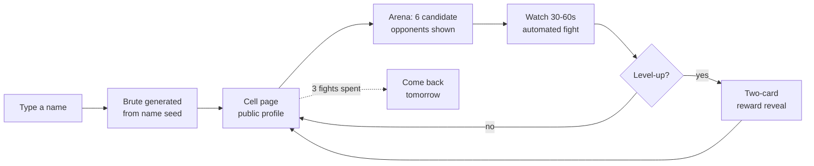

# 01 — MyBrute & Market Analysis: What We Learned and Where We Differ

> **Companion to:** `00-vision.md` (canonical contract). This document synthesises the four raw research appendices (`research/gameplay.md`, `research/community.md`, `research/market.md`, `research/tech.md`) into a single teardown of MyBrute and its market context, and closes by mapping every lesson to the AGOGE design answer defined in `00-vision.md` §3.
>
> **Purpose:** any team member should be able to read this document alone and understand *why* AGOGE is shaped the way it is — which mechanics we inherit, which failures we refuse to repeat, and which unoccupied market position we are claiming.

---

## Part 1 — MyBrute: A Complete Analysis

### 1.1 What MyBrute was

**La Brute** launched in French on 25 June 2008 (labrute.fr), built in Haxe/Flash by Motion Twin — the Bordeaux worker co-operative later famous for Dead Cells. The English **MyBrute** followed in March 2009 and exploded: by mid-2009 the game had generated roughly **70 million brutes** and **~1.7 million daily visits**, pushing Motion Twin's portal network to 10 million registered users across 15 games. Three generations exist, with slightly different rules:

1. **V1 (2008–2010)** — the original Flash game, 3 fights/day, master/pupil referrals, entirely free.
2. **V2 "MyBrute 2.0" on Muxxu (FR June 2010, EN/ES May 2011)** — added the two-choice level-up, talents and clans; removed referrals; introduced microtransactions.
3. **Eternaltwin LaBrute (2022–present)** — an open-source TypeScript/React remake by Zenoo (v1.0.0 on 10 August 2022, after ~3 weeks decrypting Motion Twin's Flash assets), recreating the V2 ruleset and extending it with a visible destiny tree, rank-up prestige, sacrifice economy, achievements, clan wars and the Goldclaw raid boss. Official servers shut down on 2 November 2023; the revival is still in beta with active patches as recently as November 2025.

The revival matters twice over: it proves persistent demand seventeen years on, and — because the entire combat engine is public source — it is the single best mechanical reference in the genre. It is, however, licence-bound to be non-commercial (Motion Twin forbade all monetisation, including ads). **The formula's commercial territory is unoccupied.**

### 1.2 Core gameplay loop

MyBrute's loop is the most compressed in the genre's history:

- **Creation is typing a name.** The game instantly generates a brute; appearance can be tweaked, but starting stats, weapons, skills and even a pet are rolled from the name/seed. No tutorial, no email, no account wall — a password was optional. The distance from "clicked a link" to "owns a character with its own URL" was roughly ten seconds.
- **A hard daily ration.** V1: **3 arena fights per 24 hours** (~6–7 on creation day), resetting at a fixed time. Muxxu V2: up to 10/day or 3 losses. Eternaltwin: 6/day, extendable to 8 via the Regeneration skill. The ration *is* the session: log in, spend fights, maybe see a level-up reveal, done in 2–5 minutes.
- **Everything is a URL.** Every brute lived at `brutename.mybrute.com`; `/cellule` exposed anyone's stats, weapons and pets to scouting; fight replays were deterministic and shareable by link. The brute page was simultaneously save file, profile, trophy cabinet and advertisement.

### 1.3 Combat mechanics — the hidden simulation

Combat was 100% AI-resolved; the only player input was choosing an opponent. Beneath four visible bars ran a genuinely deep simulation.

**The four visible stats:**

| Stat | Effect |
|---|---|
| **Endurance** | HP = 50 base + 6 per point + 1.5 per level (min 51). Pets *deduct* Endurance |
| **Strength** | Melee/fist damage; minor contribution to thrown damage |
| **Agility** | Dodge, combo rate, accuracy; the *primary* damage stat for thrown weapons |
| **Speed** | Shortens attack interval, grants extra attacks; light weapons scale with it heavily |

**The hidden stats** (per fighter, base + weapon + skill modifiers): Initiative, Interval, Counter Rate, Combo Rate, Evasion, Reversal Rate, Block Rate, Accuracy, Precision, Armour, Disarm Rate, Damage. Initiative decided who acted first (**First Strike: +200 initiative; Reconnaissance shifts ~200 the other way**); turn order was a race of interval counters rather than strict alternation, so a fast brute simply attacked more often. Hit resolution layered dodge, block (accuracy rolled against block), reach-based counters (the Whip had the highest counter rate in the game), ripostes, combos (Fists of Fury +20%), disarms (Sai ~100% disarm; Shock +50%), reversals, weapon throws and flat armour — with thrown attacks bypassing armour entirely.

**Weapons (26 in the classic roster)** each carried ~10 hidden dials (damage, interval, accuracy, block, counter, combo, disarm, precision, evasion modifier, initiative modifier), grouped into six classes: Fast (Knife, Sai, Fan), Sharp (Sword, Halbard — boosted 1.5× by Weapons Master), Heavy (Trombone — highest interval in the game; Stone Hammer), Long (Whip, Lance), Thrown (Shuriken — lowest damage *and* lowest interval in the game), and Shield (a disarmables "weapon slot" of pure block). Brutes holding several weapons drew one at random mid-fight; bare hands were a real weapon, doubled by Martial Arts (×2.00).

**Skills (42 in the LaBrute lineage, 21 passive)** split into three tiers:

- *Supers* — randomly triggered actives: Fierce Brute (next hit ×2), Hammer (unavoidable piledrive, +100% with Fierce Brute), Net (immobilise), Bomb (15–25 damage to every enemy including pets, armour-bypassing), Flash Flood (hurl ~half your inventory), Thief (steal held weapon, 2 uses), Tragic Potion (heal 25–50% of HP lost), Cry of the Damned (50%/pet flee chance), Hypnosis (enemy pets defect), Tamer (eat a downed pet: Dog 20% / Panther 30% / Bear 50% heal).
- *Stat boosters* — the build-benders: +3 to the stat, +50% of its current value, and **+50% on every future gain** of that stat (Herculean Strength, Feline Agility, Lightning Bolt, Vitality). **Immortality**: +250% Endurance and future Endurance gains, at −25% to everything else. An early booster bent a brute's entire trajectory — the origin of "god roll" hunting.
- *Passives* — Toughened Skin (+2 armour), Armor (+5 armour, −10% Speed), Lead Skeleton (−30% blunt damage), Untouchable (+30% evasion), Counter-Attack (+10% block plus riposte), Determination (70% chance to re-attack after a miss), Survival (killing blow leaves 1 HP), First Strike, Weapons Master, Martial Arts, Bodybuilder (−25% interval on Heavy weapons), and so on.

**Pets bought power with the brute's own HP** — a genuinely elegant cost model:

| Pet | Profile | Endurance tax | Limits |
|---|---|---|---|
| Dog | 14 HP, fast chip damage | −2 (−8 with both boosters) | Up to 3 |
| Panther (Wolf in EN 2009) | Mid HP, high agility/speed | −6 (−22 with both) | 1 max; excludes Bear |
| Bear | 110 HP, 18–27 damage/swipe (≈ a 40-Strength brute) but sits out 2–3 opening rounds | −6 (−42 with both boosters) | 1 max; excludes Panther |

Because boosters multiplied the tax, and Bomb/Net/Hypnosis/Tamer existed as counters, pets were a real trade-off with a rock-paper-scissors meta rather than a free power-up.

**The design takeaway:** four visible bars hiding a 12-stat simulation and per-weapon dials created endless fight texture *with zero player input*. AGOGE keeps the depth but rejects the secrecy — our derived stats are documented in an in-game Codex (`00-vision.md` §5), because seventeen years of wiki archaeology proved players want the numbers.

### 1.4 Progression — the slot machine, destiny and sacrifice

- **XP:** win = 2, loss = 1 (only against opponents within ~2 levels). Tournaments gave no XP. The curve stretched deliberately: an average player took **about two months to reach level 11**. No effective level cap.
- **The level-up reveal** (V2/LaBrute) offered a **choice of exactly two randomly drawn options** — +3 to a stat, a +2/+1 split, a weapon, a skill, or a pet — always including at least one stat option. It was the game's single dopamine moment and its *entire* build interface. The 2009 original offered no choice at all: one reward, take it.
- **Destiny (Eternaltwin):** the community had long known each brute's fate was seeded at creation ("set in stone as soon as Validate is pressed" — Smashboards); the remake made it explicit. Every brute's level-up pairs form a deterministic decision tree, visualised on a `/destiny` page including paths not taken — converting RNG resentment into theorycrafting.
- **Rank-up (Eternaltwin):** a prestige reset — the brute returns to level 1 at the next named rank, its old destiny still tracked, so the player can re-run or branch differently.
- **Sacrifice (Eternaltwin):** destroying a level-10+ brute converts it to gold (~100 per 10 levels), spent on extra brute slots — a crude but validated "dead build → currency" salvage path.

### 1.5 Retention psychology

- **Appointment mechanics.** The 3-fight ration turned a shallow loop into a durable habit; "there was no need to play for hours: a few fights a day were enough. However, you always wanted to see what would happen the next day." Crucially, the daily fights *were* the fun — not a chore gating the fun.
- **Variable-ratio rewards.** The two-card reveal is a textbook variable-ratio reinforcement schedule; rare jackpots (a Bear, the Hammer skill) became status symbols shared in threads.
- **Seed metagame.** Determinism spawned a secondary hobby of name-rerolling for "god brutes", shared name lists and guide sites — frustration alchemised into community content.
- **The tournament** — a free daily single-elimination bracket, registered from the cell, rounds firing hourly, no XP, pure prestige — provided a second daily appointment and a spectator loop.

### 1.6 Viral mechanics — the pupil/master loop

The single most-proven growth mechanic the genre ever produced. Anyone who created a brute through your brute's URL became your **pupil**; the master earned **+1 XP per new pupil and +1 XP every time a pupil levelled**. With a 3-fight cap, recruiting was the only way to level fast — so every player became a recruiter. Why it worked:

- **The invite was a challenge, not an ask.** "Fight my brute" is a playable dare; the recruit got 30 seconds of entertainment before any commitment, the recruiter got permanent compounding XP. Incentives aligned on both sides of the link.
- **Zero-friction conversion** (name only, no email) meant every converted visitor instantly became a new broadcaster.
- **Perfect channel fit** for 2009: forum signatures, MSN statuses, school labs, office chat. Multi-year megathreads on AnandTech, TeamLiquid (26+ pages), Smashboards, boards.ie (an entire "Pupil Swap" thread of strangers trading clicks).

The result: 70 million brutes. The anti-abuse (first pupil per IP only) was trivially defeated by proxy scripts, with consequences covered in §1.9. Tellingly, **V2 removed referrals entirely — and never recaptured V1's growth.**

### 1.7 Social features

The **cell** was the social object: portrait, stat bars, weapon wall, pets, master/pupil lists, clan, fight log, tournament sign-up and the recruit link, all public at a human-readable URL. The **arena** showed six candidates near your level, all scoutable before spending a fight. **Clans** were cosmetic in V2 but mechanical in the revival: clanmates occasionally assist in fights; **clan wars** are opt-in, 7 brutes/day per side, first to 4 battle wins without exhausting the roster — with genuine bait-and-starve lineup strategy; clans also raid **Goldclaw**, a megaboss with millions of HP whose damage persists across days. The revival's clan content is validated demand for exactly what AGOGE ships as the Phalanx, Skirmish and Titan Siege (`03-gdd-systems.md`).

### 1.8 Monetisation history

| Era | Model | Outcome |
|---|---|---|
| V1 (2008–10) | Entirely free; a colossal funnel into Motion Twin's portal (10M users) which monetised other games | Beloved; virality unimpeded |
| iOS (2009, Bulkypix) | Paid app €3.99/$4.99; free "Lite" capped at 3 fights/day | Decent reviews (Pocket Gamer 8/10) — an early "pay to remove the appointment" experiment |
| V2 Muxxu (2010/11) | 10 fights/day, extendable to 20 for €0.25; extra brute slots ~100 Muxxu Tokens; Sacripoints as the free-player path to slots | Tolerated, not loved; fractured the player base and deleted the growth engine |
| Eternaltwin (2022–) | Licence forbids all monetisation including ads | Free forever; also proof there is no commercial incumbent |

The community's actual grievance in V1 was never payment — it was **unpoliced cheating** ("it seems the site's owners aren't doing anything to remove or prevent this activity"). The most-cited *upside* of V2 in forums was that removing referrals "made the game fair" by killing script-levelling. Lesson: players will forgive a business model long before they forgive a corrupted ladder.

### 1.9 Why it declined

1. **"Release, update a bit, drop."** Sébastien Bénard's own description of Motion Twin's web-era pattern. No content cadence; the level-up pool and endgame never grew; 26-page forum threads from April 2009 petered out within months.
2. **Seed-locked RNG.** The same determinism that fuelled the metagame poisoned attachment: a bad brute was *irredeemably* bad, and the only remedy was "create a new brute".
3. **No endgame.** Once the slot machine's novelty faded there was nothing to do — no builds to pilot, no active decisions, tournaments gave no XP.
4. **Industrialised referral abuse.** Scripted pupil farms ("tens of thousands of pupils… created automatically") put 100+-level brutes atop every ladder, unmoderated, hollowing out competitive legitimacy.
5. **V2 self-sabotage.** Fragmented the player base onto Muxxu, deleted the viral loop, charged for what had been free.
6. **Platform death.** The web-game market dried up; Motion Twin's mobile pivots flopped; Flash EOL (December 2020) killed the client; Twinoid died 2 November 2023.

### 1.10 UI/UX of the era

Side-view 2D Flash arena; two chibi brutes (plus pets) in slapstick 45-second cartoons with floating damage numbers, weapon-draw moments and finisher poses. Every screen — cell, arena, fight, reveal — was one click from every other; the loop closed in minutes. The presentation was charming but of its time: no mobile consideration, no accessibility, hidden numbers everywhere, and total dependence on a plugin that died.

### 1.11 Technical architecture

V1 was Haxe/Flash with server-resolved fights addressable by URL — deterministic replays avant la lettre. The Eternaltwin remake is the modern reference: a **pnpm-workspace TypeScript monorepo** with `client/` (React + Vite), `server/` (Node + Express + Prisma + PostgreSQL) and a **shared `core/` package** running the same sim code on both sides; fights are stored records fetched by UUID and animated client-side. AGOGE's stack (`00-vision.md` §6, detailed in `04-technical-architecture.md`) is a deliberate refinement of this exact layout — Fastify + tRPC instead of Express, mulberry32 seeded PRNG, integer maths, `simVersion` on every fight, and snapshot-based replays per the Super Auto Pets ghost model.

### 1.12 Strengths — what we keep

1. **Ten-second onboarding**: name-only creation, instant identity, no signup wall.
2. **The daily ration as ritual**: 2–5 minute sessions by construction; the limited fights *were* the fun.
3. **Depth behind simplicity**: 4 visible bars over a 12-stat simulation and per-weapon dial bundles.
4. **Level-up as drafted dice**: emergent builds without a skill-tree UI; compounding boosters made early picks momentous.
5. **Pets as HP-taxed, counterable, mutually exclusive choices** — a genuine build decision.
6. **The challenge-link referral**: mechanical, both-sides-rewarded, the best organic-growth engine the genre has produced.
7. **Everything a URL**: profile, replay, recruit link — frictionless scouting, bragging and spread.
8. **The free daily tournament**: a second appointment and a spectator loop at zero content cost.
9. **Tone**: free, friendly, funny — a game people were happy to be seen playing.
10. **The revival's additions** — visible destiny tree, prestige rank-ups, sacrifice salvage, clan wars, persistent raid boss — are seventeen years of community demand made concrete.

### 1.13 Weaknesses — what we refuse to repeat

1. **Seed-locked fate**: the whole build determined at creation; bad seeds unfixable; "reroll a new character" as the only remedy.
2. **Agency vacuum**: choosing between two dice, once a day, was the entire game; no tactical layer whatsoever.
3. **No endgame**: nothing past collection and the ladder; tournaments not even feeding progression.
4. **Referral abuse**: first-per-IP was defeated by proxies; raw-signup rewards invited scripting; moderation absent.
5. **Content stagnation**: no live cadence; the studio's attention moved on and the game died of neglect years before Flash did.
6. **Monetisation missteps**: V2 charged for fights and fractured the community; the funnel model meant the game itself never earned its keep.
7. **Hidden everything**: 12 undocumented stats bred wiki dependence and mistrust of outcomes ("fights seemed completely random").
8. **Platform fragility**: Flash-only, no mobile path, no data portability — the whole 70M-brute universe evaporated with a plugin.

---

## Part 2 — Comparable Games & the Modern Opportunity

### 2.1 Teardown table

The table below compresses nine comparables; prose teardowns follow. Read "Build agency" as *how much the player authors the fighter*, the axis on which AGOGE competes.

| Game | Session | Build agency | Async PvP | Monetisation | Player verdict |
|---|---|---|---|---|---|
| MyBrute '09 | <1 min/fight | None (RNG levels) | Ghost fights, 3/day | Free funnel → V2 microtx | Beloved, shallow |
| Super Auto Pets | 5–15 min | Shop drafting | Win-count-matched ghosts | $5–10 packs, free weekly rotation | Fairness benchmark (89% positive) |
| Backpack Battles | 10–20 min | Spatial item puzzle | Ghost battles | $13 premium | 640k copies month one |
| The Bazaar | 20–40 min | Shop/economy days | Stage-matched ghosts | Pass revolt, walked back | Trust burned, partial recovery |
| Shakes & Fidget | 5–15 min | Stat allocation | Stat-sheet duels | Premium currency + energy | "Heavily Pay2Win" |
| Torn | 5–30 min | Deep RPG economy | Attacks/factions | $5 pack / $4.85/mo sub, tradeable | Trusted; 100k DAU in 2026 |
| Melvor Idle | Check-ins | Skilling plans | None | Buy-once ~$10 + expansions | Trusted; ~$6.7M Steam gross |
| AFK Journey | 10–30 min | Hero collection | Async arena | Gacha + layered passes | Huge revenue, gacha fatigue |
| Hero Zero | 5–15 min | Stat training | Animated duels | Timers + donuts | Mixed (63% Steam) |
| Swords & Souls | 10–20 min | Minigame training | Leaderboard-ish | Premium | Fun spice, stale core |

### 2.2 The auto-battler renaissance — MyBrute's grandchildren

**Super Auto Pets** (Team Wood Games, 2021; browser-first) rebuilt the formula around a **drafting economy**: per-turn gold buys/sells/combines pets and food, then an async battle against a *recorded ghost* of another player at the same win-count; first to 10 wins. Runs are pausable mid-run with no penalty. Its monetisation — $5–10 expansion packs, a free rotating weekly pack so everyone samples paid content, nearly all cosmetics earnable — is widely cited as the benchmark for F2P that "stays out of the way". Its lesson for AGOGE: *drafting is the agency MyBrute lacked*, and generosity converts to trust which converts to sales.

**Backpack Battles** (PlayWithFurcifer, EA March 2024) added **spatial build expression** — items arranged in a grid where adjacency defines synergies — and sold **640,000 copies in its first month** (48% China, 11% Japan, 10% US) at $13, from a two-person studio, powered by a permanently generous demo. Lesson: async PvP plus tinkerable builds is *currently* viral, and players reward generosity with purchases rather than exploiting it.

**The Bazaar** (Tempo, open beta 2024) is both the state of the art and the cautionary tale. Its day-cycle structure (merchant hours punctuated by a PvE fight and a stage-matched ghost PvP battle) is the genre's most sophisticated async loop. But on 5 March 2025 it removed free ranked tickets, charged ~100 gems (~$1) per ranked run and locked hero expansions inside a $10/month "Prize Pass" — after years of promising cosmetic-first monetisation. The community revolted, press called it "a brilliant game undermined by predatory monetization", the CEO fought his own subreddit, and after a month Tempo reversed everything. The Steam launch remained shadowed by the trust damage. This is why `00-vision.md` §5 draws red lines in ink: **never sell ranked entry, never paywall power content, and treat a stated monetisation promise as a contract** — because the genre's players demonstrably enforce it.

None of these three, note, has a *persistent* character — every run resets the build. And none uses a referral mechanic.

### 2.3 The direct descendants and adjacent long-livers

**Shakes & Fidget** (Playa Games, 2009) proves the browser stat-duel formula retains for 15+ years — and is the standing P2W cautionary tale: premium mushrooms buy triple quest energy (100 F2P vs 300 paid), nearly every shop item costs premium currency, and payers progress "at least 2× faster". The community verdict ("heavily Pay2Win") poisons its leaderboard credibility permanently. **Hero Zero** (Playata, 2012; "35M+ players", 63% positive on Steam) is the same formula in superhero dress with the same timer-and-donut resentments. Together they prove longevity *despite* monetisation, not because of it — and they are AGOGE's foil: energy-gating plus premium-currency-everywhere is precisely what Vigor's "identical for all players forever" rule forbids.

**Torn** (2004, text-based crime MMO) is the trust counter-example: 48,515 DAU in January 2024 growing to **its first 100,000-DAU day on 27 April 2026** — a 22-year-old browser game doubling in the modern market. Its model: a $5 Donator Pack and a **$4.85/month supporter subscription** (status, monthly items, points), with packs *tradeable in-game* so free players buy them with in-game cash. Torn monetises appreciation and convenience, never power — the direct ancestor of AGOGE's Patron's Oath ($4.99/month, QoL only).

**Melvor Idle** (solo dev; published by Jagex) cleared an estimated **$6.7M gross on Steam alone** with buy-once (~$10) plus expansions and an explicit "no microtransactions, level playing field" philosophy — proof a browser-first game with clean monetisation prints money and word of mouth. Its browser/PWA/Steam/mobile spread from one codebase is also our distribution template (`00-vision.md` §6).

**AFK Journey** (Lilith, March 2024; >12M downloads, $128M IAP in ~7 months, >$185M lifetime) proves the *idle + auto-battle + build* audience is enormous — and its layered gacha is exactly what an ethical successor should define itself against. We cite it for market size, not for design.

**Swords & Souls: Neverseen** made stat training itself a game via rhythm/reaction minigames — real agency over growth, but reviewers found the minigames "become stale quickly". Lesson absorbed: active training is a spice, not a core; AGOGE keeps its sessions authored (Battle Plans, drafts), not operated.

### 2.4 Browser gaming trends 2024–2026

The web-game renaissance is real and measured. **Poki ~60M MAU, CrazyGames ~35M MAU** — a combined ~95M monthly players on HTML5 portals; the browser-games market ~$7.7B (2024) projected toward ~$9B by 2029. Drivers: post-Flash tooling maturity, app-store fee avoidance and mobile-store discovery fatigue. Surfaces a lightweight auto-battler can stack:

- **Portals** (Poki, CrazyGames — rev-share plus growing IAP support; itch.io for early community).
- **Discord Activities** — Embedded App SDK open to all developers since September 2024, with one-time and subscription IAP; Discord counts 200M+ MAU. A social auto-battler inside a voice channel is a natural fit; Lineage challenge-links map directly onto servers.
- **Telegram Mini Apps** — 500M+ mini-app users; Hamster Kombat's claimed 300M players is crypto froth, but it proved instant-load, socially-forwarded games acquire users at near-zero CAC.
- **PWA installability** — Melvor's template: one codebase, home-screen install, no store tax on web; AGOGE ships portrait-first PWA from day one with a Capacitor wrap later.
- **Tech maturity** — WebAssembly within ~10% of native; WebGPU at Baseline across all major browsers since November 2025. A 2D auto-battler needs none of the bleeding edge, which is the point: instant load on *every* surface is itself a competitive weapon mid-core rivals cannot match without rebuilding.

### 2.5 Retention and monetisation benchmarks

From GameAnalytics 2024/25 benchmarks (11,600 games, 1.48B MAU):

| Metric | All-games average | Healthy target | AGOGE target (`00-vision.md` §5) |
|---|---|---|---|
| D1 retention | 26.5–27.7% | 30–40% | **≥ 35%** |
| D7 retention | ~8% | 10–20% | **≥ 15%** |
| D30 retention | <3% | 5–10% | **≥ 8%** |

Those AGOGE targets are top-decile but plausible: async PvP's "check your fights" pull, plus mid-core's 6–7 sessions/day pattern fitting a 2-minute loop naturally. The mechanics research says what earns them: dailies work only when the daily content is *intrinsically* fun (MyBrute's genius — the ration was the game); Duolingo-style streaks with freeze buffers roughly double daily retention (hence the Eternal Flame and Ember freezes); seasonal resets refresh ladders (Sagas); and guild obligation is the strongest D30+ driver — people return for people (Phalanx, Titan Siege).

On monetisation, the community line is precisely drawn by the case studies. **Acceptable:** cosmetics; account-wide QoL; supporter status; retroactive passes (Halo Infinite's permanently purchasable passes; Deep Rock Galactic's free, anti-FOMO Performance Pass is the gold standard AGOGE's Chronicle follows at $9.99/Saga); Torn-style ~$5 supporter subs. **Radioactive:** paying for ranked entry (The Bazaar's ~$1/run), power in a paid pass, energy splits like Shakes & Fidget's 100-vs-300, premium-priced core items. The regulatory tailwind seals it: Belgium bans paid loot boxes outright, the Netherlands urged an EU-wide ban in December 2024, and the EU Digital Fairness Act is expected to add loot-box rules — **no paid randomness** is simultaneously our ethics, our brand and our legal safe corridor.

### 2.6 The opportunity gap

Lay the field on two axes — session length and build persistence — and a hole appears that nobody occupies:

- The modern auto-battlers (Super Auto Pets, Backpack Battles, The Bazaar) deliver real build agency but demand **10–40 minute runs and reset your build every run**.
- MyBrute had a **persistent, named character** checkable in two minutes — with zero agency over it.
- The idle descendants (Shakes & Fidget, Hero Zero, AFK Journey) have persistence but monetise power and offer allocation, not authorship.

**Nobody offers a persistent, named, evolving fighter you shape through meaningful choices and check on in two minutes.** Add the three assets the modern games abandoned — the challenge-link referral tree (no modern auto-battler uses one, and Discord/Telegram are tailor-made for it), publicly spectatable replay URLs (modern ghost battles are private; every shared fight is free marketing), and trust-first monetisation as a *stated, marketable* position after The Bazaar burned the genre's goodwill in public — and the position is: **persistent named fighter + 2-minute sessions + build agency + social lineage + shareable replays**, delivered instantly on every web surface. That is AGOGE's claim, and every element of it is load-bearing in `00-vision.md` §§1–3.

### 2.7 Lesson → Source → AGOGE response

The closing map. Left column: what we learned. Middle: where the evidence lives. Right: the design answer, as canonised in `00-vision.md` §3 and §5 and elaborated in the GDDs.

| Lesson | Source | AGOGE response |
|---|---|---|
| Name-only creation is the genre's best onboarding | MyBrute V1 | Name → Champion → first fight before signup; anonymous-first auth upgrades invisibly (`02-gdd-core.md`) |
| Seed-locked fate ruins attachment; bad builds must be salvageable | MyBrute decline; Eternaltwin sacrifice/rank-up | Name seeds flavour + starting kit only; growth is a 1-of-3 **Thread of Fate** draft with earned **Favour** rerolls; **Aristeia** rebirth converts any dead-end into legacy |
| Two random options is not agency; drafting is | MyBrute two-card reveal vs Super Auto Pets / Backpack Battles | 1-of-3 drafts, milestone-level category guarantees, visible **Tapestry** history |
| The daily ration retains — but give it a decision | MyBrute 3/day; community wish list | 6 **Vigor**/day (bank cap 12), each fight preceded by a 10-second **Battle Plan** (Stance/Gambit/Trump) with last-known-plan bluffing |
| Hidden stats breed wiki dependence and mistrust | MyBrute's 12 hidden stats; destiny-tree demand | All derived stats documented in the in-game **Codex**; transparency as a feature |
| The challenge-link referral is the proven growth engine — and raw-signup rewards get scripted | V1's 70M brutes; proxy pupil farms; V2's fatal removal | **Lineage**: challenge links kept sacred and free; rewards capped, D7-activity-gated, and strictly non-power (sigils, Obols, titles) |
| Unpoliced cheating kills ladders faster than any business model | endlessbob 2009; forum sentiment on V2 "fairness" | Server-authoritative sim, replay re-validation, feeder-graph detection, admin flag queues (`04-technical-architecture.md`) |
| No endgame = death after the collection novelty | MyBrute stagnation; revival's clan wars demand | **Aristeia** prestige, Olympian league, **Titan Sieges**, **Gauntlet of Labors**, seasonal **Sagas**, **Grand Agon** (`03-gdd-systems.md`) |
| Content cadence is the life/death variable | "Release, update a bit, drop" — Motion Twin post-mortem | Saga-cadenced LiveOps drip of weapons, skills, bosses and cosmetics (`07-monetisation-liveops.md`) |
| Guild obligation is the strongest D30+ driver | Torn factions; AFK Journey; LaBrute clan wars | **Phalanx** (cap 30): Titan Siege persistence, opt-in Skirmish wars, banner cosmetics |
| Streaks retain when humane | Duolingo benchmark | **Eternal Flame** streak with **Ember** freezes — buffer, not punishment |
| Selling power or ranked access triggers revolt; energy splits poison ladders | The Bazaar 2025; Shakes & Fidget | Red lines: never sell Vigor, XP, stats, rerolls, gear or ranked entry; Vigor identical for all players forever |
| Supporter subs and retroactive passes earn trust and revenue | Torn $4.85/mo; DRG/Halo passes; Melvor buy-once | **Patron's Oath** $4.99/month (QoL only); **Chronicle** $9.99/Saga, retroactive, never expires |
| Paid randomness is ethically and legally radioactive | Belgium ban; NL EU-ban push; Digital Fairness Act | No loot boxes, no paid randomness, real-currency price transparency |
| Public replay URLs are free marketing modern ghosts forgo | MyBrute URLs vs private modern ghosts | Every fight a web-native deterministic replay URL with OG-image cards |
| Plugin dependence killed a 70M-character universe | Flash EOL; Twinoid shutdown | Web-native TS monorepo, PWA-first, Capacitor path; data in Postgres, replays as seed+snapshot records (`04-technical-architecture.md`, `05-database-schema.md`) |
| The web is a distribution weapon again | Poki/CrazyGames ~95M MAU; Discord Activities; Telegram | <3 MB instant-load client shaped for portals, Discord Activities and PWA from one codebase |

---

## Sources

Consolidated from the four research appendices; see `research/gameplay.md`, `research/community.md`, `research/market.md` and `research/tech.md` for the full annotated lists and access caveats.

**MyBrute / LaBrute primary:** My Brute Wiki and Mybrute (Muxxu) Wiki (Fandom) — statistics, hidden stats, weapons, skills, supers, pets, pupil/master, experience, tournaments; BestBrute Wiki (fight rations, resets); Wikipedia "My Brute" and "Motion Twin"; fr.wikipedia "La Brute (jeu vidéo)"; Grokipedia "My Brute" (scale figures, used with caution); Smashboards comprehensive guide (2009); AtmaXplorer definitive guide (2009); endlessbob review (2009); MyBrute Forumotion guides; AnandTech, TeamLiquid, MTG Salvation, boards.ie virality threads.

**Revival:** eternaltwin.org (project origin, Zenoo interview, licence threads); brute.eternaltwin.org patch notes and ranking pages; GitHub Zenoo/labrute and GitLab eternaltwin/labrute (open-source engine); Chasing Dings! clan-war series (2024–25).

**Motion Twin post-mortem:** MCV "When We Made Dead Cells"; PCGamesN and deepnight.net (Sébastien Bénard, 2024).

**Comparables:** Wikipedia and Steam pages for Super Auto Pets, Backpack Battles, Shakes & Fidget, Hero Zero, AFK Journey; GameDiscoverCo on Backpack Battles' 640k month; Noisy Pixel, PCGamesN, TheGamer, PC Gamer on The Bazaar's monetisation arc; Torn wiki and MMORPG.com/GamesBeat DAU coverage; Melvor Idle news and Steam revenue estimates; Naavik on AFK Journey; GodIsAGeek/GameSpace on Swords & Souls: Neverseen.

**Market & benchmarks:** Naavik "Web Gaming Strikes Back"; Metaplay "Return of the Web"; Discord developer monetisation docs and GamesBeat coverage; The Block/Wikipedia on Telegram Mini Apps; GameAnalytics 2025 benchmarks and aggregators; Deconstructor of Fun on Duolingo streaks; PocketGamer.biz on daily rewards; Halo Waypoint and Deep Rock Galactic wiki on pass models; Game Developer and PC Gamer on Path of Exile's ethical F2P; Promise Legal, Franssen Tolboom and esportslegal.news on loot-box regulation.

**Technical:** Zenoo/labrute repository; OpenFrontIO architecture notes; Super Auto Pets ghost-battle documentation; mulberry32/splitmix32 PRNG references; Supabase, Fastify/tRPC, BullMQ/pg-boss, Redis leaderboard, PostHog and hosting comparisons as listed in `research/tech.md`.
