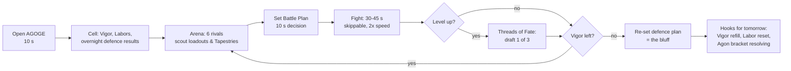
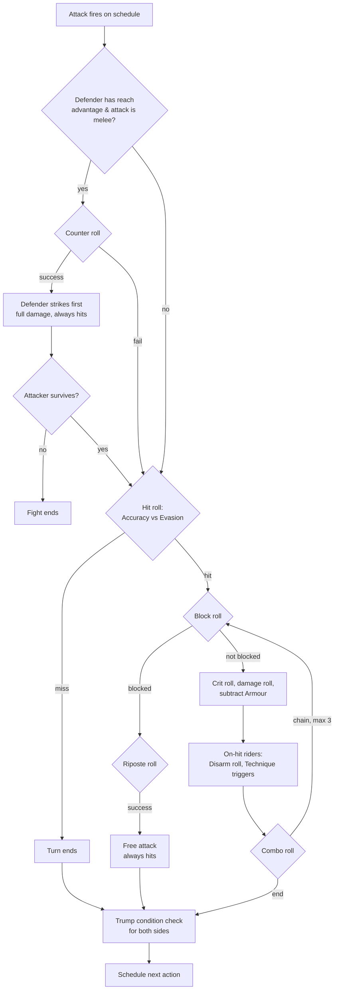

# AGOGE — Game Design Document I: World, Loop, Combat & Progression

> **Document:** `02-gdd-core.md` · **Conforms to:** `00-vision.md` (canonical contract)
> **Owns:** all combat and progression numbers not fixed by the vision brief. Sibling documents defer to the values here.
> **Cross-references:** modes, economy and social systems → `03-gdd-systems.md`; simulation engineering → `04-technical-architecture.md`; data model → `05-database-schema.md`; screens and flows → `06-ui-ux.md`; monetisation and LiveOps → `07-monetisation-liveops.md`.

---

## 1. Game overview

### 1.1 Elevator pitch

AGOGE is a browser auto-battler RPG where you speak a name and the Fates forge you a **Champion** — a mythic warrior who brawls in an eternal arena-academy outside time. Fights are fully automatic 30–45 second spectacles, shareable as a URL. Your skill is *authorship*: drafting your Champion's growth one **Thread of Fate** at a time, setting a three-slot **Battle Plan** that out-thinks your rival's last-known plan, and eventually rebirthing your legend through **Aristeia**. It keeps MyBrute's ten-second onboarding and five-minute daily appointment, and repairs its famous failures: no ruined builds, real tactical agency, a genuine endgame, and monetisation players can respect.

### 1.2 Pillars

The six pillars are defined in `00-vision.md` §2 and bind every decision in this document. In practice they mean, for this GDD:

1. **Ten seconds to delight** — §3 specifies a creation flow with zero mandatory sign-up before the first fight.
2. **Author, don't operate** — §4 specifies a deterministic simulation with *no* mid-fight input, ever. All expression happens before the gong.
3. **A ritual, not a grind** — §1.4 and §6 pace the game around 6 Vigor per day; every number in the XP curve assumes a 5-minute player.
4. **No ruined Champions, ever** — §6.3's draft algorithm guarantees a stat offer in every draft and gives every archetype a path (§6.6).
5. **Legend is social** — every fight in §4 is a seeded replay URL; the Tapestry (§6.4) is a shareable build history.
6. **Fair is the brand** — nothing in this document is purchasable. Power comes only from play.

### 1.3 Target audience & platforms

- **Primary:** 25–40 year olds who played MyBrute, Travian-era browser games or modern auto-battlers; they have jobs, phones and five spare minutes, and they miss having "a brute". They value ritual over reflexes and hate pay-to-win.
- **Secondary:** auto-battler and idle-RPG players (Super Auto Pets, Backpack Battles audiences) who want a persistent character rather than a run; streamers and group-chat instigators for whom a challenge link is content.
- **Platforms:** browser-first (desktop and mobile web), responsive portrait-first PWA from day one, Capacitor wrap for iOS/Android later — per the technical canon in `00-vision.md` §6 and `04-technical-architecture.md`. Sessions target 3–6 minutes, 1.5–2.5 sessions/day.

### 1.4 The daily ritual

The loop is a closed five-minute circuit. Vigor (6/day, bank cap 12) is the metronome: it makes each fight precious, ends the session cleanly, and baits tomorrow.

A typical full-ration session budget:

| Beat | Time |
|---|---|
| Open + cell review (overnight defences, Labors) | 45 s |
| 6 × (scout + Battle Plan + fight, mostly at 2× or skipped) | 3–4 min |
| One Threads of Fate draft (early game: most days) | 20 s |
| Re-set defensive Battle Plan, check Agon bracket | 30 s |
| **Total** | **≈ 5 min** |

Everything else — Gauntlet of Labors, Agon, Phalanx content — layers onto this circuit without lengthening it (see `03-gdd-systems.md`).

---

## 2. World & narrative

### 2.1 The Eternal Agoge

An arena-academy adrift outside time: bronze halls and marble terraces ringed around a fighting floor, suspended in a permanent golden dusk. The **Moirai** — the three Fates — weave Champions out of memory and myth. Nobody dies here; a felled Champion bursts into bronze dust and re-forms in their alcove, grinning and cracking their knuckles. What persists is **Kleos** — glory — etched into the **Stele of Deeds**. The player is a **Mentor**: an unseen patron voice whose Champion is their work of art.

### 2.2 The cast

The canonical cast from `00-vision.md` §4, with their functional roles in this GDD's systems:

| Character | Voice | Where they appear in play |
|---|---|---|
| **The Herald** | Booming, affectionate hype-man | FTUE narration; fight commentary barks; Agon bracket announcements |
| **Lachesis** | The middle Fate; dry wit | Presents every Threads of Fate draft; comments on your picks and rerolls |
| **Bronte** | One-armed forge-mistress | Cosmetic Forge and shop; grumbles about your dented armour after losses |
| **Krios** | Chained Titan beneath the arena | Phalanx Titan Siege boss; his rumbles foreshadow siege weeks |

### 2.3 Tone

Warm, witty, mythic — never grimdark, never "300". The Agoge is a gym with a view of eternity; everyone is here forever, so everyone has a sense of humour about it. Violence is slapstick-heroic: squash-and-stretch, bronze dust, dazed birds. The Fates are civil servants of destiny with infinite caseloads. Losses are material for banter, not shame.

### 2.4 How lore surfaces (light-touch, loop-serving)

Lore never gates play and never demands reading. It seeps in through:

- **Barks.** Launch corpus: ~120 Herald fight-commentary lines (triggered by sim events: first blood, counters, disarms, Trump activations, upsets), ~40 Lachesis draft quips (react to your pick history: "Three Grit in a row. Building a wall, are we?"), ~30 Bronte shop/Forge lines, ~12 Krios siege rumbles. Barks are data-driven off the deterministic event log, so replays bark identically.
- **Labor flavour.** Daily Labors (see `03-gdd-systems.md`) are framed as academy chores set by the cast: *"Bronte needs the racks tested — win a fight wielding a Labrys."*
- **Saga framing.** Each 8–10 week Saga is patronised by a god (*Saga of Ares*), which skins the arena backdrop, the Chronicle cosmetics and the Grand Agon's title — flavour and cosmetics only, never rules changes that invalidate builds.
- **The Stele.** Achievement titles are written as epithets ("Thrice-Woven", "Boar-Breaker") and attach to the Champion's public cell.

---

## 3. Onboarding / FTUE

### 3.1 Ten seconds to delight

The landing page is a name field and a gong. No account, no email, no tutorial screens. Under the hood an anonymous Supabase session is created silently (`04-technical-architecture.md`); the player just sees:

1. **Type a name** (0–5 s). Uniqueness checked live; the name is the Champion's URL identity (`agoge.gg/kassia`).
2. **The Fates weave** (2 s). A loom animation resolves into the Champion: appearance, epithet, starting kit — all seeded from the name.
3. **The Herald roars, the gong sounds** (by 10 s). The first fight begins immediately.

### 3.2 Name-seeded generation — flavour, not fate

The name is hashed (normalised, salted per realm) into a generation seed. **The seed determines flavour and starting tendencies, never permanent fate** — the single most important fix over MyBrute, where the name decided your whole destiny. Everything the seed grants is a starting point that drafting can overwrite.

The seed determines:

- **Appearance:** build, skin/hair from the terracotta-bronze-lapis-ivory palette, crest colour, idle pose, bark voice set. (Fully re-styleable later with cosmetics.)
- **Omen:** one of six starting archetypes, mapping to the six weapon disciplines. The Omen sets the starting weapon(s), a +6 spread over the base stat line, and an epithet.
- **Nothing else.** Draft offers, skill pools and future weapons are *not* name-seeded (unlike LaBrute's Destiny tree). Two Champions with the same Omen diverge entirely through drafting.

Base stats at level 1 are **6 / 6 / 6 / 6** (Might/Grace/Tempo/Grit); the Omen distributes **+6** on top, for a starting total of 30:

| Omen | Epithet | Starting kit | Might | Grace | Tempo | Grit |
|---|---|---|---|---|---|---|
| Omen of the Doru | "the Patient" | Doru | +2 | +1 | +1 | +2 |
| Omen of the Xiphos | "the Poised" | Xiphos | +2 | +2 | +1 | +1 |
| Omen of the Cestus | "the Restless" | Cestus | +1 | +2 | +2 | +1 |
| Omen of the Labrys | "the Thunderous" | Olive-Root Club | +3 | +1 | +1 | +1 |
| Omen of the Akontia | "the Far-Sighted" | Akontion | +1 | +3 | +1 | +1 |
| Omen of the Aspis | "the Unbroken" | Pelte + Xiphos | +1 | +1 | +1 | +3 |

### 3.3 Guaranteed first-session beats

The first session is choreographed. Every beat below is guaranteed, in order:

1. **Create** (10 s) — as above.
2. **First fight, first win** (60 s) — the Herald stages an "exhibition bout" against a **Shade**, a bronze practice construct tuned below the Champion. The server selects, from candidate seeds, one whose deterministic outcome is a win (authored PvE; the sim itself is never falsified — see `04-technical-architecture.md`). The player watches their Champion win at full presentation pace, learning the fight grammar (counters, blocks, damage numbers) by spectacle.
3. **First level draft** (30 s) — the win pays 2 XP; level 2 costs exactly 2 XP (§6.2). Lachesis appears with the first Threads of Fate draft. First-draft composition is fixed: one +3 stat, one +2/+1 stat, one weapon — a safe, legible introduction.
4. **Real fights** (3–4 min) — the Arena opens with six rivals (early-cohort Champions and seeded ghosts near the 1,500-Kleos starting rating). Day-one bonus: **+6 Vigor**, so up to 12 fights on day one — enough to reach level 4–5 and see two or three drafts.
5. **Hook into tomorrow** (20 s) — the session ends with three planted hooks: the Vigor refill timer, the first Labor ("Return tomorrow and win with your Omen weapon"), and Lachesis holding up a shimmering, unreadable thread: *"This one's for next time."*

### 3.4 Anonymous-first account upgrade moments

The anonymous session is a full account in all but recoverability. Upgrade prompts (email/OAuth link) are offered — never forced — at moments of felt investment:

| Moment | Prompt framing |
|---|---|
| After the first draft | "Bind your Champion to the loom" — don't lose them |
| First replay share / challenge link sent | Claim your URL permanently |
| Champion reaches level 5 | Cross-device play ("your Champion, on your phone") |
| Joining a Phalanx or accepting a Protégé | Social identity requires a recoverable account |

Declining costs nothing; the anonymous account persists via device credentials until the player is ready. See `06-ui-ux.md` for the flows and `04-technical-architecture.md` for the auth mechanics.

---

## 4. Combat system

### 4.1 Simulation model

Combat is **fully automatic, server-simulated and deterministic**: `seed + simVersion + both combatant snapshots → identical fight, every time` (`00-vision.md` §6). The simulation is pure TypeScript in `packages/core`, integer-maths only, using a mulberry32 seeded PRNG. Every random decision in this section — every roll quoted as "roll(0–49)" or a percentage check — draws from that single seeded stream in a fixed order, which is what makes replays exact.

- **Ticks.** The sim advances in abstract integer ticks. Ticks are *not* wall-clock time: a full fight resolves in 400–1,200 sim ticks, and the client renderer paces the resulting event log into the canonical **30–45 second** presentation (roughly 1.6–2.2 s of animation per attack event), with skip and 2× controls.
- **Actors.** The two Champions plus any Beasts of Legend are independent actors, each with their own interval and event schedule.
- **Termination.** A fight ends when a Champion reaches 0 HP (beasts fight on only in barks). Hard cap of 3,000 ticks; if reached, the Champion with the higher remaining HP *percentage* wins (ties: higher initiative). The cap exists for pathological turtle mirrors; tuning targets <0.5% of fights reaching it.
- **Transparency.** Every derived stat and formula below is published in the in-game **Codex**. Hidden stats were MyBrute's mystique; visible ones are our theorycrafting engine.

### 4.2 Initiative and turn flow

There is no strict turn alternation — turn order is a race of interval counters, exactly the texture that made MyBrute fights readable but lively.

- **Initiative** (rolled once at fight start):
  `Initiative = 10 × Tempo + weapon Initiative modifier + Gambit modifier + roll(0–49)`
- **Attack Interval** (ticks between actions):
  `Interval = floor(WeaponBaseInterval × 100 / (100 + 4 × Tempo))`, then the Stance percentage is applied.
- **Scheduling.** An actor's first action fires at tick `max(0, Interval − Initiative)`; each subsequent action fires `Interval` ticks after the last. High Tempo with a light weapon can mean acting twice before a Minoan Crusher wielder moves at all — heavy weapons' negative initiative modifiers delay their opening swing, exactly like MyBrute's sleepy Bear.
- **Simultaneity.** Events on the same tick resolve in initiative order; residual ties are broken by the seeded stream.

### 4.3 The four visible stats

Per `00-vision.md` §5: **Might** (melee damage), **Grace** (evasion, accuracy, combo, thrown damage), **Tempo** (attack interval, initiative), **Grit** (HP pool, companion capacity). Typical values: 6–9 at level 1, mid-teens by level 12, high-20s in a stat-focused level-30 build.

### 4.4 Derived stats — complete formula table

All values are integers; percentages are whole points; `floor` after every multiplication (integer maths canon). "Mods" means the sum of weapon, skill, Stance and Gambit modifiers.

| Derived stat | Formula | Clamp | Notes |
|---|---|---|---|
| **HP** | `50 + 6 × Grit + 2 × level` | — | Canonical (`00-vision.md`). Beast Grit taxes reduce effective Grit here. |
| **Initiative** | `10 × Tempo + mods + roll(0–49)` | — | Offsets first action only (§4.2). |
| **Attack Interval** | `floor(WeaponBase × 100 / (100 + 4 × Tempo))` × Stance % | min 60 | Lower = faster. Weapon bases run 210–460. |
| **Accuracy** | `80 + 2 × Grace + mods` | — | Rolled against Evasion (below). |
| **Evasion** | `5 + 2 × Grace + mods` | 0–60 | Full avoidance. |
| **Hit chance** | `clamp(Accuracy − Evasion, 5, 95)` | 5–95 | Nothing is ever certain or hopeless. |
| **Block** | `weapon/shield base + mods` | 0–60 | Gear-driven, chiefly the Aspis discipline. Blocked hits deal 0 (Measured stance: 25% chip). |
| **Riposte** | `20 + mods` | 0–75 | Rolled after each successful block; a free attack. Always hits. |
| **Counter** | `8 × (defender reach − attacker reach) + mods` | 0–50 | Longer-reach defenders only; §4.6. Always hits. |
| **Combo** | `4 + floor(3 × Grace / 2) + weapon mod` | 0–60 | Rolled after each *landed* hit; chain cap 3 hits; each chained hit deals 85% of the previous. |
| **Crit** | `5 + mods` | 0–40 | Crit damage = ×3/2, applied before variance. |
| **Disarm** | `weapon/skill mods − foe disarm resistance` | 0–70 | Rolled on landed hits; removes the held weapon for the rest of the fight. |
| **Armour** | sum of item/skill armour | 0–12 | Flat reduction per hit, minimum 1 damage. Bypassed by Akontia (thrown) and effects flagged armour-piercing. |
| **Damage** | `floor((WeaponBase + floor(Stat × Scale / 100)) × Stance% / 100 × roll(85–115) / 100)` | min 1 | `Stat` = Might for melee and fists, Grace for Akontia. `Scale` is per-weapon. |
| **Companion capacity** | sum of beast Grit taxes ≤ `Grit − 1` | — | Net Grit can never drop below 1. |

### 4.5 Attack resolution pipeline

Each scheduled attack resolves through a fixed pipeline (one pass through the seeded stream):

Trump conditions (§4.7.3) are checked after every resolved event, for both fighters, in initiative order.

### 4.6 Weapons as dial bundles; reach and counter

Every weapon is a bundle of ~10 dials (base damage, scaling stat and %, base interval, reach, and modifiers to accuracy, evasion, block, counter, combo, crit, disarm, initiative). This is the MyBrute insight kept intact: weapon variety creates fight texture with zero player input. AGOGE removes the one frustration — random weapon draws — by making **draw order player-authored** (§7.1).

**Reach** is an integer 0–3: fists/Cestus 0, Xiphos/Labrys 1, Trident/Boar Spear 2, Doru/Sarissa 3. Rules:

- Counters trigger only when a **melee** attacker closes on a defender with strictly longer reach; chance per incoming attack = `8 × reach difference + mods` (cap 50).
- A successful counter is a full-damage, auto-hitting strike that lands *before* the incoming attack resolves; the attack then proceeds if the attacker still stands. Counters and ripostes never trigger combos, but they count as attacks for Trump effects (a Wrath of Herakles counter hits like a train).
- **Thrown (Akontia) attacks cannot be countered** — you cannot spear-wall a javelin. They can be evaded and blocked, and they bypass Armour.
- The *Close the Gap* Gambit cancels the defender's first counter attempt; *Hold Ground* rewards the defender's first counter or riposte (§4.7.2). Reach is therefore a live tactical axis, not a passive stat.

### 4.7 The Battle Plan

Set before each fight in ~10 seconds; three slots. This is the tactical mindgame the vision demands, and the only "input" a Mentor ever gives a fight.

#### 4.7.1 Stances — exact stat-weight shifts

| Stance | Damage | Interval | Accuracy | Crit | Evasion | Block | Counter | Riposte | Armour | Special |
|---|---|---|---|---|---|---|---|---|---|---|
| **Aggressive** | +15% | −10% | 0 | +3 | −8 | −10 | −5 | 0 | 0 | — |
| **Measured** | 0 | 0 | +6 | 0 | +3 | 0 | 0 | 0 | 0 | Your blocked hits deal 25% chip damage |
| **Guarded** | −10% | +8% | 0 | 0 | 0 | +12 | +10 | +10 | +2 | — |

These shifts engineer a soft counter-triangle: **Aggressive beats Measured** (raw output outpaces a neutral posture), **Measured beats Guarded** (chip damage through blocks defuses the wall), **Guarded beats Aggressive** (extra swings feed counters and ripostes). It is deliberately soft — build and loadout can override it — but strong enough that reading your rival's likely stance matters every fight.

#### 4.7.2 Gambits — launch list (7)

A Gambit scripts the opening behaviour only; after it resolves, the sim runs on stats.

| Gambit | Effect | Cost / risk |
|---|---|---|
| **Hurl First** | Open by throwing: your first-listed Akontia weapon (or, lacking one, your slot-1 melee weapon, thrown once and lost for the fight) | Committing a melee weapon to the throw |
| **Close the Gap** | +20 Initiative; the defender's first counter attempt is cancelled | None — the default aggressor's pick, and known to be such |
| **Hold Ground** | −20 Initiative; your first counter or riposte within the first 600 ticks deals +30% damage | Slower start |
| **Feint** | Your first attack deals 0 damage; the foe's Block and Evasion drop by 15 for the following 300 ticks | An entire action spent |
| **Loose the Beast** | Your beasts' first actions fire 100 ticks earlier | Your own Initiative −30 |
| **Test the Shield** | Your Disarm chance is doubled on your first three landed hits | No damage bonus; wasted vs bare-handed foes |
| **War Cry** | Your first action is delayed +60 ticks; the foe's Accuracy −8 for the first 500 ticks | Tempo loss up front |

#### 4.7.3 Trumps — the condition grammar

A Trump slot arms **one owned Trump skill** (§5.3) behind **one trigger condition**: `WHEN [trigger] → UNLEASH [Trump]`. The condition is checked after every resolved event; the Trump fires once, immediately, then is spent. A condition that never becomes true means a Trump that never fires — narrow triggers are high leverage and high risk, and reading *when* a rival's Trump will fire is half the metagame.

**Trigger list (10 at launch):**

| Trigger | Fires when |
|---|---|
| At the First Clash | Immediately after initiative resolves |
| First Blood Taken | You take your first damage |
| First Blood Drawn | You deal your first damage |
| When Bloodied | Your HP drops below 50% |
| At Death's Door | Your HP drops below 20% |
| When the Foe is Bloodied | Foe's HP drops below 50% |
| When Disarmed | You lose a weapon to disarm |
| When Your Beast Falls | Any of your beasts reaches 0 HP |
| On Your First Crit | Your first critical hit lands |
| After the Tenth Exchange | The 10th attack event of the fight resolves |

The **effect list** is the Champion's owned Trump skills — see §5.3 for all eight with numbers. Simultaneously-triggered Trumps resolve in initiative order.

### 4.8 Information asymmetry — the bluffing metagame

Per the vision: *the attacker sees the defender's public loadout and last-known Battle Plan, not the current one.*

- **Public forever:** stats, level, HP, carried loadout, skills, beasts, Kleos, full Tapestry.
- **Last-known Battle Plan:** the plan the defender used in their **most recently resolved fight** (attacking or defending). Shown to any would-be attacker in the Arena scout view.
- **Hidden:** the defender's *currently saved* plan, which is what their ghost actually uses when attacked.

This one rule creates the metagame. Ending your session by re-setting your defence plan is the daily bluff: show Aggressive/Close the Gap in your last fight, sleep on Guarded/Hold Ground, and harvest the Mentors who took the bait. Attackers, conversely, must price in staleness: how old is that last-known plan? Does this Mentor *always* turtle, or only when their Tapestry says they drafted Serpent Reflex? Scouting rewards game knowledge, never wallet. (Defence snapshots, revenge mechanics and Kleos exchange are specified in `03-gdd-systems.md`.)

Defenders fight as server-held snapshots: defending costs no Vigor and earns no XP; only the initiating Mentor spends Vigor and banks XP. Kleos adjusts for both sides (`03-gdd-systems.md`).

### 4.9 Worked example — Kassia vs Dromeus

Fight seed `2740589`, simVersion `1`. **Dromeus attacks Kassia** (1 Vigor). His scout screen shows her loadout and her *last-known* plan — Measured / Feint, from yesterday. Overnight she saved Guarded / Hold Ground. The trap is set.

**Kassia** — level 12, Omen of the Aspis, "the Unbroken" (Counter-Turtle):

| | Might 8 · Grace 12 · Tempo 10 · Grit 16 → **HP 170** |
|---|---|
| Loadout | Doru (slot 1), Xiphos (slot 2), Aspis (off-hand) |
| Skills | Serpent Reflex (+10 Counter), Stone Wall, Wrath of Herakles (Trump) |
| Battle Plan | **Guarded / Hold Ground / When the Foe is Bloodied → Wrath of Herakles** |
| Derived | Interval 246 (Doru 320 → Tempo → 228, Guarded +8%); Accuracy 109; Evasion 24; Block 42 (Aspis 25 + Doru 5 + Guarded 12); Counter 50 (capped: reach diff 16 + Doru 15 + Serpent Reflex 10 + Guarded 10); Riposte 30; Armour 4; Damage 17 (Doru 12 + floor(8×90%) = 19, Guarded −10%) |

**Dromeus** — level 12, Omen of the Cestus, "the Restless" (Glass Tempest):

| | Might 10 · Grace 15 · Tempo 18 · Grit 7 → **HP 116** |
|---|---|
| Loadout | Twin Xiphoi (slot 1, two-handed), Himantes (slot 2) |
| Skills | Winged Heels (+10 Evasion), Hermes' Rush (Trump) |
| Battle Plan | **Aggressive / Close the Gap / When Bloodied → Hermes' Rush** |
| Derived | Interval 125 (Twin Xiphoi 240 → Tempo → 139, Aggressive −10%); Accuracy 110; Evasion 42 (5 + 30 + Heels 10 + weapon 5 − Aggressive 8); Block 0; Combo 38; Damage 17 (8 + 7 = 15, Aggressive +15%) |

Hit chances: Dromeus vs Kassia `110 − 24 = 86%`; Kassia vs Dromeus `109 − 42 = 67%`.
Initiative: Dromeus `180 + 0 + 20 (Gambit) + roll 3 = 203`; Kassia `100 + 20 (Doru) − 20 (Hold Ground) + roll 31 = 131`. First actions: Dromeus tick 0 (125 − 203 < 0), Kassia tick 115 (246 − 131).

| Tick | Event | Annotation |
|---|---|---|
| 0 | Dromeus attacks. Counter cancelled (Close the Gap). Hit (roll 41 < 86). No block (77 > 42). Damage 17, variance 103% → 17; **Stone Wall** halves → 8; Armour 4 → **4**. Kassia 166. | Close the Gap earns its keep — Kassia's 50% counter never rolls. |
| 0 | Combo (roll 22 < 38): chain hit lands the hit roll but is **blocked** (30 < 42). Riposte (12 < 30): Doru 17, var 96% → 16, **Hold Ground +30% → 20**. Dromeus 96. | The chain hit feeds the wall. Hold Ground's one-shot bonus, spent perfectly. |
| 115 | Kassia attacks: **miss** (74 > 67). | 42 Evasion is Dromeus's whole defence — and it works. |
| 125 | Dromeus attacks. **Counter** (18 < 50): 17, var 108% → **18**. Dromeus 78. His attack still lands (62 < 86): var 88% → 14; Stone Wall → 7; Armour → **3**. Kassia 163. | The spear-wall tax: 18 damage just for approaching. |
| 250 | Dromeus attacks. No counter (71). Hit — **blocked** (40 < 42). No riposte (44). | Nothing happens — which cost Dromeus a whole action. |
| 361 | Kassia hits (33 < 67): var 112% → **19**. Dromeus 59. | One point above his Bloodied line of 58. |
| 375 | Dromeus attacks. **Counter** (45 < 50): var 85% → **14**. Dromeus 45 — **Bloodied**. Both Trump conditions true; initiative order: **Hermes' Rush** fires (interval 125 → 75, +15 Evasion, 500 ticks), then **Wrath of Herakles** fires (Kassia's next 3 attacks +100%, unblockable, within 400 ticks). His attack: miss (90 > 86). | The double Trump. His condition read "self Bloodied" — accelerating exactly when he is walking into a counter-wall. Hers read "Foe Bloodied" — a finisher's trigger. |
| 450 | Dromeus attacks (Rush pace). **Counter — with Wrath** (roll 45): 17 × 2 = 34, var 85% → **28**. Dromeus 17. His attack lands: Stone Wall (3rd and final charge) → **3**. Kassia 160. | Rush bought him one extra action; the wall made him pay double for it. |
| 525 | Dromeus attacks. No counter (68). Hit — **blocked** (40 < 42). **Riposte — with Wrath** (25 < 30): 34, var 104% → **35**. **Dromeus falls.** | A riposte is an attack; Wrath does not care that Kassia never swung. |

**Result:** Kassia wins at 160/170 HP, having landed one active hit all fight — counters and ripostes did the rest. Presentation: 15 attack events ≈ 34 seconds. Dromeus (attacker, higher Kleos 1,540 vs 1,495): **1 XP** for the loss. Kassia's Mentor logs in tomorrow to find the win banked — the defence bluff paid. Replay URL shareable; identical for every viewer, forever.

---

## 5. Arsenal

### 5.1 Design rules

- **Horizontal, always.** No weapon is a straight upgrade; every dial gain costs another dial. No rarity tiers, no gear levels, no upgrade currencies (`00-vision.md` §5). "Power" in AGOGE is fit — the right bundle for your stats, skills and Battle Plan.
- **Acquisition is drafting.** Weapons, skills and beasts enter a Champion's armoury *only* through Threads of Fate offers (§6.3). Nothing here is ever sold.
- **Fists are always there.** Unarmed baseline: damage 4, Might scale 60%, interval 240, reach 0, Combo +5. A disarmed Champion is never helpless — and Pankration builds weaponise this.

### 5.2 The 24 launch weapons

Weapon bases feed the formulas in §4.4: `Dmg` is base damage, `Scale` the stat scaling, `Int` the base interval, `Reach` per §4.6. "Dials" lists every non-zero modifier. Two-handed weapons cannot be paired with an Aspis.

**Doru — the spear discipline (reach, counter):**

| Weapon | Dmg | Scale | Int | Reach | Dials | Trade-off |
|---|---|---|---|---|---|---|
| Doru | 12 | Might 90% | 320 | 3 | Init +20, Counter +15, Acc +5, Block +5 | The measuring stick: pays for reach with middling pace |
| Sarissa | 15 | Might 95% | 380 | 3 | Counter +25, Init −40, Acc −5; two-handed | The counter-wall incarnate; slow, shieldless, clumsy |
| Trident | 13 | Might 85% | 330 | 2 | Counter +12, Disarm +15, Block +5 | Weapon control at the cost of one reach step |
| Boar Spear | 14 | Might 90% | 340 | 2 | Counter +10, Crit +6; +25% damage vs beasts | The Beastmaster answer; ordinary vs beastless foes |

**Xiphos — the blade discipline (balanced):**

| Weapon | Dmg | Scale | Int | Reach | Dials | Trade-off |
|---|---|---|---|---|---|---|
| Xiphos | 11 | Might 80% | 280 | 1 | Acc +5, Block +8, Combo +5 | No weakness, no spike — the honest blade |
| Kopis | 13 | Might 85% | 300 | 1 | Crit +8, Block −5 | Chops harder, guards worse |
| Makhaira | 12 | Might 80% | 290 | 1 | Block +10, riposte damage +25% | The duellist's blade; wants a Guarded plan |
| Twin Xiphoi | 8 | Might 70% | 240 | 1 | Combo +12, Eva +5, Block −5; two-handed | A blender that forfeits the shield |

**Cestus — the fist discipline (fast, combo):**

| Weapon | Dmg | Scale | Int | Reach | Dials | Trade-off |
|---|---|---|---|---|---|---|
| Cestus | 7 | Might 65% | 220 | 0 | Combo +15, Eva +5, Acc +5 | Death by a thousand slaps |
| Iron Cestus | 9 | Might 75% | 250 | 0 | Combo +10, Disarm +10, Crit +4 | Heavier hands, slower hands |
| Sphairai | 8 | Might 70% | 230 | 0 | Combo +12, Crit +8, Acc −5 | Crit-fisher; swings wild |
| Himantes | 6 | Might 60% | 210 | 0 | Combo +18, Eva +8 | Fastest weapon in the game; tickles |

**Labrys — the great-axe discipline (slow, huge):**

| Weapon | Dmg | Scale | Int | Reach | Dials | Trade-off |
|---|---|---|---|---|---|---|
| Labrys | 24 | Might 110% | 400 | 1 | Crit +10, Acc −10, Combo −10, Init −60; two-handed | Feast or famine, every swing |
| Minoan Crusher | 30 | Might 120% | 460 | 1 | Crit +12, Acc −15, Init −90; two-handed | The biggest hit in AGOGE; may never land it |
| Bipennis | 20 | Might 105% | 380 | 1 | Crit +8, Acc −5, Disarm +10; two-handed | The "light" heavy; batters weapons loose |
| Olive-Root Club | 16 | Might 95% | 340 | 1 | On crit: foe's next action delayed +80 ticks | The only one-handed Labrys — pairs with Aspis |

**Akontia — the thrown discipline (Grace-scaled, armour-piercing, ammo-limited, cannot be countered):**

| Weapon | Dmg | Scale | Int | Ammo | Dials | Trade-off |
|---|---|---|---|---|---|---|
| Akontion | 10 | Grace 100% | 300 | 4 | Crit +5 | The standard javelin |
| Kestros | 7 | Grace 90% | 260 | 6 | Acc +10 | Reliable sting, modest venom |
| Discus | 14 | Grace 110% | 360 | 3 | Acc −5, Crit +6 | Three big questions, then fists |
| Peltast Blades | 5 | Grace 80% | 220 | 8 | Combo +10 | A chip stream; feeble singly |

When ammo is spent, the Champion draws the next carried weapon (or fists). Thrown attacks bypass Armour, can be evaded and blocked, and never trigger counters.

**Aspis — the shield discipline (off-hand, defence, disarmable):**

| Shield | Dials | Trade-off |
|---|---|---|
| Aspis | Block +25, Armour +2, Counter +5, Eva −5 | The standard: a wall you carry |
| Pelte | Block +15, Armour +1, Eva +5, Init +10 | The skirmisher's shield; guards less, dances more |
| Tower of Dikte | Block +32, Armour +4, Eva −10, Interval +10%, Init −40 | Near-impregnable, near-immobile |
| Spiked Aspis | Block +20, Armour +2, riposte damage +30%, Counter +5 | Defence that bites back |

An Aspis occupies a carry slot, is worn from the fight's start whenever a one-handed weapon (or fists) is held, and — uniquely among defensive options — **can be disarmed**.

### 5.3 The 30 launch skills

**Boons (12) — always-on passives:**

| Boon | Effect |
|---|---|
| Bronze Hide | +4 Armour |
| Winged Heels | +10 Evasion |
| Eagle Eye | +10 Accuracy |
| Hoplite Drill | +10 Block with an Aspis equipped; +5 without |
| Pankration | Fists become a true weapon: base damage 10, Might scale 100%, interval 220, Combo +10 |
| Titan Grip | Labrys-discipline interval −15%; cannot be disarmed while wielding a Labrys weapon |
| Keen Edge | +6 Crit |
| Serpent Reflex | +10 Counter |
| Iron Wrists | +25 disarm resistance; +10 Disarm |
| Marathon Lungs | Every 500 ticks, recover `3 + floor(Grit / 2)` HP |
| Beast Bond | Each beast's Grit tax −1; beasts gain +15% HP |
| Endless Quiver | Akontia ammo +3 per weapon; thrown damage +10% |

**Techniques (10) — auto-triggered actives (conditions are fixed, not player-set):**

| Technique | Effect |
|---|---|
| Whirl of Bronze | Once per fight, when facing 2+ enemies (beasts count): strike every enemy for `8 + floor(Might / 2)` |
| Shield Slam | After a successful block, 40% chance (max once per 400 ticks): bash for 60% weapon damage; foe's next action +80 ticks |
| Perfect Riposte | Your first riposte each fight deals double damage |
| Hamstring | Your first crit each fight also slows the foe: interval +15% for 400 ticks |
| Second Breath | Once per fight, on dropping below 30% HP: heal 25% of HP lost |
| Rope and Net | Once per fight, on your first attack after tick 300: entangle the foe (or their largest beast) for 200 ticks — no acting, evading or blocking |
| Skyfall | Once per fight, when the foe drops below 35% HP: leap strike for 150% weapon damage; cannot be evaded or blocked |
| Twin Fangs | Your first combo each fight extends by 2 guaranteed chain hits |
| Beast's Fury | When one of your beasts falls: +20% damage for the rest of the fight |
| Stone Wall | The first three hits against you each fight deal −50% damage |

**Trumps (8) — player-conditioned ultimates (armed via the Battle Plan, §4.7.3; once per fight):**

| Trump | Effect when unleashed |
|---|---|
| Wrath of Herakles | Your next 3 attacks within 400 ticks: +100% damage, unblockable (counters and ripostes count) |
| Aegis of Dawn | For 600 ticks, automatically block every incoming melee hit; your ripostes still roll |
| Gorgon's Glare | The foe is frozen for 250 ticks (their beasts are unaffected) |
| Chiron's Mending | Heal 40% of missing HP; cleanse slows and entangles |
| Hermes' Rush | For 500 ticks: interval −40%, +15 Evasion |
| Bronte's Bolt | `20 + floor(Grace / 2)` damage to the foe and all their beasts; ignores Armour |
| Cast Down | Disarm the foe's held weapon; their next draw is delayed 300 ticks |
| Moira's Thread | The next killing blow against you leaves you at 1 HP instead; your damage +25% thereafter |

### 5.4 Beasts of Legend

Companions purchase power with your own HP pool: each beast levies a permanent **Grit tax** while equipped (reducing HP by 6 per point and companion capacity alike). Up to 3 Lykoi; **one non-wolf beast maximum**; total taxes may not exceed `Grit − 1`.

| Beast | Grit tax | HP | Damage | Interval | Traits |
|---|---|---|---|---|---|
| **Lykos** (wolf, up to 3) | −2 each | 16 + level | 4–6 | 260 | Evasion 15; pack instinct: each additional Lykos grants all Lykoi +5% damage |
| **Stymphal Shrike** | −4 | 22 + level | 5–8 | 200 | Evasion 25; first action at tick 40; harass: foe Accuracy −5 while it lives |
| **Kalydon Boar** | −5 | 45 + level | 10–16 | 340 | Armour 1; charge: its first attack deals +50% damage |
| **Nemean Cub** | −6 | 70 + level | 8–12 | 380 | Armour 3; Initiative −100 (slow to wake); guardian: 30% of hits aimed at you strike the Cub instead |

Counterplay is deliberate and plentiful: Boar Spear (+25% vs beasts), Whirl of Bronze, Bronte's Bolt, Rope and Net, and the *When Your Beast Falls* trigger turning a loss into a Trump. A beast wall is a build, not a cheat code.

### 5.5 Rarity and unlock philosophy

There are no rarities. All 24 weapons, 30 skills and 4 beasts sit in one flat pool, gated only by the draft (§6.3) and its milestone guarantees. Prestige attaches to *combinations and mastery* (Tapestry bragging, Stele epithets), never to drop luck. Post-launch content enters the draft pool with each Saga — additive novelty, price-tagged never (cadence in `07-monetisation-liveops.md`).

---

## 6. Progression

### 6.1 XP and pace

Canonical (`00-vision.md`): **2 XP per win, 1 per loss, +1 bonus for beating a higher-rated opponent**; only initiated fights earn XP (§4.8). At 6 Vigor/day fully spent and a 50% win rate, expected pace is **9 XP/day** (bonus XP and win streaks push real pace 10–20% higher; the table below uses the conservative 9).

Level-up frequency is tuned to the ritual: a draft **every day** in week one, every 2–3 days through the teens, roughly weekly in the 40s — the reveal stays an event, never wallpaper.

### 6.2 XP curve, levels 1–50

Cost to reach the next level: levels 1–9 pay `level + 1`, levels 10–29 pay `level + 2`, levels 30–49 pay `level + 20`. The soft cap is 50 per Aristeia cycle (`00-vision.md`). "Day" assumes 9 XP/day with the day-one +6 Vigor bonus (≈18 XP on day one).

| Level | Cost | Cum. XP | Day | | Level | Cost | Cum. XP | Day |
|---|---|---|---|---|---|---|---|---|
| 2 | 2 | 2 | 1 | | 27 | 28 | 394 | 43 |
| 3 | 3 | 5 | 1 | | 28 | 29 | 423 | 46 |
| 4 | 4 | 9 | 1 | | 29 | 30 | 453 | 50 |
| 5 | 5 | 14 | 1 | | **30** | 31 | **484** | **53** |
| 6 | 6 | 20 | 2 | | 31 | 50 | 534 | 59 |
| 7 | 7 | 27 | 2 | | 32 | 51 | 585 | 64 |
| 8 | 8 | 35 | 3 | | 33 | 52 | 637 | 70 |
| 9 | 9 | 44 | 4 | | 34 | 53 | 690 | 76 |
| 10 | 10 | 54 | 5 | | 35 | 54 | 744 | 82 |
| 11 | 12 | 66 | 7 | | 36 | 55 | 799 | 88 |
| 12 | 13 | 79 | 8 | | 37 | 56 | 855 | 94 |
| 13 | 14 | 93 | 10 | | 38 | 57 | 912 | 101 |
| 14 | 15 | 108 | 11 | | 39 | 58 | 970 | 107 |
| 15 | 16 | 124 | 13 | | 40 | 59 | 1,029 | 114 |
| 16 | 17 | 141 | 15 | | 41 | 60 | 1,089 | 120 |
| 17 | 18 | 159 | 17 | | 42 | 61 | 1,150 | 127 |
| 18 | 19 | 178 | 19 | | 43 | 62 | 1,212 | 134 |
| 19 | 20 | 198 | 21 | | 44 | 63 | 1,275 | 141 |
| 20 | 21 | 219 | 24 | | 45 | 64 | 1,339 | 148 |
| 21 | 22 | 241 | 26 | | 46 | 65 | 1,404 | 155 |
| 22 | 23 | 264 | 29 | | 47 | 66 | 1,470 | 163 |
| 23 | 24 | 288 | 31 | | 48 | 67 | 1,537 | 170 |
| 24 | 25 | 313 | 34 | | 49 | 68 | 1,605 | 178 |
| 25 | 26 | 339 | 37 | | **50** | 69 | **1,674** | **185** |
| 26 | 27 | 366 | 40 | | | | | |

Shape rationale: level 5 lands inside the double-ration first day; level 10 inside the first week (draft momentum through the D7 retention window); **level 30 — Aristeia eligibility — at roughly day 53**, i.e. within one Saga; level 50 is a ~6-month monument, and most players will choose rebirth at 30–35 long before grinding for it.

### 6.3 Threads of Fate — full draft rules

On each level-up, Lachesis presents **three offers; the Mentor keeps exactly one** (`00-vision.md`).

**Offer composition algorithm** (server-side, seeded per draft):

1. Draw three offers from the weighted category table: **stat +3** (weight 28), **stat +2/+1** (27), **weapon** (20), **skill** (17), **beast** (8).
2. Apply constraints, redrawing as needed:
   - **At least one stat offer, always** (canonical — the no-brick guarantee).
   - No two identical offers in one draft ("+3 Might" twice is illegal; "+3 Might" and "+2 Might/+1 Tempo" is fine).
   - **Duplicate protection:** weapon and skill offers are drawn only from the *unowned* pool; a specific declined weapon/skill cannot reappear within the next 3 drafts ("Lachesis remembers"). Empty pools redistribute their weight proportionally.
   - **Beast offers** appear only if companion capacity permits (§5.4) and respect the one-non-wolf rule; the Lykos may re-appear until the pack is 3.
3. Apply **milestone guarantees** (levels 5, 10, 15, 20 … per the vision): at least one non-stat offer. Additionally: **level 5 guarantees a weapon offer, level 10 a skill offer, level 15 a beast offer** (capacity permitting; otherwise weapon/skill). These three make the first fortnight a guided tour of the arsenal.
4. **Pity rule:** if 4 consecutive drafts contained no skill offer, the next draft must contain one; likewise for weapons.

**Favour and rerolls.** Spending **1 Favour** rerolls the entire draft once (all three offers redrawn under the same constraints); the redraw is final. Favour is earned only through play, is never purchasable, and banks to a **cap of 6**:

| Favour source | Amount |
|---|---|
| Each milestone level (5, 10, 15 … 50) | +1 |
| Saga Epic-chain: complete 4 weekly Epic Labors within a Saga (`03-gdd-systems.md`) | +1, max twice per Saga |
| League promotion at Saga's end (`03-gdd-systems.md`) | +1 |
| Eternal Flame 30-day streak milestone (`03-gdd-systems.md` §5.3) | +1 |
| Aristeia lineage perk (§6.5) | +1 per Saga (+2 from the third rebirth) |

Expected supply over a full 1→50 cycle: ≈18–20 Favour against 49 drafts — a reroll for roughly every third draft. Enough to steer a build; never enough to trivialise the dice.

### 6.4 The Tapestry

Every draft is recorded as a woven band on the Champion's **Tapestry**: the three offers shown, the pick, and any reroll. It is public at `agoge.gg/<name>/tapestry` — a shareable build history that turns RNG resentment into theorycrafting ("she declined the Nemean Cub at 15 and *still* turtles?"). Aristeia archives the current Tapestry as a numbered **Weave** (Weave I, Weave II …), browsable forever. Presentation spec in `06-ui-ux.md`; Patron's Oath adds analytics overlays, never data others cannot see (`07-monetisation-liveops.md`).

### 6.5 Aristeia — prestige rebirth

**Eligibility:** level 30+. Invoked from the cell at any time; effective immediately.

| Persists | Resets |
|---|---|
| Name, URL, appearance, all cosmetics | Level → 1 |
| Stele deeds, titles, achievement progress | Stats → base 30 (Mentor picks any Omen spread — self-authorship is earned) |
| Tapestry archive (as a numbered Weave) | All weapons, skills and beasts (full re-draft) |
| Lineage, Protégés, Phalanx membership | Carry slots re-lock (3 base; 4th at level 15) |
| Obols, Trophies, Favour balance | Kleos takes a Saga-style soft reset (formula in `03-gdd-systems.md`) |

**Laurel tiers** (account-wide, one per rebirth):

| Laurel | Grant |
|---|---|
| I | **+1 Favour per Saga**; bronze laurel sigil; title "Reborn" |
| II | Silver laurel sigil; exclusive victory pose |
| III | Gold laurel sigil; **second +1 Favour per Saga (cap +2 — final mechanical grant)** |
| IV | Marble laurel sigil; arena-entrance VFX |
| V+ | Olympian border tiers; purely cosmetic escalation forever |

**Why players want to.** The early curve is where the game is richest — a draft nearly every day, milestone guarantees firing weekly — and Aristeia is a ticket back to that cadence with full knowledge and a plan. Add: the ability to re-spec the Omen, laurel cosmetics that cannot be bought, the Favour trickle, Stele deeds reserved for the reborn ("Twice-Woven"), and the leaderboard prestige of a laurel count next to your name. Aristeia converts any dead-end into legacy — pillar 4 made mechanical.

### 6.6 Expected build archetypes

Eight archetypes we expect (and want) to emerge. None is designed to dominate: the stance triangle (§4.7.1), reach rules (§4.6) and beast counterplay (§5.4) give each a predator and prey.

| Archetype | Core stats | Signature draft picks | Battle Plan habit | Preys on / Falls to |
|---|---|---|---|---|
| **Counter-Turtle** | Grit, Grace | Doru or Sarissa, Aspis, Serpent Reflex, Stone Wall | Guarded / Hold Ground | Aggressive melee / Measured chip and Akontia |
| **Glass Tempest** | Tempo, Grace | Twin Xiphoi or Himantes, Winged Heels, Hermes' Rush | Aggressive / Close the Gap | Slow Colossi / counter-walls |
| **Colossus** | Might, Grit | Minoan Crusher, Titan Grip, Skyfall, Wrath of Herakles | Aggressive / War Cry | Turtles (crits ignore chip maths) / evasion stacks |
| **Beastmaster** | Grit | 3 Lykoi + Nemean Cub, Beast Bond, Loose the Beast, Beast's Fury | Measured / Loose the Beast | Action-economy-poor builds / Bronte's Bolt and Boar Spear tech |
| **Peltast** | Grace | Akontion + Kestros, Endless Quiver, Eagle Eye | Measured / Hurl First | Armour and counter builds (both bypassed) / high-Evasion duellists |
| **Disarmist** | Might, Grace | Trident or Bipennis, Iron Wrists, Test the Shield, Cast Down, Pankration | Measured / Test the Shield | Single-weapon builds / deep loadouts and fists specialists |
| **Attrition Priest** | Grit, Grace | Makhaira + Aspis, Marathon Lungs, Second Breath, Chiron's Mending | Guarded / War Cry | Burst builds it outlasts / the 3,000-tick cap and chip stances |
| **Bluff Duellist** | Balanced | Xiphos, Feint tech, flexible Trumps | Rotates plans every fight | Predictable plans / raw stat checks |

**How the draft keeps them viable.** The guaranteed stat offer means every archetype can always deepen its core; duplicate protection concentrates the remaining pool towards what a build still needs; milestone and pity guarantees ensure no archetype's key category starves; Favour rerolls let a Mentor steer without scripting. Balance levers live in weapon dials and category weights — patchable server-side under a new `simVersion` without invalidating old replays (`04-technical-architecture.md`).

---

## 7. Equipment & inventory

### 7.1 Loadout model

- **Armoury:** everything the Champion has drafted, per Champion. Nothing is consumed, traded or degraded.
- **Carry slots:** 3 at creation, a 4th unlocked free at level 15. The loadout is what enters the fight.
- **Draw order is authored.** Slot order *is* draw order: the Champion opens holding slot 1 and moves down the list on disarm or spent ammo, ending at fists. This deletes MyBrute's random-draw frustration and adds a real decision (open on the Discus, fall back to the Kopis?).
- **The off-hand rule:** a carried Aspis is worn from the start whenever a one-handed weapon or fists is held; it costs a carry slot and can be disarmed. Two-handed weapons (Sarissa, Twin Xiphoi, Labrys, Minoan Crusher, Bipennis) forgo it while held.
- **Beasts** are equipped separately, gated by Grit capacity (§5.4), and always fight.
- **Presets:** 2 saved loadout + Battle Plan presets free; 5 with Patron's Oath — a pure QoL convenience, per the red lines in `00-vision.md` (`07-monetisation-liveops.md`).

### 7.2 How new unlocks enter the pool

One door: the draft. A weapon or skill accepted from a Threads of Fate offer lands in the armoury immediately and is flagged "newly woven" until first equipped. Duplicate unlocks cannot occur (§6.3); the Forge transmutes Trophies and cosmetic duplicates into skins and VFX only (`03-gdd-systems.md`, `07-monetisation-liveops.md`). Shop and Chronicle never touch the armoury.

### 7.3 Inventory UI implications

The armoury reads as the Champion's cell wall — weapons hung as icons, beasts idling beside the alcove, drag-to-reorder carry slots doubling as the draw-order editor, with each item's full dial sheet one tap away (Codex transparency, §4.1). The cell is simultaneously the Mentor's workshop and the Champion's public profile, so the same layout must serve both self-editing and rival-scouting at phone size. Full wireframes, interaction and accessibility spec belong to `06-ui-ux.md` and are deferred there.
