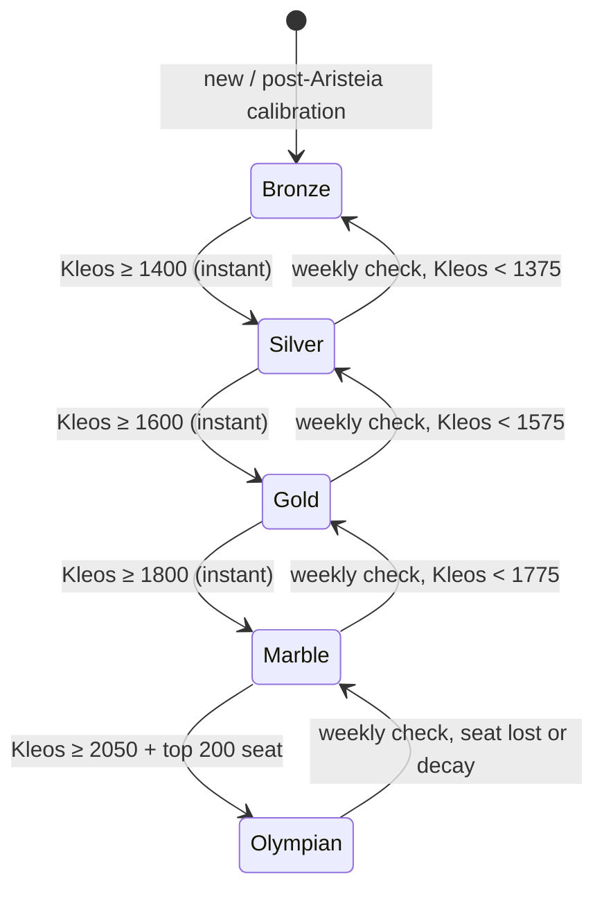
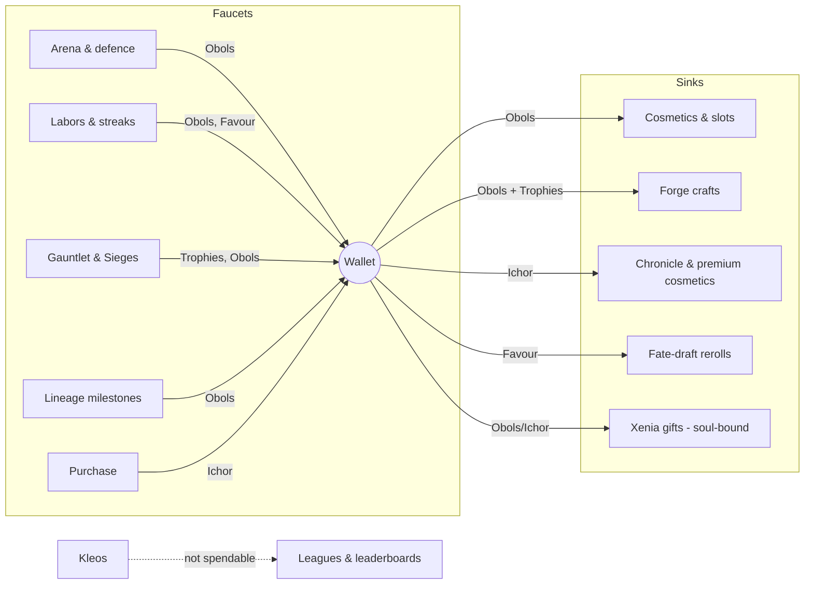
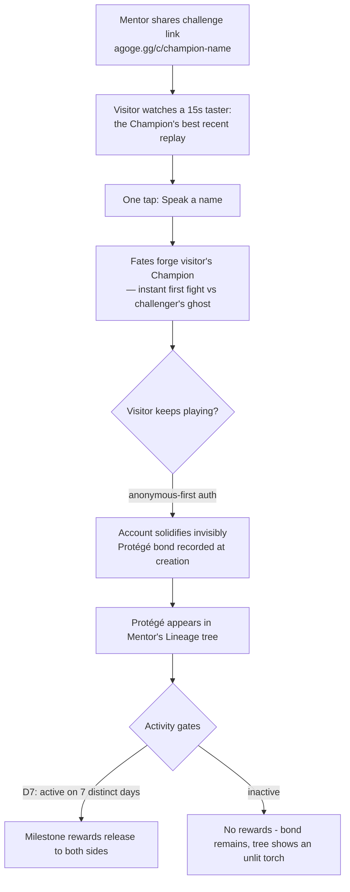

# AGOGE — Game Design Document II: Modes, Meta, Economy & Social

> **Scope.** This document owns AGOGE's meta-systems: PvP and PvE modes, tournaments, the Phalanx (guild) layer, the daily ritual, Sagas and events, achievements, the economy, the Forge, social and virality systems, and the veteran endgame. Combat resolution, stats, arsenal and level-up progression are owned by `02-gdd-core.md`; real-money pricing and the LiveOps calendar are owned by `07-monetisation-liveops.md`; technical delivery is owned by `04-technical-architecture.md` and `05-database-schema.md`. All names and anchor numbers conform to `00-vision.md`, the canonical contract.
>
> **Reading key.** A **Mentor** is the player. A **Champion** is their fighter. A **Phalanx** is a guild (cap 30). A **Saga** is an 8–10 week season. **Vigor** (6/day, bank cap 12) is the ranked-fight token. **Kleos** is glory — the Glicko-2 rating that is also the game's prestige score.

---

## 1. PvP — The Arena

The Arena is the heartbeat: the place a Mentor's six daily Vigor are spent, and the stage where Battle Plans (see `02-gdd-core.md`) are out-guessed. Everything in this section is asynchronous — you always fight a server-simulated **ghost** of another Champion, never a live opponent.

### 1.1 The Rival Board

On each daily reset the Arena presents a **board of six rivals**, one per daily Vigor — a deliberate 1:1 rhyme that makes the day's work legible at a glance. Each rival can be attacked **once per reset**. Defeating all six awards the **Clean Sweep** bonus (+20 Obols and a Stele tally).

Selection algorithm (all bands in Kleos rating points, using the conservative estimate μ − RD described in §1.2):

| Slot | Band vs your Kleos | Purpose |
|---|---|---|
| 2 × **Beatable** | −120 to −40 | Guaranteed wins for confidence and streak upkeep; low Kleos yield |
| 2 × **Even** | −40 to +40 | The real mindgame fights; standard Kleos stakes |
| 2 × **Reach** | +40 to +150 | Upset opportunities; best Kleos and the +1 XP bonus for fighting up (`02-gdd-core.md`) |

Additional selection rules:

- Candidates are drawn from Champions active within 14 days, excluding your Phalanx-mates, your Protégés/Mentor, and anyone you fought in the last 3 resets (staleness guard).
- If a band is empty at the extremes of the ladder (very top or bottom), the band widens by 40 points per retry until filled; Olympians may therefore see boards of six near-peers.
- One **free board reroll** per day (replaces all unfought rivals); no purchasable rerolls — the board is never a monetisation surface.
- The board displays each rival's public loadout and *last-known* Battle Plan, per the bluffing rule in `02-gdd-core.md`. Scouting is free; certainty is not.

### 1.2 Kleos and Glicko-2

Kleos is a standard **Glicko-2** implementation with **one public number**: the Kleos figure shown everywhere (profile, leaderboards, rival board) is the rounded conservative estimate **μ − RD** — the same value matchmaking uses — so there is no separate hidden MMR (transparency is a feature, as with the Codex). The underlying μ/RD pair is inspectable in the rating detail panel for the curious.

| Parameter | Value | Rationale |
|---|---|---|
| Starting rating (μ) | 1,500 | Glicko-2 convention; leaves visible headroom in both directions |
| Starting deviation (RD) | 350 | New Champions swing fast toward their true level |
| Volatility (σ) | 0.06, τ = 0.5 | Conservative volatility damping suits a 6-fight/day cadence |
| Rating period | 1 day (batch update at daily reset) | Matches the async, appointment-based loop; simplifies replay determinism |
| RD floor | 60 | Even veterans keep some movement; the ladder never fossilises |
| RD inactivity growth | +6 per idle week, cap 250 | Returning casuals recalibrate quickly without free-falling |
| Provisional band | Until 10 rated fights **and** RD < 120 | Shown as **Unproven**: hidden from leaderboards, faces widened bands |

**Handling casuals is the design's centre of gravity**, not an edge case — the market research (`docs/research/market.md`) shows this genre lives on lapsed-and-returned players. Three protections:

1. **Matchmaking uses μ − RD**, the conservative estimate. A returning Mentor with inflated RD is matched slightly *down*, so their comeback week feels winnable while Glicko-2 re-converges.
2. **Ratings only move at fight time.** There is no passive decay of μ for absence at Bronze–Marble; you never log in to discover your number fell while you slept. (Olympian is the sole exception — see §1.5.)
3. **Unproven quarantine.** New and freshly-reborn (Aristeia) Champions cannot appear on veterans' boards as free Kleos piñatas until their rating has meaning.

### 1.3 Attack/defence asymmetry: zero-loss defence

When your ghost is attacked and loses, **you lose nothing**. No Kleos, no Obols, no streak, no visible dent. When your ghost *wins* a defence, you gain Kleos at **50% weight** plus 5 Obols, and the defence appears in your **Chronicle of the Night** feed at next login.

Formally: the attacker's Glicko-2 update applies at full weight in both directions; the defender's update applies at half weight on a win and **zero on a loss**.

Why this matters enough to bend rating purity:

- **Login dread is the retention killer.** In attack-loss ladders (classic Clash-style), every notification is potential bad news; lapsed players stay lapsed because returning means confronting losses. In AGOGE every overnight event is neutral-or-good: "your ghost held the line twice" is a *reward* for having built well, and a losing night simply doesn't exist. The research on MyBrute's appeal — "you always wanted to see what would happen the next day" — depends on tomorrow never being a punishment.
- **It protects the 5-minute player.** A Mentor who can only log in twice a week is attacked dozens of times between sessions. Symmetric ratings would grind them down purely for being absent, punishing the exact player pillar 3 protects.
- **It keeps bluffing healthy.** Because defence is free, Mentors happily leave bold, weird Battle Plans set overnight. Symmetric loss would push everyone to one cowardly meta-defensive plan, killing the mindgame.
- **The inflation cost is bounded and drained.** Half-weight defence wins plus zero-loss defence inject a small system-wide positive drift (modelled ≈ +8 to +12 mean Kleos per Saga at 6 fights/day). The end-of-Saga soft reset (§1.5) squashes ratings toward 1,500 and drains the drift on schedule. We accept mild intra-Saga inflation as the price of dread-free sleep; the reset makes it rigorous again every 8–10 weeks.

### 1.4 Revenge hooks

Every defence loss in your feed carries a **Reckoning** button: attack that Mentor back within 48 hours, outside your normal board, using one Vigor. A won Reckoning pays **+25% Kleos** and a distinctive replay flourish (the Herald bellows *"A RECKONING!"*). Rules: maximum 2 Reckonings per day; a Reckoning cannot itself be Reckoned (no infinite feud chains — feuds resolve in one round); the target is notified only if they lose, preserving zero-loss defence psychology. Reckonings are the single strongest re-engagement push notification we send (opt-in, see `06-ui-ux.md`).

### 1.5 Leagues and the Saga reset

Each Saga, every Champion climbs the five leagues by Kleos band:

| League | Kleos band | Notes |
|---|---|---|
| **Bronze** | < 1,400 | Cannot demote out of Bronze; floor league |
| **Silver** | 1,400 – 1,599 | |
| **Gold** | 1,600 – 1,799 | |
| **Marble** | 1,800 – 2,049 | Grand Agon qualification pool begins here (§2.2) |
| **Olympian** | ≥ 2,050 **and** global top 200 | Seat-limited; the 200th seat's rating is the live bar |

Promotion and demotion rules:

- **Promotion is instant**, checked at daily reset the moment your Kleos crosses a threshold. Promotion triggers a full-screen laurel ceremony and a 7-day **Promotion Shield** (no demotion possible).
- **Demotion is gentle**: checked only at the weekly checkpoint, requires being 25+ points below the threshold (hysteresis), and never occurs while shielded. You can have a bad Tuesday without your league flinching.
- **Olympian is the exception to all mercy**: seats are contested daily, and Olympians idle for 7+ days suffer −15 Kleos/week decay until they act or drop to Marble. The summit must be alive.

**End-of-Saga rewards** key off the highest league held for at least 7 consecutive days (an anti-snipe rule — you cannot buy a border with one lucky final hour):

| Highest league held ≥ 7 days | Obols | Cosmetic | Title (Saga-stamped) |
|---|---|---|---|
| Bronze | 200 | Saga banner ribbon | — |
| Silver | 400 | Silver profile border (Saga variant) | — |
| Gold | 700 | Gold border + weapon-trail VFX | *Gilded* |
| Marble | 1,200 | Marble border + victory pose | *Marble-Carved* |
| Olympian | 2,000 | Animated Olympian border + arena backdrop | *Olympian of the [God] Saga* |

**Soft reset formula**, applied at Saga rollover: `Kleos′ = 1500 + 0.4 × (Kleos − 1500)`, RD raised to `max(RD, 200)`. A 2,200 Olympian restarts at 1,780 (still Marble-bound, quickly re-proving); a struggling 1,100 Bronze restarts at 1,340 (a fresh climb, not a life sentence). The 0.4 multiplier drains a full Saga's asymmetry inflation while preserving enough ordering that week one is not chaos.

---

## 2. Tournaments

Tournaments are the spectacle layer: **prestige only, no XP** — deliberately, so tournament grinding can never substitute for the Vigor ritual, and so the mode stays pure theatre. This repeats MyBrute's most-loved secondary appointment (its daily tournament also granted no XP) while fixing its opacity.

### 2.1 The daily Agon

| Property | Value |
|---|---|
| Registration window | Opens at daily reset, closes 18 hours later |
| Entry cost | Free; consumes **no Vigor** |
| Bracket size | 64 per **Flight**; unlimited parallel Flights, seeded by Kleos so each Flight spans a narrow band |
| Resolution | Single elimination; one round resolved **hourly** for 6 hours after the window closes |
| Loadout | Your Champion fights with the loadout and Battle Plan set at registration — one held snapshot, so late edits don't retro-change early rounds |
| Spectation | Every bracket is a public URL; every fight a replay link. Live-ish tension via SSE/polling (`04-technical-architecture.md`) |
| Rewards | **Laurels** (see below) + Obols: champion 150, finalist 90, semi-finalists 50, quarter-finalists 25, all entrants 10 |

**Laurels** are not a currency (the economy has exactly five — §8). They are a *counted honour*: a lifetime tally of Agon round-wins and championships displayed on the profile and Stele, with cosmetic wreath tiers at 10 / 50 / 200 / 500 round-wins. Winning a Flight also grants a **Laurel Seal** — the Grand Agon ticket.

The Agon is designed to be a second, optional two-minute appointment: register in the morning (one tap — the previous day's setup is remembered), then check the bracket in the evening. Byes fill undersized Flights; a Flight below 8 entrants merges upward into the neighbouring band.

### 2.2 The Grand Agon

Each Saga closes with a 256-seat championship resolved across the final weekend, one round per hour in a published broadcast schedule (8 rounds), fully spectatable with a front-page bracket.

Qualification, in priority order:

1. **Laurel Seals** — every Mentor who won a daily Agon Flight during the Saga (one seat each, regardless of league; a Bronze giant-killer belongs on this stage).
2. Remaining seats by **Kleos ranking among Marble and Olympian** Champions at the qualification snapshot (72 hours before the bracket locks).

Rewards: the champion's statue enters the **Hall of Legends** (§11.2), plus the unique Saga title *Aristos of the [God] Saga*, an animated sigil, and 5,000 Obols; the top 16 receive an exclusive Forge recipe (§9). No XP, no power — the prize is being remembered.

### 2.3 Future direction: Phalanx Agons

Post-launch (see `08-roadmap.md`), the Agon system extends to teams: a weekly **Phalanx Agon** where guilds enter squads of 8, resolved as aggregate first-to-5 duel sets over a weekend bracket. It reuses the entire Flight/bracket/spectation machinery — the engineering marginal cost is low, which is why it is the designated first post-launch tournament expansion. Not in launch scope.

---

## 3. PvE — The Gauntlet of Labors

The Gauntlet is a **weekly 12-rung boss ladder**: authored fights against hand-built Champions with named modifiers. It is the game's build-experimentation sandbox and the primary **Trophies** faucet.

**Access and cost.** Gauntlet attempts cost **no Vigor** and award **no XP or Kleos**. Retries are unlimited and free. This is deliberate: the Gauntlet must invite tinkering ("what if I re-plan around a Guarded stance?") without ever competing with, inflating, or substituting for the ranked ritual. PvE serves experimentation precisely *because* it cannot mint PvP power — its currency (Trophies) buys only cosmetic craft at the Forge (§9).

**Boss design philosophy.** Every boss is an authored loadout that **teaches a counter to a live meta**. If telemetry (PostHog cohorts of winning loadouts) shows, say, Cestus combo-flurry dominating Gold league, within two weeks a rung features *Pyrrhos the Hundred-Handed*, a Cestus flurry boss whose rung modifier rewards Doru reach and counter builds — beating him is a playable lesson in beating the meta. Bosses are content *and* curriculum. Each boss's full loadout and Battle Plan are public (transparency pillar): the puzzle is answering it, not guessing it.

**Rung modifiers.** Each rung applies one named, one-line modifier on top of the boss, drawn from a design library of ~25. Examples:

| Modifier | Effect |
|---|---|
| *Bronze Skin* | Boss armour +3 |
| *Thin Air* | Your companions stay home this fight |
| *The Herald Counts Ten* | Fight ends at 10 exchanges; leader on damage wins |
| *Oath of Empty Hands* | Your weapon slots are sealed; skills and fists only |
| *Twin Shadows* | The boss fields two half-strength copies in sequence |
| *Molten Sand* | Both sides take 2 damage per exchange; races favour Tempo |

**Rewards — the Trophies curve.** First clear of each rung, per week:

| Rungs | Trophies each | Cumulative |
|---|---|---|
| 1–3 | 5 | 15 |
| 4–6 | 10 | 45 |
| 7–9 | 15 | 90 |
| 10 | 20 | 110 |
| 11 | 30 | 140 |
| 12 | 40 | 180 |

Rungs 1–8 are tuned for a competent mid-league Champion; 9–11 demand genuine counter-building; rung 12 is a weekly community event in itself (global first-clear feed, sharable replays). A full clear yields 180 Trophies/week; a casual clearing rung 6 banks 45.

**Rotation.** Rungs and modifiers refresh **weekly** (Monday, with the Siege — §4.2); the boss *cast* rotates **monthly**, with one returning "classic" boss per month voted by the community (a cheap, beloved LiveOps beat — see `07-monetisation-liveops.md`).

---

## 4. Phalanx — the guild layer

Guild obligation is the strongest D30+ retention force in the comparables research: people return for people. The Phalanx layer is therefore built to create *visible mutual reliance* — Siege maths where every member's contribution shows, wars where seven names carry the banner — without ever taxing the personal ritual.

### 4.1 Creation, roles, and the 30-cap

- **Creation**: 5,000 Obols (a meaningful sink — roughly a month of casual earnings, §8) plus a level-10+ Champion. Founder chooses name, sigil and banner colours from the free heraldry set.
- **Joining**: open, application-gated, or invite-only (setting per Phalanx). Applications carry the applicant's Tapestry link and a 140-character note.

| Role | Count | Powers |
|---|---|---|
| **Polemarch** | 1 | Everything: promote/demote, kick, war declarations, banner edits, disband; succession auto-passes to senior Lochagos after 30 days' absence |
| **Lochagos** | up to 5 | Accept applications, set Skirmish lineups, edit MOTD, start Siege weeks |
| **Hoplite** | remainder | Fight, donate to the banner fund, chat, appear on internal leaderboards |

**Why cap at 30?** Three reasons. (1) *Every name legible*: 30 rows fit on one screen; a member's Siege damage and war record are visible to all, which is the social pressure that powers participation. (2) *Siege and Skirmish maths*: the Titan's health (§4.2) is tuned so ~70% participation of 30 clears the weekly tier — at 100+ members, individual absence becomes statistically invisible and obligation dies. (3) *Skirmish meaning*: 7 champions/day from a roster of 30 means most actives fight most wars; from 200, wars belong to an elite and everyone else spectates their own guild. The cap matches the vision contract exactly and is not a growth-limiting compromise — it is the design.

### 4.2 Titan Siege — the chained Krios

Beneath the arena, the Titan **Krios** strains against his chains. Each week the Phalanx tries to beat him back down.

**Attack allocation — decision: separate Siege Marks, not Vigor.** Each member receives **2 Siege Marks per day, banking cap 4**. Justification: Vigor is the sacred personal ration ("a ritual, not a grind"); if guild raids consumed it, every Siege attack would be a ranked fight *not taken*, converting guild membership into a tax on personal progression and Kleos — the exact resentment loop that makes players quit guilds in mid-core games. Separate Marks also let us tune raid pacing (participation targets, boss HP) without ever touching the PvP ration, and they give lapsed-for-PvP players a lighter reason to log in ("just spend my Marks"). The cost is a second small token to explain; the Phalanx tab owns that explanation and Marks appear nowhere else in the game.

**The fight.** Spending a Mark simulates a fight against one of Krios's aspects (*Grasping Hand*, *Bronze Gaze*, *Heel of the Mountain* — each with a stated defensive bias, e.g. the Hand punishes thrown builds). Damage dealt in the sim becomes raid damage. Contribution is level-normalised — `raid damage = sim damage × (1 + 50/champion level)` — so a level-12 Hoplite's clean fight matters, and Sieges never pressure anyone to rush levels.

**Health pool and tiers.** Weekly reset each Monday. Tier maths anchor: 30 members × 70% participation × 2 Marks × 7 days ≈ **294 attacks**; a reasonable attack averages ~900 raid damage.

| Tier | Krios form | Health pool | Tuning intent |
|---|---|---|---|
| I | *Krios Stirring* | 260,000 | Clearable by a casual full Phalanx |
| II | *Krios Straining* | 600,000 | Needs ~85% participation or strong builds |
| III | *Krios Unbound* | 1,400,000 | Coordinated counter-building vs weekly aspect biases |
| IV | *Krios, Sky-Bearer* | 3,000,000 | Aspirational; expected by <5% of Phalanxes; global race feed |

A Phalanx fights one tier per week, chosen by the Polemarch/Lochagoi; clearing a tier before Sunday unlocks an immediate start on the next.

**Leaderboards.** Internal: member damage this week (the social engine — the table every Lochagos screenshots into chat). Global: Phalanx total Siege damage, weekly and per-Saga windows (Redis sorted sets, `04-technical-architecture.md`).

**Weekly reward chest**, delivered Monday, tiered by the deepest tier cleared; individual eligibility requires **≥ 4 Marks spent that week** (anti-freeloading, but low enough for a twice-a-week member):

| Cleared | Chest | Per eligible member |
|---|---|---|
| Tier I | Bronze Chest | 20 Trophies + 100 Obols |
| Tier II | Silver Chest | 35 Trophies + 200 Obols |
| Tier III | Gold Chest | 55 Trophies + 350 Obols + Siege-exclusive Forge recipe progress |
| Tier IV | Adamant Chest | 80 Trophies + 500 Obols + animated chain-break banner VFX |

### 4.3 Skirmish — the Phalanx war

Skirmish is **opt-in per war**: a Phalanx that just wants a chatroom and a Titan never sees a war screen. This protects small and casual guilds from obligation creep.

- **Cadence**: wars matchmake every Monday among opted-in Phalanxes, paired by a **hidden war MMR** (a Glicko-lite rating never displayed — hiding it prevents rating-anxiety and sandbagging; only the win-loss record is public).
- **The day**: each day, each side fields **7 champions**. Lochagoi set the lineup from volunteers by 22:00; unset slots auto-fill by rotation among opted-in members (nobody can be conscripted who didn't volunteer for the war). The server pairs the seven duels by Kleos seeding and resolves them as one hourly-revealed sequence; the **first side to 4 duel wins takes the day**.
- **The war**: **first to 4 day-wins takes the war** (maximum 7 days) — the daily rule fractally repeated, so one sentence teaches both.
- Skirmish fights cost nothing (no Vigor, no Marks — lineup slots are themselves the scarce resource), award no XP or Kleos, and use each champion's current loadout with a war-specific Battle Plan the member may pre-set (lineup mindgames are the strategic depth the Eternaltwin clan-war community demonstrably loves — `docs/research/community.md` §6).
- **War seasons** align to the Saga. End-of-Saga war rewards by wins: 3+ wars won → war-paint cosmetic set; 6+ → animated banner rims; top 20 Phalanxes by hidden MMR → *Sacred Band* title for all members who fought ≥ 8 war days.

### 4.4 Social glue

- **Phalanx Hall**: the guild's public page — banner, MOTD, member Stele highlights, Siege record, war record, and a rotating "Deed of the Week" (best member replay, pinned by a Lochagos).
- **Banner cosmetics**: heraldry layers (field, charge, crest, trim) unlocked via Siege chests, war seasons and the Forge; the banner renders behind both champions in any fight between Phalanx-mates' rivals and in war replays.
- **MOTD & wall**: Polemarch/Lochagos MOTD (280 chars); member wall messages under the safety defaults of §10.4.
- **Applications feed**: applicants' Tapestries visible; one-tap accept surfaces a welcome emote ceremony in the Hall.

---

## 5. The daily and weekly ritual

The ritual is the retention spine: **3 daily Labors + 6 Vigor fights + Eternal Flame**, all inside six minutes. Design rule inherited from the research: the dailies must *be* the fun, not chores bolted onto it — so every daily Labor resolves through fights you were going to take anyway.

### 5.1 Daily Labors — rotating template pool

Three Labors are drawn daily from a pool of ~20 templates, with constraints: at least two of the three must be **passive** (completed by simply playing normally), and all three must be completable within the day's 6 Vigor plus free modes. No Labor can require spending currency or fighting more than 6 times.

| # | Labor template | Type | Reward |
|---|---|---|---|
| 1 | Win 2 Arena fights | Passive | 40 Obols |
| 2 | Fight all 6 board rivals | Passive | 50 Obols |
| 3 | Win a fight against a Reach rival | Directed | 60 Obols |
| 4 | Win a fight using an Aggressive stance | Directed | 40 Obols |
| 5 | Win a fight using a Guarded stance | Directed | 40 Obols |
| 6 | Land a Trump condition in any fight | Passive | 40 Obols |
| 7 | Win a fight in under 30 seconds | Directed | 50 Obols |
| 8 | Win with a Doru / Xiphos / Cestus / Labrys / Akontia / Aspis equipped (discipline rotates) | Directed | 50 Obols |
| 9 | Win a fight with a companion surviving | Directed | 40 Obols |
| 10 | Change your Battle Plan before any fight | Passive | 30 Obols |
| 11 | Complete a Reckoning | Directed | 60 Obols |
| 12 | Clear any Gauntlet rung | Passive | 40 Obols |
| 13 | Clear a Gauntlet rung ≥ 7 | Directed | 60 Obols |
| 14 | Spend 2 Siege Marks | Passive (Phalanx) | 40 Obols |
| 15 | Register for today's Agon | Passive | 30 Obols |
| 16 | Watch any replay to the end | Passive | 30 Obols |
| 17 | Spectate one Agon bracket fight | Passive | 30 Obols |
| 18 | Send an emote or wall message | Passive | 30 Obols |
| 19 | Win 3 Arena fights | Directed | 60 Obols |
| 20 | Defend successfully once (checked overnight; auto-substituted if you were not attacked) | Passive | 40 Obols |

Templates 14 and 20 auto-substitute for Mentors without a Phalanx or without overnight attacks — no Labor can ever be impossible. Daily Labor income averages **~120 Obols**.

### 5.2 The weekly Epic Labor

One larger arc per week, always passive-cumulative (e.g. *"Win 12 Arena fights"*, *"Deal 5,000 total Siege damage"*, *"Clear 8 Gauntlet rungs"*). Reward: **150 Obols**, plus progress on the Saga's **Epic-chain**: every 4 Epic Labors completed within a Saga yields **1 Favour**, at most twice per Saga (`02-gdd-core.md` §6.3). This is the ritual's steady Favour faucet (a play milestone, per the vision contract — Favour is never purchasable) — combined with milestone levels and league promotions, enough to reroll roughly one in three Threads of Fate drafts. Scarcity is the point: rerolls are a considered veto, not a lever pulled every level.

### 5.3 The Eternal Flame streak

A day counts toward the Flame when you complete **any single Labor** (deliberately generous — the streak measures showing up, not output).

| Milestone (days) | Reward |
|---|---|
| 3 | 30 Obols |
| 7 | 1 Ember + 60 Obols |
| 14 | 100 Obols + *Flamebearer* sigil |
| 30 | 1 Favour + Flame cosmetic tier I (profile flame) |
| 60 | 2 Embers + 200 Obols |
| 100 | Title *Keeper of the Flame* + Flame tier II (animated) |
| 200 | 1 Ember + 300 Obols |
| 365 | *The Undying* title + Eternal Flame arena backdrop |

**Embers** (streak freezes, Duolingo-style): hold up to 2; auto-consumed on a missed day; earned at streak milestones and on the Chronicle's free track (`07-monetisation-liveops.md`). Never sold on their own — matching "no energy-for-money".

**Humane catch-up rules** (loss-aversion must motivate, never punish into quitting):

- Breaking a streak with no Ember drops you to the **previous milestone floor**, not zero (a 47-day streak falls to 30, not 0).
- Milestone *rewards* already earned are never revoked.
- **Rekindling**: returning after 7+ days away grants 3 days of double Labor Obols and a Herald welcome-back — absence is greeted, not shamed.

### 5.4 The six-minute budget

| Ritual step | Time |
|---|---|
| Open (PWA, <3 MB payload — `04-technical-architecture.md`), collect overnight feed | 20 s |
| Thread of Fate draft (on level-up days) | 20 s |
| Review board, adjust Battle Plan | 40 s |
| 6 Arena fights at 2× or skipped-to-verdict | ~2.5 min |
| Claim Labors, Flame tick | 15 s |
| Optional: Agon register, 2 Siege Marks | 50 s |
| **Total** | **≈ 5 min** |

Everything beyond this — spectating, Gauntlet tinkering, war lineups, Forge sessions — is voluntary depth, never ritual debt. Protecting this budget is a hard design constraint on every future feature: if it adds mandatory daily minutes, it is wrong.

---

## 6. Events & Sagas

### 6.1 Saga structure

A Saga runs 8–10 weeks under the patronage of a god who stamps the era: one **arena-wide modifier** (exactly one, readable in a sentence), a themed cosmetic line in shop/Chronicle/Forge, themed Gauntlet bosses, and Saga-stamped titles. One week before rollover, **Omens** appear — arena flavour and a full patch-notes preview of the next god's modifier, so theorycrafting begins before the meta arrives.

Rhythm of a 9-week Saga:

| Weeks | Beat |
|---|---|
| 1 | New god's rites: modifier live, soft reset, league placement rush |
| 2–3 | Settling meta; first themed Gauntlet cast |
| 4 | **Community goal** (§6.3) |
| 5–6 | Mid-Saga cosmetic drop; classic Gauntlet boss returns |
| 6 (weekend) | **Twisted Weekend** (§6.3) |
| 7–8 | Grand Agon qualification push; Omens of the next god |
| 9 (final weekend) | **Grand Agon**; rewards, rollover, soft reset |

### 6.2 The first four Sagas

| Saga | Modifier (the whole rule, as displayed) | Meta push | Cosmetic theme |
|---|---|---|---|
| **Saga of Ares** | *Blood Price:* all damage +15% | Faster fights; Grit and burst stocks rise; Guarded turtling weakens | Crimson bronze, boar-crest helms, spear-and-drum victory theme |
| **Saga of Athena** | *The Aegis:* the first critical hit against each Champion is negated | Crit-burst builds lose their alpha-strike; Measured stances and counter builds shine | Owl-grey and gold, olive-wreath sigils, marble-relief backdrops |
| **Saga of Hermes** | *Winged Sandals:* the higher-Tempo Champion always acts first and gains +10% evasion | Tempo becomes a duel-defining stat; Akontia and Cestus tempo builds surge | Sky-blue and silver, winged sandals VFX, messenger-scroll emotes |
| **Saga of Hephaistos** | *Unbreakable Grip:* no weapon or shield can be disarmed | Aspis and Labrys builds stabilise; disarm skills rotate out; anvil-solid metas | Ember-orange and iron, forge-spark trails, anvil victory pose |

### 6.3 Mid-Saga event beats

- **Community goal (week 4)**: a single arena-wide counter (e.g. *"10,000,000 victories under Ares"*) with a progress bar on the arena facade; success unlocks one free cosmetic for **every** account plus a lore vignette. Collective, no leaderboard, no losers — pure warmth.
- **Twisted Weekend (week 6)**: for 72 hours, a second, louder modifier stacks on the god's (e.g. under Ares: *"companions fight twice"*). Arena, Agon and Gauntlet all twist; Kleos stakes reduced to 50% weight for the duration so the chaos is playful, not rank-deciding.
- **Classic boss vote (week 5)**: the community votes back one retired Gauntlet boss — cheap content, high nostalgia (cadence detail in `07-monetisation-liveops.md`).

### 6.4 Rotating the meta without invalidating builds

Three hard rules keep Sagas fresh but fair:

1. **Modifiers reweight, never remove.** ±10–25% swings and single-rule twists; no Saga disables a discipline, skill or companion. Equipment is horizontal (`00-vision.md`), so a down-weighted build remains viable — merely off-meta.
2. **One modifier, one sentence.** If the rule needs a paragraph, it fails review. Readability is what lets a 5-minute player participate in the meta shift.
3. **Answers stay in reach.** Every Saga's advantaged archetypes must have counters already in the launch arsenal, and the Gauntlet teaches them (§3). Favour income (§5.2; supply in `02-gdd-core.md` §6.3) plus normal levelling lets any Mentor bend an existing Champion toward the meta without rebirth; Aristeia remains a choice, never Saga homework.

---

## 7. Achievements & rankings

### 7.1 The Stele of Deeds

The Stele is the permanent public record — lore-literally, glory etched in marble. Achievements grant **titles** (equipped beside your name, one at a time), sigils, and Obols on prestige tiers. Categories:

| Category | Scope | Example deeds → title rewards |
|---|---|---|
| **Deeds of Blood** | Combat feats | *First Blood* (win 1); *Hekatomb* (100 wins); *Giant-Slayer* (beat a rival 150+ Kleos above you) → **the Slayer** |
| **Deeds of Wit** | Battle Plan mastery | *Called It* (Trump triggers exactly as conditioned 25×); *The Feint That Won* (win via Feint gambit 50×) → **the Cunning** |
| **Deeds of the Odyssey** | Progression & Aristeia | *Thread by Thread* (reach level 30); *Born Again* (first Aristeia); *Twice-Woven* (2 Aristeia cycles) → **the Reborn** |
| **Deeds of the Hoard** | Collection / Codex | *Six Disciplines* (win with each weapon class); *Beastmaster* (own every Beast of Legend); *Codex Complete* (unlock every launch entry) → **the Collector** |
| **Deeds of Brotherhood** | Phalanx | *Chain-Breaker* (Tier III Krios cleared); *Sacred Band* (fight 25 war days) → **the Loyal** |
| **Deeds of Legacy** | Lineage | *First Torch* (1 active Protégé); *The Academy* (10 D7-active Protégés) → **the Mentor** |
| **Deeds of Devotion** | Ritual & streaks | *Week of Fire* (7-day Flame); *The Undying* (365 days) |
| **Apocrypha** | Hidden | Discovered oddities (*win a fight in which both companions flee*); revealed only when earned |

Roughly 120 achievements at launch; every category has a visible completion percentage feeding the Codex-completionist appetite the research identifies.

### 7.2 Leaderboard surfaces

All boards are Redis sorted sets (`04-technical-architecture.md`), each viewable through four scopes and three windows:

| Board | Scopes | Windows |
|---|---|---|
| Kleos (rating) | Global · League · Phalanx · Friends | Live · Saga |
| Arena wins | Global · League · Phalanx · Friends | Daily · Weekly · Saga |
| Agon laurels | Global · Phalanx · Friends | Daily (today's Flights) · Saga · Lifetime |
| Gauntlet depth (highest rung, fastest clear) | Global · Phalanx · Friends | Weekly · Saga |
| Siege damage | Phalanx-internal · Global (Phalanx totals) | Weekly · Saga |
| Skirmish record | Global (Phalanx) | Saga |
| Flame streak | Friends · Phalanx | Live |

Design rules: friends-scope is the default tab (comparisons against strangers demotivate; against friends they animate); Unproven Champions are hidden from global boards; every leaderboard row deep-links to that Champion's profile, Tapestry and latest replay — every board is a spectating funnel.

---

## 8. Economy

Five currencies, per the vision contract. Design intent: **bounded faucets, deep cosmetic sinks, zero convertibility into power, no player-to-player market.** All real-money pricing lives in `07-monetisation-liveops.md`; this section owns the in-game flows.

### 8.1 Faucets and sinks per currency

**Obols** (soft currency):

| Faucets | Amount | Sinks | Price anchors |
|---|---|---|---|
| Arena win / loss | 10 / 5 | Emote | 300 |
| Clean Sweep | +20 | Victory pose | 800 |
| Defence win | +5 | VFX palette | 1,200 |
| Daily Labors (3) | ~120 | Weapon skin | 1,500 |
| Epic Labor (weekly) | 150 | Arena backdrop | 2,500 |
| Agon placement | 10–150 | Full Champion skin | 3,000–4,000 |
| Siege chest (weekly) | 100–500 | Forge fees (§9) | 200–500 per craft |
| League end-of-Saga | 200–2,000 | Champion slots 3/4/5/6 | 8,000 / 15,000 / 25,000 / 40,000 |
| Lineage milestones (§10.1) | 50–150 | Phalanx creation | 5,000 |
| Streak milestones | 30–300 | Xenia gift purchases (§8.3) | catalogue price |

**Daily-earn budget (Obols)**: an engaged Mentor (6 fights, 3 Labors) earns **~185/day**; with weekly items amortised (Epic Labor, Siege chest, Agon runs), **~1,500/week, ~6,200/month**. A month of engaged play therefore buys one full Champion skin plus change, or banks a third of the third Champion slot — cosmetic desire always modestly outpaces income, which is what keeps Obols meaningful and Ichor attractive without ever gating power.

**One-off prestige faucets** sit outside this per-player budget by construction: the Grand Agon champion's **5,000-Obol** prize and its finalist tiers (§2.2) touch a handful of Champions per Saga — designed ceremony, not income.

**Ichor** (premium, purchase only): sinks are cosmetics, the Chronicle, and Champion slots — never power, rerolls, Vigor or entries. No Ichor→Obol exchange (a one-way premium bridge would let money buy every Obol sink at scale and trivialise the soft economy). Pricing in `07-monetisation-liveops.md`.

**Favour** (reroll token, never purchasable): faucets — milestone levels (5, 10, 15 …), the Epic-chain (+1 per 4 weekly Epic Labors, max twice per Saga, §5.2), streak day-30 milestone, league promotion (1 per league first reached per Saga), Aristeia lineage perk (+1/Saga); ≈18–20 over a full 1→50 cycle (`02-gdd-core.md` §6.3). Sink — Thread of Fate rerolls, exclusively.

**Trophies** (PvE material): faucets — Gauntlet (≤180/week), Siege chests (20–80/week), duplicate conversion (§9); budget ceiling ~260/week for a hardcore Phalanx member, ~60 for a casual. Sink — the Forge, exclusively.

**Kleos** (rating/prestige): faucet — ranked Arena fights (asymmetric, §1.3); "sink" — league placement and the Saga soft reset. Kleos is never spendable; it is the score of record.

### 8.2 Inflation controls

1. **Faucets are structurally bounded**: Vigor caps fight income; the Labor list caps quest income; Gauntlet Trophies are first-clear-only. There is no repeatable farm anywhere.
2. **Sinks refresh every Saga**: each god brings a themed cosmetic line priced in Obols and Trophies, and the Forge rotates recipes (§9) — old wallets always have somewhere new to go.
3. **Ladder sinks**: Champion slots (8k→40k) and Phalanx creation absorb veteran surpluses.
4. **Telemetry guardrail**: PostHog dashboards track median wallet age and size; design target is ≤10% month-on-month growth in the median engaged wallet. Breaching it triggers new sinks (never faucet nerfs — taking away income players have planned around is how trust dies).
5. **Kleos drains on schedule** via the soft reset (§1.5), so prestige inflation is also bounded.

### 8.3 No trading — and what exists instead

**There is no player-to-player trading at launch.** Rationale:

- **RMT and farms.** Any transferable value spawns real-money trading, bot farms and account theft. MyBrute's proxy-scripted pupil farms (`docs/research/community.md` §5) destroyed its ladder *without* trading; add trading and the same actors industrialise instantly.
- **Economy control.** Tradeable goods force pricing to emerge from a market we would then have to police (dupes, scams, mule accounts, regional arbitrage). A five-currency, no-trade economy is auditable by one designer with a dashboard.
- **Nothing needs it.** With horizontal gear and cosmetic-only sinks, trading would carry status goods only — precisely the goods RMT loves most.

**What exists instead — Xenia gifting** (named for the sacred guest-friendship): a Mentor may **send 1 gift per week** to a friend of ≥7 days' standing, chosen from a fixed catalogue of cosmetics and bought at full Obol/Ichor price at send time. Recipients accept a maximum of 3 gifts/week. Gifted items are soul-bound: never resellable, never Forge-convertible (no laundering path back to currency). Gifting keeps the warm social gesture — "I saw this pose and thought of your Champion" — while presenting zero surface to RMT. Xenia gifting ships with **Saga 2** (the first post-launch Saga — `07-monetisation-liveops.md` §5.4); the friends-list and friendly-duel foundations it builds on ship at launch.

### 8.4 Currency flow overview

---

## 9. The Forge (crafting)

Bronte's Forge is **cosmetic-only transmutation** — the Trophies sink and the collector's long game. No stat crafting, no gear upgrading, ever.

**Recipe types** (each craft also charges a small Obol fee, binding the two soft economies):

| Recipe | Inputs | Output |
|---|---|---|
| Palette transmutation | 60 Trophies + 200 Obols | Seasonal VFX palette (weapon trails, hit sparks) |
| Pose casting | 90 Trophies + 300 Obols | Victory pose from the current Saga's set |
| Backdrop raising | 300 Trophies + 500 Obols | Arena backdrop (multi-week project for most Mentors) |
| Sigil etching | 40 Trophies + 200 Obols | Profile/banner sigil variants |
| Masterwork (1 per Saga) | 600 Trophies + 500 Obols + Gold Siege recipe progress (§4.2) | Animated masterwork skin — the Saga's flex piece |

**Duplicate-to-Trophy conversion.** Any duplicate cosmetic unlock (from Chronicle tiers, achievements or event drops) converts to **25 Trophies** with one tap. Duplicates thus always have value, without any randomised acquisition existing anywhere (no loot boxes — duplicates arise only from overlapping fixed rewards, e.g. re-earning an achievement sigil post-Aristeia). Gifted items are excluded (§8.3).

**Seasonal rotation.** Each Saga retires the previous Saga's recipe set and introduces a themed one; one **master recipe** per Saga returns from the archive by community vote, so lapsed players can eventually finish a missed piece — anti-FOMO by design, mirroring the retroactive Chronicle (`07-monetisation-liveops.md`). Retired recipes are listed in the Codex with their return-eligibility, so nothing feels silently deleted.

---

## 10. Social & virality

### 10.1 Lineage — the challenge-link engine

The single most proven growth mechanic in this genre's history is MyBrute's "fight my brute" link; it died by proxy-farm abuse (`docs/research/community.md` §2, §5). Lineage keeps the dare and armours it.

**Flow:**

The recruit gets entertainment *before* commitment (the fight is the pitch), and the bond is struck at account creation — it can never be claimed retroactively or transferred.

**Reward track — capped, activity-gated, non-power.** Rewards release only after the Protégé passes the **D7 gate** (active on 7 distinct days), and each subsequent milestone requires the Protégé to have been active within the last 14 days when it is hit:

| Protégé milestone | Mentor receives | Protégé receives |
|---|---|---|
| D7 activity gate passed | 100 Obols + torch lit on Lineage tree | *Xenia Band* sigil + 100 Obols |
| Reaches level 5 | 50 Obols | 50 Obols |
| Reaches level 10 | *Torchbearer* sigil progress + 100 Obols | Choice of 1 emote |
| Reaches level 20 | 150 Obols + shared **Bond Boon**: matched-pair victory flourish visible in both Mentors' replays | Same Bond Boon |
| First Aristeia | *The Academy* achievement progress + unique tree ornament | *Worthy Pupil* title |

**Caps**: at most **3 new reward-bearing bindings per week and 10 per Saga** per Mentor. Links keep working beyond the caps — extra recruits still get their full new-player experience and appear on the tree, they simply yield no Mentor rewards. Lifetime tree size is unlimited (the tree itself is the trophy).

**Anti-farm design** — every lesson from the proxy-farm failure applied:

- **Non-power rewards only.** Obols, sigils, titles, cosmetic boons. A thousand fake Protégés cannot add a single point of Might or Kleos — industrial farming has no competitive payoff, which removes the *motive*, not just the method.
- **D7 activity gates.** Rewards follow sustained engagement, not signups. A script can create accounts; it cannot cheaply sustain 7 distinct active days per puppet past the behavioural checks below.
- **Per-device and per-IP caps**: max 2 reward-bearing bindings per device fingerprint or IP address per 30 days (MyBrute's first-pupil-per-IP rule, hardened and made a rolling window). Datacentre/VPN IP ranges never produce reward-bearing bindings (the recruit still gets a full, normal game — only the Mentor reward channel is silently withheld pending review).
- **Velocity and pattern flags**: bursts of bindings, shared device graphs, and correlated play-schedules queue for review; rewards release on a 48-hour delay so fraud can be unwound before payout.
- **No compounding XP — the fatal MyBrute mechanic (+1 master XP per pupil level-up, forever) is deliberately absent.** The track is finite per Protégé and per Saga.

### 10.2 Replays, sharing and spectating

- **Every fight is a URL.** Deterministic re-simulation (seed + simVersion + snapshots, `04-technical-architecture.md`) means a replay link is a few hundred bytes of truth, playable on any device, forever.
- **OG-image cards**: each replay URL serves a server-rendered 1200×630 card — both Champions posed, sigils, result banner (*"PYRRHA felled OKEANOS in 34s"*) — so a pasted link unfurls as a poster in Discord, X, WhatsApp and forums. The card carries a one-tap *"Face the victor"* challenge link: **every shared replay is a Lineage on-ramp.**
- **Spectating**: Agon and Grand Agon brackets are public pages with hourly reveals; the Gauntlet's rung-12 global first-clear feed and Krios Tier-IV race are spectator events; any profile exposes recent public replays (a privacy toggle can restrict to friends).
- **Theatre features** (slow-motion, frame-step, damage-log overlay) are Patron's Oath QoL — spectating itself is always free (`07-monetisation-liveops.md`).

### 10.3 Friends

Mutual-consent friends list (cap 200): friends-scope leaderboards (the default tab, §7.2), friendly duels (free, unranked, no rewards — pure showmatch with a shareable replay), Xenia gifting eligibility after 7 days, and Flame-streak visibility for gentle mutual accountability. Friend requests can be sent from any profile, replay page or Phalanx Hall.

### 10.4 Emotes, wall messages and safety defaults

- **Preset-first communication.** The default social vocabulary is ~40 curated **Herald's Phrases** and emote glyphs (praise, challenge, humour, respect — no negativity presets). Presets are localisation-proof and toxicity-proof.
- **Free text** exists only on Phalanx walls and between mutual friends, **opt-in**, filtered (deny-list + ML moderation queue), with one-tap report and block. Blocking removes the blocker from the blocked party's boards, boards' feeds and matchmaking candidate pools.
- **Defaults**: anonymous and fresh accounts have free text *off*, profile replays *public* (sharing is the growth engine), wall *friends-only*. Nothing about a child's or streamer's account invites contact by default.
- Names pass the same moderation pipeline at creation (`06-ui-ux.md` owns the flows).

---

## 11. Endgame — the veteran's twelve months

### 11.1 How the systems interlock

The endgame is not a mode; it is the lattice formed when the systems above start feeding each other. A veteran's year, assuming launch entry:

| Months | Dominant arc | Systems carrying it |
|---|---|---|
| 1–2 | First climb: Silver→Gold, first Phalanx, Flame to 60 | Arena, Labors, Gauntlet lower rungs |
| 2–3 | First Saga rollover: league rewards, first Grand Agon spectated, first soft reset re-climb | Leagues, Agon, Sagas |
| 3–5 | Level 30+: **first Aristeia decision** — rebirth for the lineage perk and a meta-tuned re-draft under the new god | Aristeia, Threads of Fate, Sagas |
| 4–6 | Phalanx maturity: Lochagos role, Tier III Krios, first war season, Masterwork craft | Titan Siege, Skirmish, Forge |
| 6–9 | The summit push: Marble held, Olympian contested, daily Agon Flights won → Laurel Seals → **first Grand Agon entered** | Leagues, Agon, Reckonings |
| 9–12 | Legacy: 10-Protégé Academy, Codex completion runs, second/third Aristeia cycles stacking +Favour perks, Hall of Legends candidacy | Lineage, Stele, Codex, Grand Agon |

Each arc hands momentum to the next: Aristeia resets the ladder climb precisely when climbing stales; the Phalanx carries motivation through mid-year; Grand Agon gives the rating grind a stage; Lineage converts veteran pride into new players; Codex completion (tracked on the Stele, fed by Forge seasons) gives collectors a horizon measured in Sagas. The failure mode this lattice is built against is MyBrute's: *"once the slot machine wore off, there was nothing to do."* Here, something is always two weeks from mattering.

### 11.2 Recommended additional systems (impact vs complexity)

Four additions selected for maximal retention-per-engineering-hour; recommended sequencing in `08-roadmap.md`.

**1. Rival of the Week.** Every Monday, each Mentor is paired with a **Rival** of near-identical Kleos and activity band. Both see a head-to-head widget: most wins against each other's ghosts by Sunday takes the duel (+100 Obols, Stele tally, *Rivals* replay reel). *Impact:* very high — a named nemesis is the strongest known re-engagement trigger, and it personalises the ladder for the mid-league majority whom global boards ignore. *Complexity:* low — one weekly pairing job, two counters, one widget; no new combat, no new economy. **Build first.**

**2. Hall of Legends.** A permanent, browsable museum: every Grand Agon champion's statue (posed skin snapshot), every Saga's Olympian top 10, record-book pages (longest Flame, deepest Gauntlet clears, greatest Reckoning upsets), each entry linking to the actual replays. *Impact:* high — it makes Kleos *permanent* (the lore promise of the Stele), gives the top 0.1% a reason to fight for immortality that spectators enjoy, and is superb shareable marketing. *Complexity:* low — static pages over data we already store; art cost only.

**3. Echo Duels.** Monthly, the Fates conjure an **Echo**: a snapshot of your own Champion from 30 days ago (or pre-Aristeia). One free fight, no stakes, shareable replay: *you versus who you were*. *Impact:* medium-high — it makes progression visceral in a game where power creep is deliberately flat, is a uniquely AGOGE share object ("I beat my old self"), and quietly showcases Aristeia's value. *Complexity:* trivial — combatant snapshots are already stored for every fight (`05-database-schema.md`); this is one query and a framing screen.

**4. Sparring Grounds.** Custom unranked duels with host-set rules (pick the arena modifier, force disciplines, ban companions) and challenge links. *Impact:* medium — it hands the community the tool that MyBrute's forums improvised with megathreads: player-run tournaments, coaching matches, content-creator formats; community-organised play is cheap longevity. *Complexity:* low-medium — parameterising the existing sim and reusing challenge-link plumbing; the only new surface is the rules picker. Ship after Rival of the Week and Hall of Legends.

Deliberately **not** recommended: player-run markets (§8.3), real-time fights (violates pillar 2), and any second raid boss before Krios Tier IV participation data justifies it.

---

*End of GDD II. Combat, stats and progression: `02-gdd-core.md`. Monetisation detail and the LiveOps calendar: `07-monetisation-liveops.md`. Wireframes and flows for every surface named here: `06-ui-ux.md`.*
