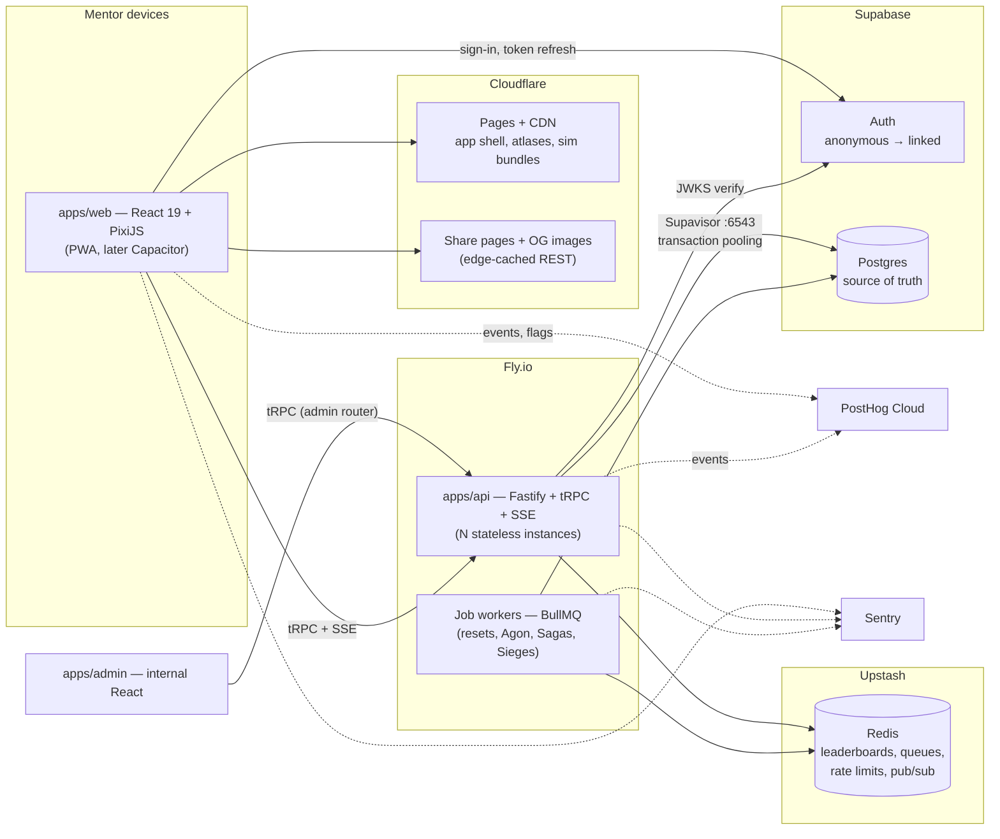

# AGOGE — Technical Architecture

> **Document:** `04-technical-architecture.md` · **Status:** Canonical for all technology decisions, within the bounds of `00-vision.md` §6.
> **Siblings:** database DDL, ERD and Redis keyspace live in `05-database-schema.md`; UI flows and accessibility in `06-ui-ux.md`; game rules in `02-gdd-core.md` and `03-gdd-systems.md`; pricing and LiveOps cadence in `07-monetisation-liveops.md`; build order in `08-roadmap.md`.

---

## 1. Architecture overview

### 1.1 Goals

AGOGE's architecture is designed against three hard constraints, in this order:

1. **Thousands of concurrent Mentors on commodity hardware.** An async auto-battler is ~95% request/response; "thousands of CCU" translates to low hundreds of requests per second with a millisecond-scale CPU hot path (the fight sim). The design must exploit that cheapness, not squander it.
2. **Maintainable by a tiny team.** One to three engineers must be able to hold the whole system in their heads, deploy daily, and debug production at 2 a.m. Every component must earn its place.
3. **Mobile without a rewrite.** The same codebase must ship as a responsive PWA on day one and a Capacitor-wrapped store app later (§12). No React Native, no second client.

### 1.2 Guiding principles

- **Server-authoritative everything.** The client sends intent; the server picks seeds, simulates fights, moves currency, and grants XP. The client is a renderer. This is simultaneously our anti-cheat foundation (§8), our cross-device save system (§5), and our mobile story (§12) — one decision, three problems solved.
- **Deterministic core.** All combat lives in `packages/core`, a pure TypeScript package with zero I/O that produces byte-identical results from `(seed, simVersion, snapshots, plans)` on any runtime. Replays, audits, and golden-master tests all fall out of this one discipline (§3).
- **Boring technology.** Postgres, Redis, Node, React. No edge-native databases, no bespoke consensus, no GraphQL federation. We take exactly one architectural risk — the deterministic sim contract — and pay for it with dullness everywhere else.
- **Stateless services, state in stores.** Every `apps/api` instance is interchangeable; all state lives in Postgres (truth) and Redis (derived/ephemeral). Horizontal scaling is "add an instance".
- **Buy the undifferentiated.** Auth, analytics, error tracking, payments and hosting are rented (Supabase, PostHog, Sentry, Stripe, Fly.io, Cloudflare). We build only what makes AGOGE AGOGE: the sim, the game services, and the admin tooling around them.

### 1.3 System diagram



Payments (Stripe Checkout + webhooks) terminate on a small REST surface of `apps/api` (§4.4); the future store-IAP path plugs into the same entitlement tables via the adapter interface in §12.3.

---

## 2. Monorepo

### 2.1 Layout

pnpm workspaces orchestrated by Turborepo (remote caching on, so CI never rebuilds an unchanged sim):

| Path | Contents | Runtime deps policy |
|---|---|---|
| `packages/core` | The deterministic fight sim: mechanics, derived-stat formulas, Battle Plan resolution, event-log emitter. Exports `simulateFight()`. | **Zero.** No I/O, no DOM, no Node APIs, no third-party packages. |
| `packages/protocol` | Shared contract: zod schemas for every tRPC input/output, fight-record and snapshot types, error codes, the analytics event enum (§9.3), config schemas. | zod only. |
| `apps/web` | React 19 + Vite. DOM for all UI; PixiJS canvas solely for the fight scene. TanStack Query + tRPC client. PWA shell. | Depends on `core`, `protocol`. |
| `apps/api` | Fastify + tRPC. All game services, SSE endpoints, REST edge (§4.4), rate limiting, ledger writes. | Depends on `core`, `protocol`. |
| `apps/admin` | Internal React admin (§10), served behind auth on a separate subdomain. | Depends on `protocol` only — it views fights through the api, never simulates. |
| `apps/workers` | BullMQ processors (§7). Thin shell over the same service layer as `apps/api` (imported as a package, so a job and a request mutate state through identical code paths). | Depends on `core`, `protocol`. |

### 2.2 Dependency rules

The arrows only point one way: `apps/* → packages/*`, never between apps, never from packages to apps. `core` imports nothing but itself. These rules are machine-enforced with dependency-cruiser in CI — a PR that makes `core` import `pg` fails before a human sees it.

### 2.3 TypeScript configuration strategy

- One root `tsconfig.base.json`: `strict: true`, `noUncheckedIndexedAccess: true`, `exactOptionalPropertyTypes: true`.
- **`packages/core` compiles with `"lib": ["ES2020"]` and no `@types/node`** — purity enforced at the type level: `Date`, `fetch`, `process`, and the DOM simply do not exist inside the sim. (Runtime bans are additionally linted, §3.3.)
- Project references + composite builds so `turbo run typecheck` is incremental; apps use `moduleResolution: "bundler"`, the api uses `NodeNext`.

### 2.4 Testing strategy per package

| Package | Test style | Detail |
|---|---|---|
| `core` | **Golden-master replay tests** | A frozen corpus of 250 recorded fights per simVersion (seed + snapshots + expected event log). CI re-simulates all and diffs byte-for-byte. Any accidental nondeterminism — a stray `Math.random`, a re-ordered map iteration — fails instantly. New simVersions freeze a new corpus. |
| `core` | **Property tests** (fast-check) | Invariants across randomised snapshots: HP never negative; every fight terminates within the 3,000-tick cap (`02-gdd-core.md` §4.1); running the same inputs twice is identical; swapping attacker/defender with the same seed produces the mirrored fight; total damage dealt equals total HP lost. |
| `protocol` | Schema round-trips | Every schema parses its own serialised output; error-code exhaustiveness. |
| `api` | **Integration** | Real Postgres + Redis in docker (CI services). Covers transactions, idempotency-key replay, Vigor spend races, ledger invariants. Responses must parse against `protocol` schemas — the contract test. |
| `web` | Component + **Playwright e2e** | Vitest + Testing Library for components; Playwright against a preview deploy for the golden paths: name → first fight in under 10 seconds, replay renders, draft pick persists, Stripe test-mode purchase grants entitlement. |
| `admin` | Smoke e2e | Login, player lookup, audited grant. |

---

## 3. The deterministic sim core

### 3.1 PRNG discipline

- **mulberry32**, one instance per fight, seeded by the server from a CSPRNG at challenge time. The 32-bit state is tiny, copyable, and fast (~1 line of code — no dependency).
- The PRNG is **passed explicitly** through every function that needs randomness. There is no module-level RNG, so call order is visible in signatures and refactors cannot silently reorder draws.
- Separate named streams derived from the fight seed (`splitmix32(seed ^ streamId)`) for orthogonal subsystems — combat rolls vs. flavour rolls (victory pose selection, dust-cloud variants) — so adding cosmetic variety never perturbs combat outcomes.

### 3.2 Integer maths rules

All combat quantities — HP (`50 + 6 × Grit + 2 × level`), damage, intervals, tick counters, derived stats (initiative, interval, counter, combo, block, accuracy, disarm, armour, crit) — are **integers**. Percentages are integer basis points (block 1 250 = 12.5%); multiplications round with a single canonical helper (`mulBp(value, bp)` = floor). Floating point is banned in the sim: cross-platform float drift is the classic determinism killer and MyBrute-style stats are integers anyway. The sim advances in **abstract integer ticks** — not wall-clock time: a full fight resolves in 400–1,200 ticks (hard cap 3,000, `02-gdd-core.md` §4.1), and the renderer paces the event log into the canonical 30–45 s presentation, its frame rate fully detached from the tick count (2× speed and skip are pure presentation).

### 3.3 Lint enforcement

A dedicated ESLint config applies to `packages/core` only, failing CI on: `Math.random`, `Date`, `performance.now`, `Intl`/`toLocale*`, `Array.prototype.sort` without an explicit total-order comparator, `for…in` over objects, `Object.keys`/`entries` iteration feeding game logic (a curated allow-list exists for sorted-then-iterated cases), and any import outside the package. Combined with the no-Node/no-DOM tsconfig (§2.3), determinism is enforced by three independent layers: types, lint, and golden masters.

### 3.4 The simVersion contract

`simVersion` is a **monotonically increasing integer** stamped on every fight row. It bumps when — and only when — an outcome-affecting change ships: mechanics code, derived-stat formulas, or sim-relevant content config (weapon stats, skill triggers, beast behaviour). VFX timing, animation polish and commentary text do not bump it.

The contract:

1. **Every fight replays forever on the rules it was fought under.** The build pipeline emits each sim as a self-contained versioned bundle — `sim/v14.mjs`, ~40 KB — published to the CDN as an immutable hashed asset. `apps/api` pins the current version at deploy; `apps/web` lazy-loads the bundle matching the fight's stored `simVersion` (`import(\`/sim/v${n}.mjs\`)`). Old bundles are kept forever; at 40 KB each, a decade of weekly balance patches costs less than one arena backdrop.
2. **Belt and braces: the event log is stored too.** Per the research consensus, we persist both seed (for verification and audit re-simulation, §8.6) and the computed event log (so playback survives even a hypothetical lost bundle, and share pages can render without pulling a sim).
3. **Balance patches respect the Saga.** Outcome-affecting bumps land at Saga rollover wherever possible (see `03-gdd-systems.md` §6.4 on rotating the meta); a mid-Saga bump is an exceptional, announced event. New fights always use the current version; nothing retroactively changes a recorded fight.
4. **Each simVersion freezes its golden-master corpus** (§2.4), so we can prove at any time that `v12` still behaves exactly as `v12` did.

### 3.5 Fight record shape

The canonical record (columns and indexes in `05-database-schema.md`):

```ts
interface FightRecord {
  id: string;                    // uuid — the shareable replay identity
  mode: 'arena' | 'agon' | 'gauntlet' | 'siege' | 'skirmish' | 'friendly';
  seed: number;                  // uint32, server-chosen
  simVersion: number;            // integer, see §3.4
  attacker: ChampionSnapshot;    // full frozen loadout, stats, Battle Plan
  defender: ChampionSnapshot;    //   — never joined back to live rows
  result: {
    winnerId: string;
    ticks: number;               // 400–1,200 typical
    hpRemaining: [number, number];
    xpDelta: [number, number];   // 2 win / 1 loss (+1 vs higher-rated)
    kleosDelta: [number, number];
    obolsDelta: [number, number];
  };
  eventLog: FightEvent[];        // JSONB: [tick, actor, event, payload]
  createdAt: string;             // UTC
}
```

Snapshotting both combatants at fight time is the Super Auto Pets "ghost" pattern: the defender levelling up tomorrow can never break today's replay, and the defender is never disturbed (zero-loss defence, `03-gdd-systems.md` §1.3).

### 3.6 Client replay pipeline

```mermaid
sequenceDiagram
  participant M as Mentor's browser
  participant A as apps/api
  participant P as Postgres
  M->>A: fight.challenge { rivalId, battlePlan, requestId }
  A->>P: BEGIN — spend 1 Vigor, load snapshots, check board
  A->>A: seed = csprng32(); simulateFight(seed, snapshots, plans) @ current simVersion
  A->>P: INSERT fight record + ledger rows + Kleos/XP deltas — COMMIT
  A-->>M: FightRecord
  M->>M: import(`/sim/v${simVersion}.mjs`) (CDN, usually cached)
  M->>M: re-simulate — assert event log matches (dev builds)
  M->>M: render event log in PixiJS (1×/2×/skip)
```

The renderer consumes the **event log**, not sim internals — the sim emits semantic events (`weapon_swing`, `blocked`, `beast_pounce`, `trump_triggered`) and the PixiJS scene maps them to animation. A shared replay URL follows the same pipeline via the public REST fetch (§4.4) with no auth required.

---

## 4. API design

### 4.1 Why Fastify + tRPC

The game API is private — consumed only by our own client and admin. tRPC gives end-to-end type inference across the monorepo with zero codegen; Fastify supplies the fast, unopinionated HTTP layer, schema-validated at the edge (§8.3). We do not need OpenAPI, GraphQL, or REST semantics for the game surface; the handful of genuinely public endpoints get plain REST (§4.4).

### 4.2 Router map

One tRPC router per game system, mounted under a single `appRouter`. Representative procedures (`q` = query, `m` = mutation; all mutations take a `requestId` idempotency key, §4.3):

| Router | Procedures (examples) |
|---|---|
| `auth` | `me` q · `deleteAccount` m — sign-in itself is client ↔ Supabase (§5); the api only verifies JWTs |
| `champion` | `list` q · `create { name }` m · `get { championId }` q · `setBattlePlan { stance, gambit, trump }` m · `setLoadout` m · `tapestry` q |
| `arena` | `board` q (today's six rivals) · `history { cursor }` q |
| `fight` | `challenge { rivalId, battlePlan }` m · `get { fightId }` q · `recent { championId, cursor }` q |
| `fate` | `currentDraft` q · `pick { draftId, offerIndex }` m · `reroll { draftId }` m (spends Favour) |
| `labors` | `today` q · `claim { laborId }` m · `epic` q · `streak` q · `useEmber` m |
| `gauntlet` | `week` q · `attempt { rung }` m · `firstClears` q |
| `phalanx` | `get`/`create`/`join`/`leave` · `siege.status` q · `siege.attack` m · `skirmish.volunteer` m · `skirmish.day` q |
| `tournament` | `agonToday` q · `enter` m · `bracket { agonId, cursor }` q · `grandAgon` q |
| `season` | `currentSaga` q · `chronicle` q · `claimTier { tier }` m · `leaguePlacement` q |
| `shop` | `catalogue` q · `purchaseWithObols { sku }` m · `checkout { sku }` m (returns Stripe Checkout URL) · `entitlements` q |
| `lineage` | `link` q (mints challenge URL) · `proteges` q · `claim { rewardId }` m |
| `leaderboard` | `get { scope, cursor }` q — scopes per `03-gdd-systems.md` §7.2, served from Redis sorted sets |

A full procedure, showing the conventions:

```ts
challenge: protectedProcedure
  .input(z.object({
    rivalId: z.string().uuid(),
    battlePlan: BattlePlanSchema,        // from @agoge/protocol
    requestId: z.string().uuid(),        // idempotency key
  }))
  .output(FightRecordSchema)
  .mutation(({ ctx, input }) => arenaService.challenge(ctx.userId, input)),
```

### 4.3 Idempotency for mutations

Every mutation carries a client-generated UUID `requestId`. The service layer wraps the mutation in a transaction that first inserts `(user_id, request_id)` into an `idempotency_keys` table (unique constraint, response payload stored, 48 h retention per `05-database-schema.md` — Redis fast-paths the first 24 h). A retried request — flaky mobile network, double-tap, service worker replay — returns the stored response instead of spending a second Vigor. This one convention makes the whole API safe to retry blindly, which the client's mutation layer does (3 attempts, exponential backoff).

### 4.4 Pagination, caching, and the REST exceptions

- **Pagination:** cursor-based everywhere (`{ cursor?, limit? }`, limit capped at 100, default 20); the cursor is an opaque base64 of `(sortKey, id)`. No offset pagination — fight history and leaderboards are exactly the tables where OFFSET dies.
- **Client caching:** TanStack Query with per-resource `staleTime` — arena board 60 s, leaderboards 30 s, shop catalogue 1 h, fight records **infinite** (immutable).
- **Server caching:** fight records served with `ETag` + `Cache-Control: public, max-age=31536000, immutable`; leaderboard pages cached 30 s in Redis; everything user-specific is `private, no-store`.
- **REST is exposed only where the consumer is not our client:**

| Endpoint | Purpose |
|---|---|
| `GET /f/:fightId` | Share page: minimal HTML with OG meta tags, edge-cached at Cloudflare, hydrates into the replay viewer |
| `GET /og/:fightId.png` | OG card image (satori + resvg render of the two Champions and the verdict), generated once, cached at the CDN |
| `GET /healthz`, `GET /readyz` | Load-balancer probes |
| `POST /webhooks/stripe` | Signature-verified payment events → entitlements |
| `GET /sse/*` | Server-sent events (§6.2) |

---

## 5. Auth & save

### 5.1 Anonymous-first, upgraded losslessly

The 10-second onboarding (pillar 1) is only possible because **Supabase anonymous sign-in creates a real authenticated user before the Mentor types anything but a name**. Flow:

1. First load → `signInAnonymously()` → real `user_id`, real JWT. Champion creation and the first fight run against this identity. (Abuse guard: anonymous sign-ups rate-limited per IP, §8.4.)
2. At an **emotional peak** — first Agon entry, level 10, first Chronicle glance — the client offers the upgrade: `linkIdentity()` for OAuth (Google, Apple, Discord) or `updateUser()` for email OTP. **The `user_id` never changes**, so every row the Mentor owns carries over untouched. No migration, no merge screen.
3. Purchases **require** a linked account (you cannot pay from an anonymous identity that a cleared cache would orphan) — which conveniently makes the monetisation funnel double as the account-linking funnel.

Unlinked anonymous accounts idle for 180 days are garbage-collected by a scheduled job (§7; retention policy in `05-database-schema.md` §5.2).

### 5.2 Sessions in browser and Capacitor

The Supabase JS client manages the JWT + refresh-token pair with auto-refresh; storage is a pluggable adapter — `localStorage` in the browser today, Capacitor `SecureStorage` in the wrapped app later, with no other code changing. `apps/api` verifies JWTs **locally against Supabase's JWKS** (cached, rotated) — no network hop per request — and derives `ctx.userId` for every procedure.

### 5.3 Cloud save by construction

There is **no client save file, therefore no sync problem**. The server is the single source of truth: a "save" is simply the Mentor's rows in Postgres, keyed by `user_id`. Signing in on a second device *is* the cloud-save restore. This is a deliberate consequence of server authority — the entire class of save-conflict, clock-tamper and local-edit exploits does not exist in AGOGE, and the future Capacitor install has no local-save migration to perform.

### 5.4 Auto-save semantics

Every mutation is one Postgres transaction: Vigor spend + fight insert + ledger rows + rating delta commit or roll back together. The client renders **optimistically** (TanStack Query optimistic updates — the draft pick appears instantly, the Obol counter ticks up) and reconciles with the server response; on error the cache rolls back and a toast offers retry (safe, per §4.3). There is no offline mutation queue at MVP — fights need the server anyway, and a clean failure beats a stale queue.

---

## 6. Real-time strategy

### 6.1 Honest requirements

AGOGE precomputes everything. Nothing in the core loop needs sub-second delivery. The genuinely live surfaces are: the Agon bracket during its six hourly reveals, the Grand Agon spectacle, Titan Siege damage bars, Skirmish daily reveals, and "you were challenged" toasts. All are **one-way, server → client**, at minute-to-hour cadence.

### 6.2 Default: polling + SSE

- **Polling** covers most of it: the arena board, Siege status and leaderboards refresh with TanStack Query (30–60 s stale times) — invisible infrastructure, zero connections held.
- **SSE** covers the live-window surfaces: `GET /sse/agon/:agonId` (bracket reveals), `GET /sse/siege/:phalanxId` (damage ticks during play sessions), `GET /sse/inbox` (challenge/revenge toasts). SSE endpoints live on `apps/api` behind the same auth; events are fanned out via Redis pub/sub so any instance can serve any stream. SSE costs us no library weight, proxies trivially through Cloudflare, and auto-reconnects natively.

### 6.3 Upgrade path: Socket.IO, not Supabase Realtime

When Phalanx chat and live Grand Agon spectating ship (post-MVP, see `08-roadmap.md`), we add **Socket.IO with the Redis adapter** on the existing api instances — rooms per Phalanx and per bracket, horizontal scale via the adapter, no new vendor.

**Supabase Realtime is explicitly not the plan at scale.** Its Pro tier allows 500 concurrent connections, with overage priced at $10 per 1 000 peak connections and $2.50 per million messages; a few thousand CCU all holding sockets is a recurring bill for a capability Socket.IO gives us at marginal cost on hardware we already run — and its DB-change-centric model fits row sync, not bracket-reveal choreography. Same reasoning excludes Ably (reliability we don't need yet) and Durable Objects (~150 practical connections per object and a new platform dependency).

---

## 7. Jobs & scheduling

### 7.1 Clock discipline

- **All server time is UTC.** Every timestamp is `timestamptz`; the **game day boundary — the daily reset — is 00:00 UTC.** Clients render countdowns from a server-sent epoch, never the device clock.
- The 00:00 UTC anchor makes the canonical day elegant: Agon registration opens at reset and closes 18 h later (18:00 UTC); its six hourly rounds resolve 19:00–00:00, crowning the victor exactly at the next reset. Skirmish lineups lock at 22:00 UTC. Titan Siege pools reset Mondays 00:00 UTC. Saga rollover lands on a final-weekend Sunday reset (`03-gdd-systems.md` §6.1).

### 7.2 Queues

BullMQ on Upstash Redis; processors run in `apps/workers` (two small instances, § 11). Repeatable jobs use deterministic job IDs so a duplicate schedule collapses into one execution.

| Queue | Schedule | Work |
|---|---|---|
| `daily-reset` | 00:00 UTC | Grant 6 Vigor (bank cap 12) to active Champions in batches; build each Mentor's six-rival board; rotate daily Labors; batch Glicko-2 rating update; league promotion checks + Promotion Shields; Eternal Flame streak advance/Ember consumption; expire idle anonymous accounts (180 d) |
| `agon-bracket` | 18:00 UTC | Close registration, seed the single-elimination bracket, enqueue round 1 |
| `agon-round` | Hourly 19:00–00:00 | Simulate the round's fights via `core`, persist records, publish SSE reveals, enqueue next round |
| `saga-rollover` | Scheduled per Saga config | Grand Agon finale, league rewards, Kleos soft reset (`1500 + 0.4 × (Kleos − 1500)`), Chronicle closeout, new Saga activation |
| `siege-tick` | Every 15 min | Aggregate Titan Siege damage into tier progress, publish SSE, evaluate tier crossings; Monday 00:00 pool reset |
| `skirmish-day` | 22:00 UTC + hourly reveals | Auto-fill lineups by rotation, pair the seven duels by Kleos seeding, resolve and reveal hourly |
| `lineage-gates` | 02:00 UTC | Evaluate Protégé D7 activity gates; matured, capped rewards are released by the 15-minute `lineage-release` job (`05-database-schema.md` §4.4) |
| `economy-audit` | 03:00 UTC | Ledger invariant checks + anomaly detection (§8.7) |
| `archive-fights` | Nightly + monthly | Null `event_log` on fights older than 35 days; once partitioning lands, export partitions older than 12 months to R2 as JSONL (retention plan in `05-database-schema.md` §5.1) |

### 7.3 Idempotent job design & failure policy

- **Deterministic job IDs** (`daily-reset:2026-08-01`, `agon-round:2026-08-01:3`): re-enqueueing is a no-op.
- **Every step is a resumable upsert.** The daily reset processes Mentors in keyset-paginated batches of 1 000, each batch one transaction recording a high-water mark in `job_runs`; a crash at batch 412 resumes at 413, and no Mentor is double-granted Vigor (the grant is `INSERT … ON CONFLICT DO NOTHING` on `(user_id, game_date)`).
- **Retry:** 5 attempts, exponential backoff from 30 s; then dead-letter queue + Sentry alert + admin panel surface (§10). Queue depth and job latency are first-class metrics (§9.1) — a stuck `agon-round` pages before Mentors notice a frozen bracket.

---

## 8. Security & anti-cheat

### 8.1 Threat model

Async PvP against snapshots is the most securable competitive genre — **if the client never reports outcomes**. What we defend against:

| Threat | Vector | Primary mitigation |
|---|---|---|
| Forged fight results | Modified client / replayed traffic | Server-only simulation (§8.2) |
| Vigor bypass | Console calls, request replay | Server-side Vigor ledger + idempotency keys; anomaly flag on out-of-band calls |
| Scripted grinding / scraping | Bots | Rate limits (§8.4), behavioural anomaly scoring |
| Lineage/referral farming | Disposable multi-accounts | Non-power rewards by design, caps + D7 gates, clustering (§8.5) |
| Kleos win-trading | Colluding feeder accounts | Rival board is server-chosen (no opponent picking outside it), staleness guard, fight-graph analysis |
| Economy exploits | Bugs, dupes, race conditions | Append-only ledger + invariants (§8.7), transactions, idempotency |
| Account takeover | Credential stuffing | Supabase Auth (verified email, OAuth), per-IP auth limits |
| Injection / IDOR | Malicious input | zod at the edge, parameterised queries only, ownership checks in every service, RLS backstop (§8.9) |
| Cost attacks | Hammering public replay endpoints | CDN-cached immutable responses, per-IP buckets at origin |

### 8.2 The foundation: server-side-only simulation

The client sends `fight.challenge { rivalId, battlePlan }` — intent, nothing more. The server validates the rival is on today's board, spends Vigor transactionally, picks the seed from a CSPRNG, runs `packages/core`, and persists the record. The client receives a finished fight and animates it. **There is nothing on the client worth hacking except pixels.** Every other anti-cheat measure is defence in depth on top of this.

### 8.3 Input validation

Every tRPC input is a zod schema from `packages/protocol` — parsed, not trusted, at the process boundary. Champion names pass a dedicated validator (length 2–20, Unicode letter classes, profanity list, homoglyph normalisation for impersonation). Fastify's own JSON-schema layer rejects malformed bodies before tRPC runs. Nothing user-supplied ever reaches SQL except through parameterised queries.

### 8.4 Rate limiting

Token buckets in Redis (atomic Lua), enforced as Fastify middleware before tRPC:

| Bucket | Limit |
|---|---|
| Global per user | 120 req/min |
| Global per IP | 600 req/min |
| `fight.challenge` per user | 12/min (the board is six rivals; this is generous headroom, hard ceiling) |
| Anonymous sign-ups per IP | 20/day, with velocity alarms to the review queue |
| Public replay fetch per IP (origin) | 60/min (the CDN absorbs legitimate virality) |

Limits return `429` with `Retry-After`; the client backs off silently.

### 8.5 Multi-account & referral-farm detection

MyBrute's ladders died to proxy-scripted pupil farms; Lineage is designed so farming is *pointless* (capped, D7-activity-gated, non-power rewards — sigils, Obols, titles) and detection makes it *expensive*:

- **Signals:** shared IP/subnet + coarse device fingerprint (screen class, UA, timezone) clustering; signup-time bursts per IP; disposable-email domains at link time; fight-graph analysis (accounts whose fights disproportionately benefit one beneficiary); Protégé cohorts with identical behavioural fingerprints.
- **Policy: score, don't insta-ban.** Scores accumulate on the account; thresholds gate Lineage reward release (a flagged Protégé simply never matures past the D7 gate) and enqueue the cluster for human review in the admin panel (§10). Hard bans are always human decisions with reason codes.

### 8.6 Replay audit

Determinism is itself an audit tool: any stored fight can be re-simulated from `(seed, simVersion, snapshots)` and diffed against the stored result and event log. A nightly job re-simulates a 1% random sample plus 100% of fights involving flagged accounts. A mismatch means either tampering or a server bug — both page an engineer. This is our defence against ourselves as much as against cheats.

### 8.7 Economy ledger

Every currency movement — Obols, Ichor, Favour, Trophies (Kleos is a rating, not a balance) — writes an **append-only row**: `(user_id, currency, delta, balance_after, source, ref_id, created_at)`. Balances are derivable, never edited. The nightly `economy-audit` job verifies `Σ deltas = balance` per account, hunts duplicate `ref_id`s and negative balances, and flags quantile outliers (Obols/day ≥ p99.9 of cohort) to the admin economy dashboard. Faucet/sink totals feed the charts in §10. Full table design in `05-database-schema.md`; faucet/sink budgets in `03-gdd-systems.md` §8.

### 8.8 OWASP basics & secrets

- Strict security headers via `@fastify/helmet`; CSP allows `self`, PostHog and Sentry ingest only; CORS locked to the app origins; auth cookies (where used) `httpOnly; Secure; SameSite=Lax`.
- Dependency audit (`pnpm audit` + Renovate) in CI; lockfile integrity enforced.
- **Secrets never touch the repo.** Fly.io secrets for runtime (Supabase service key, Stripe keys, Redis URL); GitHub Environments for deploy credentials; quarterly rotation; the Postgres role used by the api has no DDL rights.

### 8.9 RLS posture on Supabase

`apps/api` and `apps/workers` connect with the **service role** through Supavisor — the service layer is the authorisation authority, and every procedure checks ownership explicitly. RLS is nevertheless **enabled on every table, deny-by-default**, as defence in depth: the browser holds only the anon key (used for Auth flows), so even a leaked anon key or a future direct-read feature cannot expose another Mentor's rows. Policies mirror the service layer's ownership rules and are tested in api integration tests.

---

## 9. Observability & analytics

### 9.1 Logs, traces, metrics

- **pino** structured JSON on api and workers, with PII redaction paths configured (emails, IPs hashed at the logger).
- **OpenTelemetry** tracing with `@opentelemetry/instrumentation-pino` injecting `traceId`/`spanId` into every log line — logs and traces correlate by construction. Traces sample at 10%; errors always.
- **Custom metrics that matter for this game:** `sim_fight_duration_ms` (histogram), `fights_simulated_total`, BullMQ queue depth and job latency per queue, SSE concurrent streams, Supavisor pool saturation. These are the capacity dials for §11.4.
- Sink: Grafana Cloud free tier at MVP; revisit at 10k DAU.

### 9.2 Sentry

Both sides: browser (source maps uploaded in CI, release = git SHA, PixiJS scene breadcrumbs) and Node (api + workers, linked to OTel traces). Alert rules: new error class in a release, dead-letter queue growth, replay-audit mismatch (§8.6).

### 9.3 PostHog event taxonomy

PostHog Cloud provides analytics, feature flags and A/B in one tool. Events are **snake_case, past tense, defined once** in `packages/protocol/analytics.ts` — client and server import the same enum and cannot drift. Server-side emission for anything that touches truth (fights, purchases); client-side for UX funnel steps. Per-fight *tick* data is never sent — event budget is a designed constraint (§11.3).

| Funnel | Events (key properties) |
|---|---|
| Onboarding | `app_opened` · `champion_named` · `champion_forged` · `first_fight_started` · `first_fight_ended {won}` · `account_linked {method}` — the 10-second promise, instrumented step by step |
| Fight lifecycle | `battle_plan_set {stance, gambit, trump}` · `fight_started {mode}` · `fight_ended {mode, won, ticks, kleos_delta}` · `replay_viewed {source: own\|shared\|spectate}` · `replay_shared {channel}` |
| Fate drafts | `fate_draft_offered {level, offer_types}` · `fate_draft_picked {offer_type, slot}` · `favour_reroll_used {level}` |
| Ritual | `labor_completed {template}` · `epic_labor_completed` · `streak_continued {days}` · `ember_used` · `vigor_capped` (banked at 12 — a lapse-risk signal) |
| Modes | `agon_entered` · `agon_round_survived {round}` · `gauntlet_rung_cleared {rung}` · `siege_attack {damage}` · `skirmish_volunteered` |
| Economy | `currency_earned {currency, source, amount, balance_after}` · `currency_spent {currency, sink, amount, balance_after}` |
| Monetisation | `shop_viewed` · `item_viewed {sku}` · `checkout_started {sku, price_usd}` · `purchase_completed {sku, price_usd}` · `chronicle_viewed` · `chronicle_purchased {saga}` · `oath_started` · `oath_cancelled {reason}` |
| Social | `lineage_link_created` · `protege_joined` · `protege_d7_matured` · `phalanx_joined` · `aristeia_taken {level}` |

### 9.4 Flags, experiments, KPI dashboards

- **Feature flags** (PostHog) follow `ff.<area>.<name>` (`ff.phalanx.skirmish`, `ff.shop.gifting`) plus kill switches (`ff.kill.checkout`) evaluated server-side for anything with money or truth attached.
- **A/B** via PostHog experiments, gated to UX-layer variants only (onboarding copy, upgrade-prompt timing, draft UI) — never sim behaviour, which would fragment determinism and fairness.
- **Dashboards mirror the vision's targets** (`00-vision.md` §5): D1 ≥ 35% / D7 ≥ 15% / D30 ≥ 8%; onboarding conversion (target ≥ 70% of `app_opened` reach `first_fight_ended`, per the KPI programme in `07-monetisation-liveops.md` §7.1); median session 3–6 min and 1.5–2.5 sessions/day; payer conversion ≥ 3% by M6; plus economy faucet/sink balance and Vigor utilisation.

---

## 10. Admin panel (`apps/admin`)

A thin custom React app — not Retool (per-seat cost, JS sprawl) and not AdminJS (our needs are behavioural, not CRUD) — talking to an `adminRouter` on `apps/api` guarded by a Supabase role claim plus an IP allow-list. Every admin mutation passes through **audit middleware**: `admin_actions (admin_id, action, target_type, target_id, before, after, reason, created_at)` — the reason field is mandatory, the log is append-only, and the panel shows it on every entity.

Capabilities:

- **Player lookup & timeline:** search by name/email/IP/device cluster; unified timeline of fights, drafts, purchases, ledger rows, flags and admin actions; one-click jump to any replay (re-simulated live for verification, §8.6).
- **Grant/revoke:** currencies, cosmetics, entitlements — always audited; grants above 1 000 Obols-equivalent or any Ichor require a second admin's approval (two-person rule).
- **Ban & appeal queue:** anomaly-score queue (§8.5) with cluster visualisation; actions = clear / warn / shadowban / ban, all with reason codes; appeal states tracked to resolution.
- **Economy dashboards:** faucet vs. sink per currency over time, Obol supply, outlier cohorts, purchase funnel — fed by the ledger and §9.3 events.
- **Content config editor:** weapons, skills, beasts, Labor templates and Saga definitions live in **versioned DB config rows** (`game_config: key, version, payload, activated_at, activated_by`), edited and previewed here, hot-reloaded by the api without deploys. The editor knows which keys are sim-affecting and forces an explicit simVersion bump + golden-master run before those can activate (§3.4).
- **Saga & season controls:** schedule Sagas, configure the patron god's modifier, trigger or extend rollover, monitor Grand Agon.
- **Feature-flag panel:** mirrors PostHog flags with the kill switches one click deep.

---

## 11. Infrastructure & scaling

### 11.1 Environments

| Environment | Composition |
|---|---|
| **Local** | `docker-compose`: Postgres 16, Redis 7, mailpit; `supabase start` for local Auth; `turbo dev` runs api, workers and Vite. A seed script forges 200 bot Champions across levels so the arena board, Agon and leaderboards are populated on first boot. |
| **Staging** | Separate Supabase project, `agoge-api-staging` + worker on Fly.io, Cloudflare Pages preview branch, Stripe test mode. Nightly golden-master and Playwright runs. |
| **Production** | The topology in §1.3. Migrations applied by CI only. |

### 11.2 CI/CD (GitHub Actions)

On every PR (Turborepo remote cache keeps this fast): lint (including the §3.3 determinism rules and dependency-cruiser boundaries) → typecheck → unit + property tests → **golden-master sim tests** → api integration (Postgres + Redis service containers) → web component tests → preview deploy → Playwright e2e. On merge to `main`: build versioned sim bundles → apply migrations (Supabase CLI, drift check, reviewed SQL) → `fly deploy` api and workers (rolling, health-checked) → publish `apps/web` to Cloudflare Pages → upload source maps to Sentry → tag release. Rollback is `fly releases revert` plus Pages' instant rollback; migrations are forward-only with expand/contract discipline.

### 11.3 Cost at three stages

Monthly, from the research's platform pricing; the vision's ~$30–60 MVP anchor holds:

| Line item | MVP (≤1k DAU) | 10k DAU | 100k DAU |
|---|---|---|---|
| Cloudflare Pages + R2 (assets, fight archive) | $0 | $6 | $30 |
| Fly.io api (stateless Fastify) | 2× shared-cpu-1x 512 MB — $7 | 3× shared-cpu-2x 1 GB — $40 | 6× performance-1x — $250 |
| Fly.io workers (BullMQ) | 1× shared-cpu-1x — $3 | 2× — $15 | 3× — $60 |
| Supabase (Postgres + Auth) | Pro — $25 | Pro + Small compute — $85 | Large compute + read replica — $550 |
| Upstash Redis | ~$5 | ~$30 | Fixed plan — $180 |
| PostHog Cloud | $0 (free tier) | ~$150 (≈3M events, budgeted taxonomy) | ~$1,200 (≈40M events, sampled) |
| Sentry | $0 | Team — $26 | Business — $80 |
| Grafana Cloud / OTel sink | $0 | $29 | $50 |
| **Total** | **≈ $40–55** | **≈ $380–420** | **≈ $2,400** |

Two management notes. First, **analytics is deliberately the largest growth line** — it is controlled by the event budget (≤ 25 events per DAU-day at 10k, ≤ 15 sampled at 100k), and PostHog self-hosting becomes worth evaluating past ~$1,500/month of cloud spend, per the research. Second, at 100k DAU even a modest ARPDAU makes infrastructure a low-single-digit percentage of revenue; the Hetzner + Coolify path (≈ $17/month for 4 vCPU) remains our recorded contingency if margins ever demand it, at the cost of an ops tax we currently refuse.

### 11.4 Capacity maths

The sim is the only CPU-bound path and it is tiny: 400–1,200 ticks of integer arithmetic on small state — **measured budget 1–3 ms per fight** on a Fly shared CPU, i.e. a single small instance can simulate 300+ fights/second flat out. Demand never approaches that: 10k DAU × ~7 fights/day ≈ 70k fights/day ≈ 0.8/s mean, ~8/s in the post-reset peak hour, with the Agon rounds arriving as scheduled worker batches rather than request spikes. At 100k DAU the mean is ~8/s — still one instance's teens-of-percent.

The real scaling constraints, in order: **Postgres write throughput and connections** (hence Supavisor transaction pooling on port 6543 is mandatory from day one — many small stateless instances would otherwise exhaust direct connections; self-hosted contingency uses PgBouncer 1.25.1+), the `fights` table's growth (35-day event-log pruning now, deferred partitioning + R2 archive per `05-database-schema.md` §5.1), and the daily-reset batch fan-out (keyset batches, resumable, §7.3). The api tier itself scales by adding interchangeable instances behind Fly's load balancer; SSE fan-out scales with Redis pub/sub.

### 11.5 CDN & asset strategy

Hard budget from the vision: **< 3 MB initial payload**. Current allocation:

| Asset | Budget (compressed) |
|---|---|
| App shell JS (React, router, tRPC/Query) | 180 KB |
| PixiJS (v8, tree-shaken) | 110 KB |
| Current sim bundle | 40 KB |
| CSS + subset fonts | 90 KB |
| UI sprite atlas | 400 KB |
| Champion base atlas + first arena backdrop | 900 KB |
| **Initial total** | **≈ 1.7 MB** |

Everything is content-hashed and `immutable` on the Cloudflare CDN; additional backdrops, weapon-discipline VFX atlases, beast animations, old sim bundles and audio lazy-load behind route or event boundaries. Atlases are sized for mobile GPUs (≤ 2048², WebP with PNG fallback). CI fails the build if the initial payload exceeds 2.5 MB — headroom is kept below the 3 MB contract, not spent to it.

---

## 12. Mobile path

### 12.1 Now: the PWA checklist

Shipped with the MVP, not retrofitted (details of layout and accessibility in `06-ui-ux.md`):

- Web app manifest: name, theme colours, maskable icons, `display: standalone`, `orientation: portrait`.
- Service worker (Workbox): precache the app shell; stale-while-revalidate for atlases and sim bundles; **network-only for tRPC** (server truth is never served stale); a themed offline page ("The Agoge drifts beyond reach — return when the winds do").
- Installability: deferred `beforeinstallprompt`, surfaced after the second session or the first Clean Sweep — an earned moment, not a door-slam.
- Portrait-first responsive layout verified at 360×640; touch targets ≥ 44 px; no hover-dependent UI (tooltips have tap equivalents); `env(safe-area-inset-*)` respected on every fixed element; iOS splash screens generated in the build.

### 12.2 Later: the Capacitor wrap

When retention data justifies store presence (`08-roadmap.md`), the same build wraps in Capacitor for iOS/Android. The wrap exists to unlock exactly three things: **push notifications** (Vigor bank full, Agon starting, Siege tier threatened — the retention levers), **store IAP**, and enough native texture (haptics on crits, share sheet) to satisfy Apple's dislike of thin wrappers. Sessions, saves and auth need no migration work: §5 already made state server-side and the storage adapter pluggable.

### 12.3 The IAP adapter — designed now, implemented twice

Store billing must coexist with web Stripe, so payments hide behind an interface **from the first Stripe integration**, keeping checkout call-sites platform-blind:

```ts
export interface PaymentsAdapter {
  listProducts(skus: SkuId[]): Promise<ProductInfo[]>;   // localised store prices
  purchase(sku: SkuId, requestId: string): Promise<PurchaseHandle>;
  restorePurchases(): Promise<PurchaseHandle[]>;
  openSubscriptionManagement(): Promise<void>;           // Patron's Oath
}
```

`StripePaymentsAdapter` (web) redirects to Stripe Checkout; `StorePaymentsAdapter` (Capacitor) drives StoreKit/Play Billing. Both resolve to server-side truth: receipts and webhooks land in one `entitlements` table keyed by `user_id`, and the game only ever reads entitlements — never the payment provider. Chronicle, Patron's Oath and cosmetics thus work identically across rails, at the store-adjusted prices set in `07-monetisation-liveops.md`.

### 12.4 Deliberately deferred

- **Offline play** — impossible by design under server authority, and accepted: a 5-minute ritual game tolerates "no connection" honestly.
- **React Native** — rejected permanently; it would rewrite the entire DOM/PixiJS view layer for nothing.
- **Tablet-landscape layouts, home-screen widgets, TV casting of replays** — none gate the loop; all can arrive post-wrap without architectural change.

---

*End of document. The database schema realising these decisions — every table, index, partition and Redis key named above — is specified in `05-database-schema.md`.*
