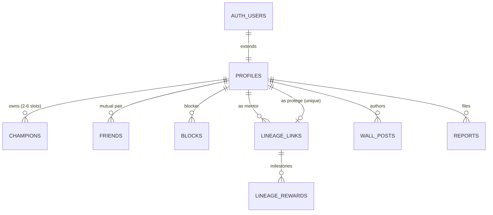
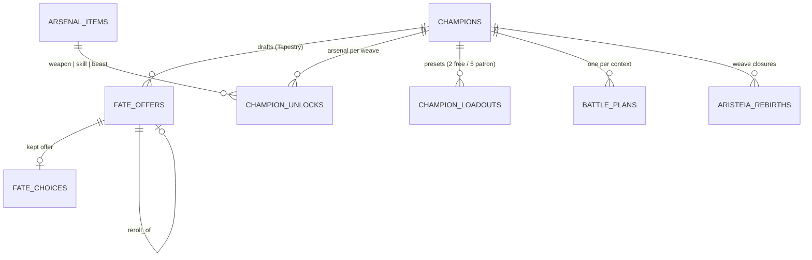
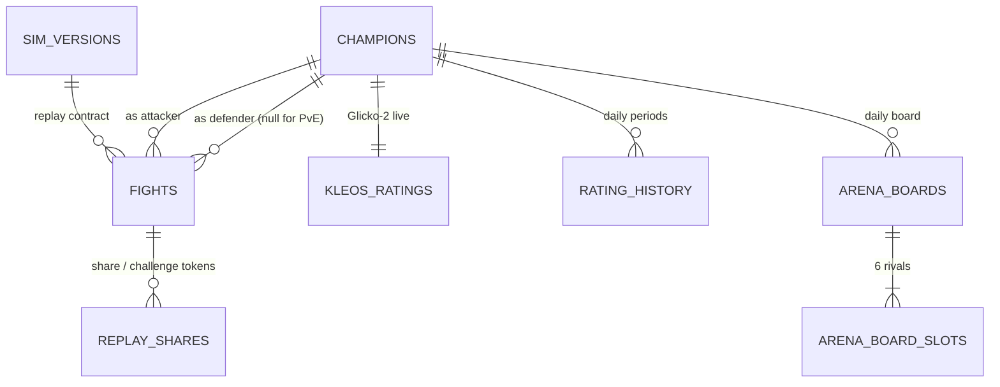
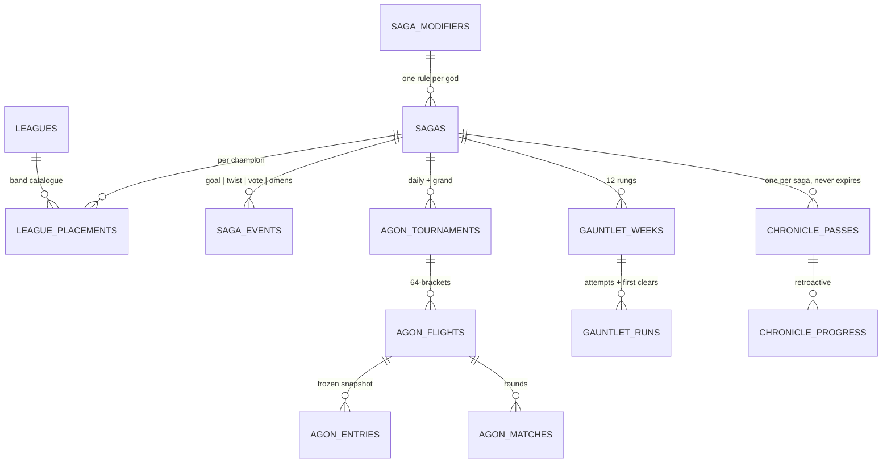
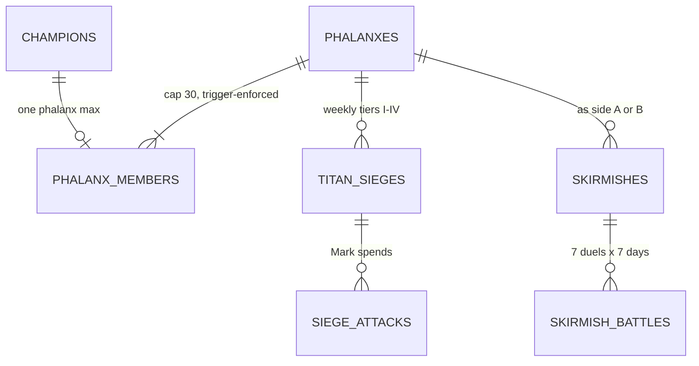
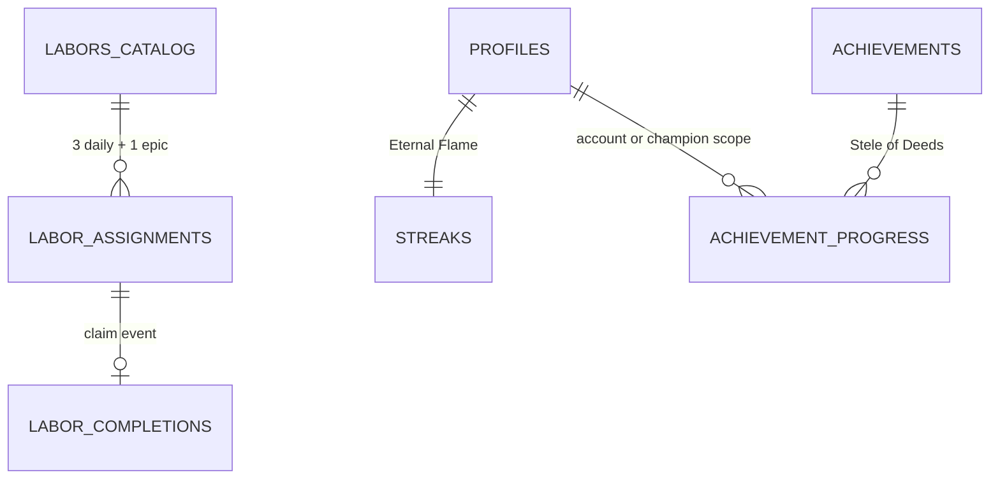
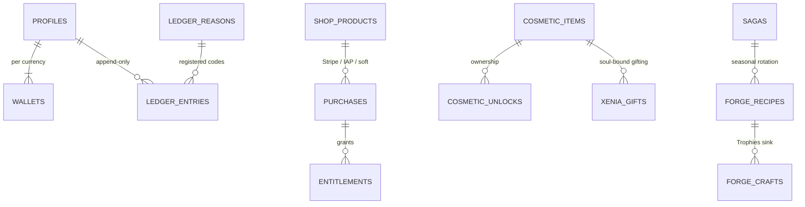
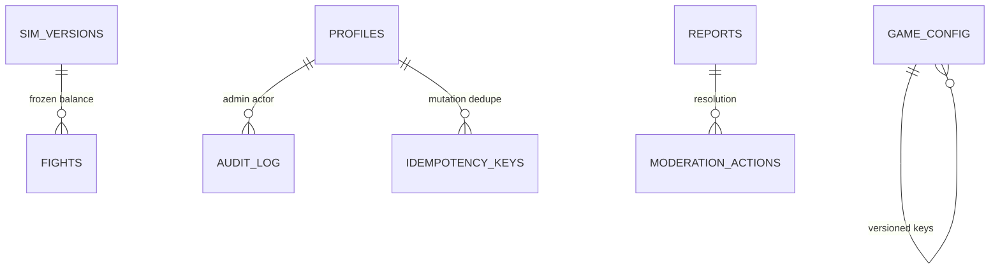

# AGOGE — Database Schema

> **Document:** `05-database-schema.md` · **Conforms to:** `00-vision.md` (canonical contract)
> **Owns:** the persistent data model — Postgres DDL, entity relationships, the Redis keyspace, and the data lifecycle (retention, GDPR, backups, migrations). Combat and progression *rules* are owned by `02-gdd-core.md`; mode and economy *rules* by `03-gdd-systems.md`; service topology, security and anti-cheat by `04-technical-architecture.md`; real-money pricing by `07-monetisation-liveops.md`. Where those documents fix a number (6 Vigor, 30-member Phalanx cap, Glicko-2 μ 1,500), this document encodes it as a constraint and does not re-argue it.

---

## 1. Design principles

Eleven rules govern every table below. They are decisions, not aspirations — the DDL in §3 is their enforcement.

1. **Postgres is the single source of truth.** Supabase Postgres holds every fact the game must never lose. Redis (§4) holds only *derivable* state — leaderboards, caches, rate-limit buckets, queues — and may be flushed at any time without data loss (BullMQ job state is the one accepted exception, with an explicit recovery story in §4.4).
2. **Currency moves only through append-only ledgers.** All four wallet currencies — **Obols, Ichor, Favour, Trophies** — flow through one `ledger_entries` table that forbids `UPDATE` and `DELETE` at the database level. **Kleos is not a wallet currency**: it is a Glicko-2 rating and lives in `kleos_ratings` (`03-gdd-systems.md` §1.2); it is never spendable and never appears in the ledger. A `wallets` row per (user, currency) is a materialised balance cache, reconciled nightly against the ledger sum (§6, query 3).
3. **Wallets are account-scoped.** Obols, Ichor, Favour and Trophies belong to the Mentor, not the Champion. This follows from the sinks: Champion slots and Phalanx creation are account purchases, the Chronicle pays the account, and Aristeia's `+1 Favour per Saga` perk is explicitly account-wide (`00-vision.md` §5). Favour's bank cap of 6 (`02-gdd-core.md` §6.3) is clamped by the API and backstopped by a CHECK.
4. **JSONB for shapes that churn; a schema-version column beside every one.** Combatant snapshots, loadouts, Battle Plans, fate offers, Chronicle tier tables and boss definitions are JSONB — they change with every balance pass and must never require a table migration. Every JSONB payload column travels with a `*_schema smallint` sibling so `packages/protocol` can parse any historical row. Relational columns are used for everything queried, joined, constrained or aggregated.
5. **Content is data, not code.** Weapons, skills, beasts, cosmetics, Labor templates, Saga modifiers, Gauntlet rungs, achievements and shop products are rows, editable from `apps/admin` without a deploy. The one hard rule: **any change that alters fight outcomes must ship as a new `sim_version`** whose frozen `balance_snapshot` is stored in `sim_versions` — that row is the replay contract that keeps every historical fight re-simulable forever (`04-technical-architecture.md`).
6. **Soft deletes only where the law or the replay graph demands them.** Social debris (friend requests, expired gifts, stale boards) is hard-deleted. Profiles, champions and fights are never row-deleted, because every fight references two champions and every replay URL is a promise; GDPR erasure is anonymise-in-place (§5.2). There are no `deleted_at` columns scattered "just in case".
7. **UTC everywhere.** Every timestamp is `timestamptz`; the server and all jobs run in UTC. Daily-cadence columns store a plain `date` computed against the canonical daily-reset instant — 00:00 UTC, defined in `04-technical-architecture.md` §7.1 — the schema never encodes a local timezone.
8. **UUID v7 primary keys.** Time-ordered UUIDs give index locality on append-heavy tables (fights, ledger) while remaining globally unique and unguessable enough for URLs. A `uuid_v7()` SQL function is defined in §3.0; when Supabase reaches Postgres 18, it is swapped for the native `uuidv7()` with zero schema change.
9. **The database enforces invariants the API might fumble.** CHECKs encode the canon: Vigor 0–12, Siege Marks 0–4, Embers 0–2, level 1–50, Phalanx `member_count ≤ 30`, ledger `balance_after ≥ 0`. The API is the first line; the constraint is the last.
10. **Clients never touch tables.** All access flows through `apps/api` (Fastify + tRPC) on the service role via Supavisor transaction pooling. Row Level Security is enabled on every table as defence-in-depth, with policies granting the anonymous key access only to the public read surfaces (champion profiles, Tapestries, replays, brackets) — the share economy must survive even a leaked anon key.
11. **Every mutation endpoint is idempotent.** Purchases, fight submissions, claim actions and gift sends carry an idempotency key persisted in `idempotency_keys` (fast-pathed in Redis), so retries on flaky mobile networks can never double-spend or double-fight.

---

## 2. Entity-relationship overview

The model divides into nine domains. Each diagram below shows keys and load-bearing relationships; full column detail is in the DDL (§3).

### 2.1 Identity & social

`profiles` extends Supabase `auth.users` one-to-one (anonymous-first auth means a profile exists from the first visit). Lineage bonds are struck between *accounts* at creation and are immutable thereafter (`03-gdd-systems.md` §10.1).



### 2.2 Champions & progression

A Champion's arsenal is the union of its `champion_unlocks` for the **current weave**; Aristeia increments `weave_no` rather than deleting anything, so every archived Weave of the Tapestry remains browsable forever (`02-gdd-core.md` §6.5).



### 2.3 Combat

One row per fight, whatever the mode. Both combatants are stored as full JSONB snapshots at fight time (the Super Auto Pets ghost pattern — replays never break when a rival levels up). The `event_log` column is a disposable cache; §3.5 justifies the storage decision.



### 2.4 Meta & competition

Sagas frame everything seasonal. Agon reuses one bracket machine for the daily and the Grand Agon; entries hold a frozen loadout snapshot taken at registration (`03-gdd-systems.md` §2.1).



### 2.5 Phalanx

Membership is per Champion (a Champion belongs to at most one Phalanx); Siege Marks live on the membership row because they exist nowhere else in the game (`03-gdd-systems.md` §4.2).



### 2.6 Ritual & deeds

Labors and the Eternal Flame are **account-scoped**: with up to six Champion slots, per-champion chores would multiply the sacred five-minute budget, which pillar 3 forbids. Any Champion's play advances them.



### 2.7 Economy & monetisation

One ledger, four currencies, every faucet and sink from `03-gdd-systems.md` §8 tagged by a registered reason code. Paid rights (Chronicle premium, Patron's Oath, Champion slots) are `entitlements`; cosmetic ownership is `cosmetic_unlocks`, whatever the source.



### 2.8 Ops



---

## 3. DDL

Organised by domain, in dependency order. All DDL targets Postgres 15+ (Supabase). Statements assume a single migration transaction per file except where noted (`CREATE INDEX CONCURRENTLY` in later migrations).

### 3.0 Extensions, helpers, enums

```sql
create extension if not exists pgcrypto;   -- gen_random_bytes for uuid_v7
create extension if not exists citext;     -- case-insensitive champion / phalanx names
create extension if not exists pg_trgm;    -- admin fuzzy search on names

-- UUID v7: time-ordered, index-friendly. Swap for native uuidv7() on Postgres 18+.
create or replace function uuid_v7() returns uuid
language plpgsql volatile as $$
declare
  ts_ms bigint := floor(extract(epoch from clock_timestamp()) * 1000)::bigint;
  buf bytea := overlay(gen_random_bytes(16)
               placing substring(int8send(ts_ms) from 3 for 6) from 1 for 6);
begin
  buf := set_byte(buf, 6, (get_byte(buf, 6) & 15) | 112);  -- version 7
  buf := set_byte(buf, 8, (get_byte(buf, 8) & 63) | 128);  -- variant 10
  return encode(buf, 'hex')::uuid;
end $$;

-- Immutability guard for ledgers and audit trails.
create or replace function forbid_mutation() returns trigger
language plpgsql as $$
begin
  raise exception '% is append-only', tg_table_name;
end $$;

create type item_kind        as enum ('weapon','skill','beast');
create type skill_family     as enum ('boon','technique','trump');
create type discipline       as enum ('doru','xiphos','cestus','labrys','akontia','aspis');
create type stance           as enum ('aggressive','measured','guarded');
create type plan_context     as enum ('defence','attack','agon','war');
create type currency         as enum ('obols','ichor','favour','trophies');  -- Kleos is a rating, never a wallet
create type league_tier      as enum ('bronze','silver','gold','marble','olympian');
create type fight_mode       as enum ('arena','reckoning','agon','grand_agon','gauntlet',
                                      'siege','skirmish','friendly','shade','echo','sparring');
create type board_band       as enum ('beatable','even','reach');
create type agon_kind        as enum ('daily','grand');
create type siege_aspect     as enum ('grasping_hand','bronze_gaze','heel_of_the_mountain');
create type labor_kind       as enum ('daily','epic');
create type champion_status  as enum ('active','retired','forgotten');   -- forgotten = GDPR-anonymised
create type link_status      as enum ('pending','eligible','withheld','fraud');
create type saga_event_kind  as enum ('community_goal','twisted_weekend','classic_vote','omens');
create type cosmetic_slot    as enum ('champion_skin','weapon_skin','vfx_palette','victory_pose',
                                      'backdrop','sigil','border','emote','banner_layer','flair');
create type purchase_provider as enum ('stripe','apple_iap','google_play','obols','ichor');
create type purchase_status  as enum ('pending','completed','failed','refunded');
create type entitlement_kind as enum ('chronicle_premium','patron_oath','champion_slot');
```

### 3.1 Identity & accounts

```sql
-- 1:1 extension of Supabase auth.users. Created on first anonymous sign-in,
-- so "account" exists before the player knows they have one (pillar 1).
-- Deliberately NOT on delete cascade: we never row-delete identities (§5.2);
-- GDPR erasure anonymises in place so the fight/replay graph stays intact.
create table profiles (
  user_id          uuid primary key references auth.users (id),
  display_name     text,
  country_code     char(2),
  role             text not null default 'player'
                     check (role in ('player','moderator','admin')),
  free_text_opt_in boolean not null default false,   -- safety default: presets only (03-gdd §10.4)
  marketing_opt_in boolean not null default false,
  created_at       timestamptz not null default now(),
  last_seen_at     timestamptz,
  anonymised_at    timestamptz                        -- set by the GDPR erasure job; PII is null beyond this point
);
create index profiles_last_seen_idx on profiles (last_seen_at desc);
```

### 3.2 Content catalogues & configuration

```sql
-- One catalogue for all draftable content. A single table (vs three) lets
-- champion_unlocks hold a real FK instead of an unenforceable polymorphic pair.
-- Per-kind shape lives in dials JSONB (weapon dial bundles per 02-gdd §4.6).
create table arsenal_items (
  id             uuid primary key default uuid_v7(),
  kind           item_kind not null,
  code           text not null unique,               -- stable slug: 'doru', 'wrath_of_herakles', 'lykos'
  name           text not null,
  discipline     discipline,                          -- weapons only
  family         skill_family,                        -- skills only
  grit_tax       smallint,                            -- beasts only (2/4/5/6)
  dials          jsonb not null default '{}',
  dials_schema   smallint not null default 1,
  released_in    uuid,                                -- saga id; null = launch content
  enabled        boolean not null default true,
  check (kind <> 'weapon' or discipline is not null),
  check (kind <> 'skill'  or family is not null),
  check (kind <> 'beast'  or grit_tax between 2 and 6)
);
-- Admin balance queries: "every item touching Counter" etc.
create index arsenal_items_dials_gin on arsenal_items using gin (dials jsonb_path_ops);

-- The replay contract. Every fight row points at a sim_version whose frozen
-- balance snapshot (stances, gambits, derived-stat params, full arsenal dials)
-- re-simulates it identically forever. Rebalancing = new row, never an update.
create table sim_versions (
  sim_version      integer primary key,               -- monotonically increasing (04-technical-architecture §3.4)
  core_package_ref text not null,                     -- packages/core build tag
  balance_snapshot jsonb not null,
  balance_hash     text not null,                     -- sha256; golden tests assert against it
  released_at      timestamptz
);

-- Versioned config-as-data (labrute precedent). Keys never overwrite: a new
-- version row activates and the old one remains for audit and rollback.
create table game_config (
  key          text not null,
  version      integer not null,
  payload      jsonb not null,
  affects_sim  boolean not null default false,        -- true => must ride a sim_version, reviewed in admin
  activated_at timestamptz,
  activated_by uuid references profiles (user_id),
  primary key (key, version)
);
create index game_config_active_idx on game_config (key, activated_at desc nulls last);

-- Server-side kill switches only. Experiments and gradual rollouts are PostHog's job
-- (00-vision §6); this table exists so a broken surface can be gated with no third party.
create table feature_flags (
  key        text primary key,
  enabled    boolean not null default false,
  conditions jsonb not null default '{}',
  updated_by uuid references profiles (user_id),
  updated_at timestamptz not null default now()
);
```

### 3.3 Champions & progression

```sql
create table champions (
  id                 uuid primary key default uuid_v7(),
  user_id            uuid not null references profiles (user_id),
  name               citext not null,                 -- URL identity: agoge.gg/<name>
  omen               discipline not null,             -- starting archetype (02-gdd §3.2)
  epithet            text not null,
  appearance         jsonb not null default '{}',
  appearance_schema  smallint not null default 1,
  level              smallint not null default 1 check (level between 1 and 50),
  xp                 integer  not null default 0 check (xp >= 0),
  weave_no           smallint not null default 1,     -- increments on Aristeia; keys arsenal + Tapestry
  might              smallint not null check (might >= 1),
  grace              smallint not null check (grace >= 1),
  tempo              smallint not null check (tempo >= 1),
  grit               smallint not null check (grit  >= 1),
  vigor              smallint not null default 12 check (vigor between 0 and 12),  -- day-one +6 bonus => starts full
  vigor_reset_on     date not null,
  equipped_cosmetics jsonb not null default '{}',
  last_known_plan    jsonb,                           -- cache: plan from last RESOLVED fight; the scout view reads
                                                      -- this, never battle_plans (the bluff, 02-gdd §4.8)
  status             champion_status not null default 'active',
  created_at         timestamptz not null default now(),
  updated_at         timestamptz not null default now()
);
-- Names are unique among the living; anonymisation frees the name.
create unique index champions_name_key on champions (name) where status <> 'forgotten';
create index champions_user_idx on champions (user_id);
create index champions_name_trgm on champions using gin (name gin_trgm_ops);  -- admin search

-- One row per draft PRESENTED (rerolls create a second row chained by reroll_of).
-- offers: [{"kind":"stat","grant":{"might":3}}, {"kind":"weapon","code":"kopis"}, ...]
create table fate_offers (
  id           uuid primary key default uuid_v7(),
  champion_id  uuid not null references champions (id),
  weave_no     smallint not null,
  level        smallint not null check (level between 2 and 50),
  draft_seed   bigint not null,                       -- server-picked; audit trail for offer composition
  offers       jsonb not null,
  offers_schema smallint not null default 1,
  milestone    boolean not null default false,
  reroll_of    uuid references fate_offers (id),      -- non-null => this draft replaced that one (1 Favour)
  created_at   timestamptz not null default now()
);
create index fate_offers_tapestry_idx on fate_offers (champion_id, weave_no, level);

-- Exactly one choice per consumed level-up. The original of a rerolled draft has no choice row.
create table fate_choices (
  id           uuid primary key default uuid_v7(),
  offer_id     uuid not null unique references fate_offers (id),
  champion_id  uuid not null references champions (id),
  weave_no     smallint not null,
  level        smallint not null,
  chosen_index smallint not null check (chosen_index between 0 and 2),
  applied      jsonb not null,                        -- the resolved grant, denormalised for Tapestry rendering
  created_at   timestamptz not null default now(),
  unique (champion_id, weave_no, level)               -- one kept thread per level per weave
);

-- Aristeia: nothing is deleted. The old weave's unlocks and Tapestry stay archived
-- under their weave_no; this table records the closure ceremony (02-gdd §6.5).
create table aristeia_rebirths (
  id            uuid primary key default uuid_v7(),
  champion_id   uuid not null references champions (id),
  closed_weave  smallint not null,
  at_level      smallint not null check (at_level >= 30),
  new_omen      discipline not null,                  -- self-authored respec is the earned right
  laurel_tier   smallint not null check (laurel_tier >= 1),
  kleos_before  double precision not null,
  kleos_after   double precision not null,
  created_at    timestamptz not null default now(),
  unique (champion_id, closed_weave)
);

-- The armoury: current arsenal = rows where weave_no = champions.weave_no.
create table champion_unlocks (
  id              uuid primary key default uuid_v7(),
  champion_id     uuid not null references champions (id),
  weave_no        smallint not null,
  item_id         uuid not null references arsenal_items (id),
  source_offer_id uuid references fate_offers (id),
  acquired_at     timestamptz not null default now(),
  unique (champion_id, weave_no, item_id)             -- duplicate protection is absolute (02-gdd §6.3)
);

-- Loadout presets. slots is the AUTHORED DRAW ORDER (02-gdd §7.1): an ordered
-- array of arsenal codes; beasts listed separately. 2 presets free, 5 with
-- Patron's Oath — cap enforced in the API against entitlements.
create table champion_loadouts (
  id           uuid primary key default uuid_v7(),
  champion_id  uuid not null references champions (id),
  name         text not null default 'Loadout',
  slots        jsonb not null,                        -- ["doru","xiphos","aspis"]
  beasts       jsonb not null default '[]',
  loadout_schema smallint not null default 1,
  is_active    boolean not null default false,
  created_at   timestamptz not null default now(),
  updated_at   timestamptz not null default now()
);
create unique index champion_loadouts_active_key
  on champion_loadouts (champion_id) where is_active;  -- exactly one equipped loadout

-- The saved plan per context. 'defence' is the hidden overnight plan; 'attack'
-- the default pre-fill; 'agon'/'war' are mode-specific. Gambit and trigger codes
-- resolve against game_config ('gambits', 'trump_triggers') so new ones ship dataside.
create table battle_plans (
  id             uuid primary key default uuid_v7(),
  champion_id    uuid not null references champions (id),
  context        plan_context not null,
  stance         stance not null,
  gambit_code    text not null,
  trump_item_id  uuid references arsenal_items (id),  -- must be an owned Trump; API-validated
  trigger_code   text,
  plan_schema    smallint not null default 1,
  updated_at     timestamptz not null default now(),
  unique (champion_id, context),
  check ((trump_item_id is null) = (trigger_code is null))
);
```

### 3.4 Combat, ratings, arena

```sql
-- ONE row per fight, all modes. Both combatants snapshotted in full at fight
-- time (stats, resolved loadout, plan, cosmetics) — replays never join live state.
-- defender_champion_id is null for PvE (Shade, Gauntlet boss, Krios aspect):
-- the opponent then exists only inside snapshot_b.
create table fights (
  id                   uuid primary key default uuid_v7(),
  mode                 fight_mode not null,
  attacker_champion_id uuid not null references champions (id),
  defender_champion_id uuid references champions (id),
  seed                 bigint not null,
  sim_version          integer not null references sim_versions (sim_version),
  snapshot_a           jsonb not null,
  snapshot_b           jsonb not null,
  snapshot_schema      smallint not null default 1,
  winner_side          char(1) not null check (winner_side in ('a','b')),
  duration_ticks       integer not null check (duration_ticks between 1 and 3000),
  rewards              jsonb not null default '{}',   -- applied xp/obols/kleos deltas, denormalised for the feed
  event_log            jsonb,                          -- REPLAY CACHE ONLY — see §3.5; nulled by the pruning job
  context_ref          uuid,                           -- agon_matches / siege_attacks / skirmish_battles row
  fought_at            timestamptz not null default now()
);
create index fights_attacker_idx on fights (attacker_champion_id, fought_at desc);
create index fights_defender_idx on fights (defender_champion_id, fought_at desc)
  where defender_champion_id is not null;              -- overnight-defence feed
create index fights_fought_brin on fights using brin (fought_at);  -- cheap time-range scans for jobs

-- Short share tokens. The raw fight id already serves replays; tokens exist to
-- attribute shares (every replay is a Lineage on-ramp, 03-gdd §10.2) and to key
-- the server-rendered OG card cache.
create table replay_shares (
  token           text primary key,                   -- 10-char base58
  fight_id        uuid not null references fights (id),
  sharer_user_id  uuid references profiles (user_id),
  kind            text not null check (kind in ('replay','challenge')),
  visits          integer not null default 0,
  og_rendered_at  timestamptz,
  created_at      timestamptz not null default now()
);
create index replay_shares_fight_idx on replay_shares (fight_id);

-- Live Glicko-2 state (03-gdd §1.2). Batch-updated at the daily reset.
create table kleos_ratings (
  champion_id  uuid primary key references champions (id),
  mu           double precision not null default 1500,
  rd           double precision not null default 350 check (rd between 60 and 350),
  sigma        double precision not null default 0.06,
  conservative double precision generated always as (mu - rd) stored,  -- matchmaking + display
  rated_fights integer not null default 0,
  updated_at   timestamptz not null default now()
);
-- Provisional (Unproven) Champions are excluded from boards; this partial index
-- IS the leaderboard fallback path (§6, query 4).
create index kleos_ratings_board_idx on kleos_ratings (conservative desc)
  where rd < 120 and rated_fights >= 10;

-- One row per champion per rating period (daily). Pruned to the last two Sagas (§5.1).
create table rating_history (
  champion_id      uuid not null references champions (id),
  period_date      date not null,
  mu               double precision not null,
  rd               double precision not null,
  sigma            double precision not null,
  fights_in_period smallint not null default 0,
  primary key (champion_id, period_date)
);

-- The daily Rival Board: 2 beatable / 2 even / 2 reach (03-gdd §1.1).
create table arena_boards (
  id          uuid primary key default uuid_v7(),
  champion_id uuid not null references champions (id),
  reset_date  date not null,
  rerolled    boolean not null default false,          -- one free reroll per day
  created_at  timestamptz not null default now(),
  unique (champion_id, reset_date)
);
create table arena_board_slots (
  board_id          uuid not null references arena_boards (id) on delete cascade,
  slot_no           smallint not null check (slot_no between 1 and 6),
  band              board_band not null,
  rival_champion_id uuid not null references champions (id),
  fight_id          uuid references fights (id),       -- set when the slot is fought (once per reset)
  primary key (board_id, slot_no)
);
```

### 3.5 The fight-log storage decision

The canon (`00-vision.md` §6) is explicit: fights are stored as *seed + simVersion + both combatant snapshots + result; replays re-simulated on demand*. That is what the `fights` table encodes, and it is non-negotiable — a replay is a few hundred bytes of truth, playable forever, because `sim_versions.balance_snapshot` freezes the rules it ran under.

The `event_log` column is therefore **a cache, not a record**. The research (`docs/research/tech.md` §1) recommends storing both seed and step log; we adopt that pragmatically but asymmetrically:

- **Written**: the simulator emits the step log anyway; persisting it inline costs one write and makes serving a hot replay a single indexed read with zero CPU — this matters because a viral replay URL can be hit thousands of times in an hour, and re-simulating on every view would turn a share spike into a CPU spike.
- **Disposable**: a nightly job nulls `event_log` on fights older than 35 days (§5.1). Cold replays fall back to re-simulation (a few milliseconds in `packages/core`), with the regenerated log cached at the CDN edge.
- **Never authoritative**: anti-cheat spot audits (`04-technical-architecture.md`) always re-simulate from seed + snapshots and compare against the stored result — the log is never trusted as evidence, only served as convenience.

This keeps the permanent per-fight footprint at roughly 2–4 KB (snapshots dominate) instead of 15–40 KB, which is the difference between keeping every fight row forever — the promise the share economy is built on — and an archaeology problem at month six.

### 3.6 Meta & competition

```sql
create table saga_modifiers (
  code      text primary key,                          -- 'blood_price', 'the_aegis', ...
  name      text not null,
  rule_text text not null,                             -- the one displayed sentence (03-gdd §6.4)
  params    jsonb not null default '{}'
);

create table sagas (
  id            uuid primary key default uuid_v7(),
  seq           integer not null unique,               -- Saga 1, 2, 3...
  name          text not null,                         -- 'Saga of Ares'
  god           text not null,
  modifier_code text not null references saga_modifiers (code),
  starts_on     date not null,
  ends_on       date not null,
  status        text not null default 'scheduled'
                  check (status in ('scheduled','active','closed')),
  check (ends_on > starts_on)
);
create unique index sagas_one_active_key on sagas (status) where status = 'active';

create table saga_events (
  id        uuid primary key default uuid_v7(),
  saga_id   uuid not null references sagas (id),
  kind      saga_event_kind not null,
  starts_at timestamptz not null,
  ends_at   timestamptz not null,
  params    jsonb not null default '{}',               -- e.g. community-goal target, twist modifier
  result    jsonb                                       -- e.g. final counter, vote winner
);

-- Static band catalogue, seeded below; kept as data so a future rebanding is a
-- config change, not a migration.
create table leagues (
  tier                league_tier primary key,
  floor_kleos         integer,                         -- null = open floor (Bronze)
  ceiling_kleos       integer,                         -- null = open ceiling (Olympian)
  seat_limit          integer,                         -- 200, Olympian only
  demotion_hysteresis integer not null default 25
);
insert into leagues values
  ('bronze',   null, 1399, null, 25),
  ('silver',   1400, 1599, null, 25),
  ('gold',     1600, 1799, null, 25),
  ('marble',   1800, 2049, null, 25),
  ('olympian', 2050, null,  200, 25);

create table league_placements (
  id               uuid primary key default uuid_v7(),
  saga_id          uuid not null references sagas (id),
  champion_id      uuid not null references champions (id),
  current_league   league_tier not null default 'bronze',
  current_since    timestamptz not null default now(),
  shield_until     timestamptz,                        -- 7-day Promotion Shield
  best_league      league_tier not null default 'bronze',
  best_since       timestamptz,
  best_held_days   smallint not null default 0,        -- reward requires >= 7 (anti-snipe, 03-gdd §1.5)
  reward_claimed_at timestamptz,
  unique (saga_id, champion_id)
);
create index league_placements_page_idx on league_placements (saga_id, current_league);

create table agon_tournaments (
  id                      uuid primary key default uuid_v7(),
  kind                    agon_kind not null,
  saga_id                 uuid not null references sagas (id),
  run_date                date not null,
  registration_closes_at  timestamptz not null,
  status                  text not null default 'open'
                            check (status in ('open','seeding','running','complete')),
  unique (kind, run_date)
);

create table agon_flights (
  id            uuid primary key default uuid_v7(),
  tournament_id uuid not null references agon_tournaments (id),
  flight_no     integer not null,
  band_floor    integer not null,                      -- Kleos band this Flight spans
  band_ceiling  integer not null,
  unique (tournament_id, flight_no)
);

-- snapshot = loadout + plan frozen AT REGISTRATION: late edits never retro-change
-- early rounds (03-gdd §2.1). laurel_seal marks a Flight win (Grand Agon ticket).
create table agon_entries (
  id            uuid primary key default uuid_v7(),
  tournament_id uuid not null references agon_tournaments (id),
  flight_id     uuid not null references agon_flights (id),
  champion_id   uuid not null references champions (id),
  snapshot      jsonb not null,
  snapshot_schema smallint not null default 1,
  seed_pos      smallint not null,
  laurel_seal   boolean not null default false,
  registered_at timestamptz not null default now(),
  unique (tournament_id, champion_id)
);

create table agon_matches (
  id           uuid primary key default uuid_v7(),
  flight_id    uuid not null references agon_flights (id),
  round        smallint not null,                      -- 1..6 daily (64), 1..8 grand (256)
  slot         smallint not null,
  entry_a      uuid not null references agon_entries (id),
  entry_b      uuid references agon_entries (id),      -- null = bye
  winner_entry uuid references agon_entries (id),
  fight_id     uuid references fights (id),
  resolved_at  timestamptz,
  unique (flight_id, round, slot)
);
create index agon_matches_resolve_idx on agon_matches (flight_id, round) where resolved_at is null;

-- rungs: 12-element JSONB array [{boss_snapshot, modifier_code, trophies}] —
-- authored content, snapshotted so a mid-week balance patch can't change a live ladder.
create table gauntlet_weeks (
  id          uuid primary key default uuid_v7(),
  saga_id     uuid not null references sagas (id),
  week_start  date not null unique,
  rungs       jsonb not null,
  rungs_schema smallint not null default 1,
  cast_month  date not null                             -- boss cast rotates monthly (03-gdd §3)
);

create table gauntlet_runs (
  id          uuid primary key default uuid_v7(),
  week_id     uuid not null references gauntlet_weeks (id),
  champion_id uuid not null references champions (id),
  rung        smallint not null check (rung between 1 and 12),
  fight_id    uuid not null references fights (id),
  cleared     boolean not null,
  fought_at   timestamptz not null default now()
);
-- Trophies are first-clear-only: at most one credited clear per rung/champion/week.
create unique index gauntlet_first_clear_key
  on gauntlet_runs (week_id, champion_id, rung) where cleared;
create index gauntlet_runs_champ_idx on gauntlet_runs (champion_id, week_id);
```

### 3.7 Phalanx

```sql
create table phalanxes (
  id           uuid primary key default uuid_v7(),
  name         citext not null,
  banner       jsonb not null default '{}',            -- heraldry layers (field/charge/crest/trim)
  motd         text check (char_length(motd) <= 280),
  join_policy  text not null default 'open'
                 check (join_policy in ('open','application','invite')),
  war_opt_in   boolean not null default false,
  war_mmr      double precision not null default 1500, -- hidden Glicko-lite (03-gdd §4.3); never in API responses
  war_rd       double precision not null default 350,
  member_count smallint not null default 0 check (member_count between 0 and 30),  -- THE cap (00-vision §5)
  created_by   uuid not null references profiles (user_id),
  created_at   timestamptz not null default now(),
  disbanded_at timestamptz
);
create unique index phalanxes_name_key on phalanxes (name) where disbanded_at is null;

-- Membership is per CHAMPION (join gate is a level-10+ Champion). user_id is
-- denormalised for account-level queries (e.g. "my phalanx" across slots).
create table phalanx_members (
  phalanx_id      uuid not null references phalanxes (id),
  champion_id     uuid not null references champions (id),
  user_id         uuid not null references profiles (user_id),
  role            text not null default 'hoplite'
                    check (role in ('polemarch','lochagos','hoplite')),
  siege_marks     smallint not null default 2 check (siege_marks between 0 and 4),  -- 2/day, bank 4
  marks_accrued_on date not null,
  joined_at       timestamptz not null default now(),
  primary key (phalanx_id, champion_id),
  unique (champion_id)                                  -- one Phalanx per Champion
);

-- Cap enforcement: counter maintained by trigger; the CHECK above aborts the 31st
-- insert atomically — no racy count(*) in the API.
create or replace function phalanx_member_counter() returns trigger
language plpgsql as $$
begin
  if tg_op = 'INSERT' then
    update phalanxes set member_count = member_count + 1 where id = new.phalanx_id;
  elsif tg_op = 'DELETE' then
    update phalanxes set member_count = member_count - 1 where id = old.phalanx_id;
  end if;
  return coalesce(new, old);
end $$;
create trigger phalanx_members_count
  after insert or delete on phalanx_members
  for each row execute function phalanx_member_counter();

-- One row per tier attempted per week (clearing early unlocks the next tier =>
-- up to four rows per phalanx-week). HP pools per 03-gdd §4.2.
create table titan_sieges (
  id              uuid primary key default uuid_v7(),
  phalanx_id      uuid not null references phalanxes (id),
  week_start      date not null,
  tier            smallint not null check (tier between 1 and 4),
  hp_pool         bigint not null,
  damage          bigint not null default 0,
  aspect_schedule jsonb not null default '{}',          -- which Krios aspects and biases this week
  cleared_at      timestamptz,
  unique (phalanx_id, week_start, tier)
);

create table siege_attacks (
  id          uuid primary key default uuid_v7(),
  siege_id    uuid not null references titan_sieges (id),
  champion_id uuid not null references champions (id),
  aspect      siege_aspect not null,
  fight_id    uuid not null references fights (id),
  sim_damage  integer not null check (sim_damage >= 0),
  raid_damage integer not null check (raid_damage >= 0), -- level-normalised (03-gdd §4.2)
  created_at  timestamptz not null default now()
);
-- Covering index: the member damage board (§6, query 5) never touches the heap.
create index siege_attacks_board_idx on siege_attacks (siege_id, champion_id) include (raid_damage);

create table skirmishes (
  id          uuid primary key default uuid_v7(),
  saga_id     uuid not null references sagas (id),
  week_start  date not null,
  phalanx_a   uuid not null references phalanxes (id),
  phalanx_b   uuid not null references phalanxes (id),
  lineups     jsonb not null default '{}',              -- per day/side: volunteered + auto-filled rosters
  day_wins_a  smallint not null default 0,
  day_wins_b  smallint not null default 0,
  status      text not null default 'active'
                check (status in ('active','complete','abandoned')),
  winner_phalanx uuid references phalanxes (id),
  check (phalanx_a <> phalanx_b)
);
create index skirmishes_phalanx_idx on skirmishes (phalanx_a, week_start);
create index skirmishes_phalanx_b_idx on skirmishes (phalanx_b, week_start);

create table skirmish_battles (
  id           uuid primary key default uuid_v7(),
  skirmish_id  uuid not null references skirmishes (id),
  day_no       smallint not null check (day_no between 1 and 7),
  slot_no      smallint not null check (slot_no between 1 and 7),
  champion_a   uuid not null references champions (id),
  champion_b   uuid not null references champions (id),
  fight_id     uuid references fights (id),
  winner_side  char(1) check (winner_side in ('a','b')),
  resolved_at  timestamptz,
  unique (skirmish_id, day_no, slot_no)
);
```

### 3.8 Ritual & deeds

```sql
create table labors_catalog (
  code          text primary key,                      -- 'win_two', 'clean_board', ...
  kind          labor_kind not null,
  title         text not null,
  flavour       text,                                  -- cast-voiced framing (02-gdd §2.4)
  params        jsonb not null default '{}',           -- e.g. {"discipline":"labrys"} for rotating templates
  passive       boolean not null default true,
  reward_obols  smallint not null,
  reward_favour smallint not null default 0,           -- 0 for all; Epic-chain Favour is granted separately (03-gdd §5.2)
  enabled       boolean not null default true
);

-- Account-scoped (principle: no per-slot chore multiplication). Daily rows carry
-- slot 1-3; the weekly Epic carries slot 0 with period_start = its Monday.
create table labor_assignments (
  id           uuid primary key default uuid_v7(),
  user_id      uuid not null references profiles (user_id),
  labor_code   text not null references labors_catalog (code),
  kind         labor_kind not null,
  period_start date not null,
  slot         smallint not null check (slot between 0 and 3),
  target       integer not null check (target > 0),
  progress     integer not null default 0,
  completed_at timestamptz,
  unique (user_id, kind, period_start, slot)
);
create index labor_assignments_open_idx on labor_assignments (user_id, period_start)
  where completed_at is null;

-- The claim event: joins the assignment to its ledger credits (auditability —
-- progress and payout are separate facts).
create table labor_completions (
  id              uuid primary key default uuid_v7(),
  assignment_id   uuid not null unique references labor_assignments (id),
  user_id         uuid not null references profiles (user_id),
  obols_entry_id  uuid,                                -- ledger_entries refs, set in the same transaction
  favour_entry_id uuid,
  claimed_at      timestamptz not null default now()
);

-- Eternal Flame (03-gdd §5.3). milestone_floor implements the humane break rule:
-- a 47-day break falls to 30, never 0.
create table streaks (
  user_id         uuid primary key references profiles (user_id),
  current         integer not null default 0 check (current >= 0),
  best            integer not null default 0,
  milestone_floor integer not null default 0,
  embers          smallint not null default 0 check (embers between 0 and 2),
  last_counted_on date,
  rekindle_until  date,                                -- 3 days of double Labor Obols after 7+ days away
  updated_at      timestamptz not null default now()
);

create table achievements (
  code         text primary key,
  category     text not null check (category in
                 ('blood','wit','odyssey','hoard','brotherhood','legacy','devotion','apocrypha')),
  scope        text not null check (scope in ('champion','account')),  -- Legacy/Devotion deeds are account-wide
  name         text not null,
  title_grant  text,                                   -- equippable epithet, e.g. 'the Slayer'
  hidden       boolean not null default false,         -- Apocrypha revealed only when earned
  tiers        jsonb not null default '[]',
  reward_obols smallint not null default 0
);

create table achievement_progress (
  id          uuid primary key default uuid_v7(),
  user_id     uuid not null references profiles (user_id),
  champion_id uuid references champions (id),          -- null for account-scoped deeds
  code        text not null references achievements (code),
  progress    integer not null default 0,
  unlocked_at timestamptz,
  unique nulls not distinct (user_id, champion_id, code)  -- PG15: one row even when champion_id is null
);
create index achievement_progress_stele_idx on achievement_progress (champion_id)
  where unlocked_at is not null;
```

### 3.9 Economy & monetisation

```sql
-- Registered reason codes (content-as-data: extending the economy = an INSERT,
-- still FK-constrained). Seed list mirrors the faucet/sink tables in 03-gdd §8.1.
create table ledger_reasons (
  code        text primary key,
  description text not null
);
insert into ledger_reasons values
  ('fight_win','Arena win +10'), ('fight_loss','Arena loss +5'),
  ('clean_sweep','All six rivals beaten +20'), ('defence_win','Ghost held +5'),
  ('labor_daily','Daily Labor claim'), ('labor_epic','Weekly Epic Labor claim'),
  ('streak_milestone','Eternal Flame milestone'), ('league_reward','End-of-Saga league chest'),
  ('agon_reward','Agon placement'), ('siege_chest','Weekly Siege chest'),
  ('gauntlet_first_clear','Gauntlet rung first clear'), ('lineage_milestone','Lineage milestone'),
  ('chronicle_tier','Chronicle tier claim'), ('favour_grant','Favour play milestone'),
  ('cosmetic_buy','Cosmetic purchase'), ('forge_craft','Forge craft fee'),
  ('slot_purchase','Champion slot'), ('phalanx_create','Phalanx creation'),
  ('xenia_gift','Xenia gift purchase'), ('duplicate_convert','Duplicate to 25 Trophies'),
  ('ichor_purchase','Ichor pack delivery'), ('purchase_grant','Product grant'),
  ('refund','Refund reversal'), ('admin_grant','Ops grant'), ('admin_revoke','Ops revoke');

-- Materialised balances, one row per (user, currency). The ledger is truth;
-- this row exists so a balance read is O(1) and a spend is one guarded UPDATE.
create table wallets (
  user_id    uuid not null references profiles (user_id),
  currency   currency not null,
  balance    bigint not null default 0 check (balance >= 0),
  updated_at timestamptz not null default now(),
  primary key (user_id, currency),
  check (currency <> 'favour' or balance <= 6)         -- Favour bank cap; API clamps first, this backstops
);

-- THE ledger. Append-only at the database level. balance_after is written inside
-- the same transaction as the wallet update, making any drift mechanically detectable.
create table ledger_entries (
  id              uuid primary key default uuid_v7(),
  user_id         uuid not null references profiles (user_id),
  currency        currency not null,
  amount          bigint not null check (amount <> 0), -- signed: faucets positive, sinks negative
  balance_after   bigint not null check (balance_after >= 0),
  reason          text not null references ledger_reasons (code),
  ref_kind        text,                                -- 'fight' | 'purchase' | 'labor_completion' | ...
  ref_id          uuid,
  idempotency_key text,
  created_at      timestamptz not null default now()
);
create trigger ledger_immutable before update or delete on ledger_entries
  for each row execute function forbid_mutation();
create index ledger_user_idx on ledger_entries (user_id, currency, created_at desc);
create unique index ledger_idem_key on ledger_entries (user_id, idempotency_key)
  where idempotency_key is not null;                   -- hard double-spend guard on retried mutations
create index ledger_created_brin on ledger_entries using brin (created_at);

create table cosmetic_items (
  code        text primary key,
  slot        cosmetic_slot not null,
  name        text not null,
  saga_id     uuid references sagas (id),              -- null = evergreen
  price_obols integer,
  price_ichor integer,
  giftable    boolean not null default true,           -- Xenia catalogue membership
  metadata    jsonb not null default '{}',
  active      boolean not null default true
);

create table cosmetic_unlocks (
  id            uuid primary key default uuid_v7(),
  user_id       uuid not null references profiles (user_id),
  cosmetic_code text not null references cosmetic_items (code),
  source        text not null check (source in
                  ('shop','chronicle','achievement','league','forge','siege','event','xenia_gift','lineage')),
  soulbound     boolean not null default false,        -- Xenia gifts: never Forge-convertible (03-gdd §8.3)
  acquired_at   timestamptz not null default now(),
  unique (user_id, cosmetic_code)                      -- duplicates convert to 25 Trophies instead of a row
);

-- Real-money and premium catalogue. Red line (00-vision §5): no product may
-- grant Vigor, XP, stats, rerolls, gear or ranked entry — enforced at review;
-- the schema deliberately has nowhere to hang power on a product.
create table shop_products (
  sku             text primary key,
  kind            text not null check (kind in
                    ('cosmetic','ichor_pack','chronicle','patron_oath','champion_slot')),
  name            text not null,
  cosmetic_code   text references cosmetic_items (code),
  saga_id         uuid references sagas (id),          -- chronicle products (retroactive: all stay purchasable)
  price_obols     integer,
  price_ichor     integer,
  price_usd_cents integer,                             -- Chronicle 999, Patron's Oath 499/month
  stripe_price_id text,
  available_from  timestamptz,
  available_until timestamptz,
  active          boolean not null default true,
  check (num_nonnulls(price_obols, price_ichor, price_usd_cents) >= 1)
);

-- One row per money-touching transaction, Stripe now, store IAP receipts later
-- (the receipt JSONB absorbs either shape). Soft-currency purchases also land
-- here when they buy a product (unified purchase history for support).
create table purchases (
  id              uuid primary key default uuid_v7(),
  user_id         uuid not null references profiles (user_id),
  sku             text not null references shop_products (sku),
  provider        purchase_provider not null,
  provider_ref    text,                                -- Stripe payment_intent / IAP transaction id
  status          purchase_status not null default 'pending',
  amount_usd_cents integer,
  receipt         jsonb,
  receipt_schema  smallint not null default 1,
  idempotency_key text not null,
  created_at      timestamptz not null default now(),
  completed_at    timestamptz,
  refunded_at     timestamptz,
  unique (user_id, idempotency_key),
  unique (provider, provider_ref)                      -- a webhook replay can never double-deliver
);
create index purchases_pending_idx on purchases (created_at) where status = 'pending';

-- Durable paid rights. Cosmetics live in cosmetic_unlocks; this table holds the
-- three renewable/countable rights. Patron's Oath rows carry the current period.
create table entitlements (
  id           uuid primary key default uuid_v7(),
  user_id      uuid not null references profiles (user_id),
  kind         entitlement_kind not null,
  ref          text,                                   -- chronicle: saga id · slot: slot number '3'..'6'
  purchase_id  uuid references purchases (id),         -- null = earned (e.g. Obol-bought slot)
  starts_at    timestamptz not null default now(),
  ends_at      timestamptz,                            -- patron_oath only; null = perpetual
  revoked_at   timestamptz,
  unique nulls not distinct (user_id, kind, ref)
);
create index entitlements_active_idx on entitlements (user_id, kind)
  where revoked_at is null;

create table forge_recipes (
  code            text primary key,
  saga_id         uuid not null references sagas (id),
  output_cosmetic text not null references cosmetic_items (code),
  trophies_cost   integer not null,
  obols_cost      integer not null,
  masterwork      boolean not null default false,      -- 1 per Saga per Mentor (03-gdd §9); API-enforced
  requires_siege_progress boolean not null default false,
  retired_at      timestamptz,
  returnable      boolean not null default true        -- archive-vote eligibility, listed in the Codex
);

create table forge_crafts (
  id          uuid primary key default uuid_v7(),
  user_id     uuid not null references profiles (user_id),
  recipe_code text not null references forge_recipes (code),
  trophies_entry_id uuid not null,                     -- ledger refs written in the same transaction
  obols_entry_id    uuid not null,
  crafted_at  timestamptz not null default now()
);
create index forge_crafts_user_idx on forge_crafts (user_id, crafted_at desc);

-- Xenia gifting (03-gdd §8.3): 1 send/week, 3 accepts/week, both API-enforced by
-- counting rows here; catalogue price charged at send time via the ledger.
create table xenia_gifts (
  id                uuid primary key default uuid_v7(),
  sender_user_id    uuid not null references profiles (user_id),
  recipient_user_id uuid not null references profiles (user_id),
  cosmetic_code     text not null references cosmetic_items (code),
  paid_currency     currency not null,
  paid_amount       integer not null,
  status            text not null default 'sent'
                      check (status in ('sent','accepted','declined','expired')),
  sent_at           timestamptz not null default now(),
  resolved_at       timestamptz,
  check (sender_user_id <> recipient_user_id)
);
create index xenia_sender_idx on xenia_gifts (sender_user_id, sent_at desc);
create index xenia_recipient_idx on xenia_gifts (recipient_user_id, sent_at desc);
```

### 3.10 Social, lineage, safety

```sql
-- Bond struck at account creation, immutable, one mentor per protege ever
-- (03-gdd §10.1). Device/IP hashes are salted SHA-256 — kept only for the
-- anti-farm caps and scrubbed on GDPR erasure.
create table lineage_links (
  id               uuid primary key default uuid_v7(),
  mentor_user_id   uuid not null references profiles (user_id),
  protege_user_id  uuid not null unique references profiles (user_id),
  via_share_token  text references replay_shares (token),
  device_hash      text,
  ip_hash          text,
  status           link_status not null default 'pending',
  d7_days          smallint not null default 0,        -- distinct active days, counted by the daily job
  d7_passed_at     timestamptz,
  created_at       timestamptz not null default now(),
  check (mentor_user_id <> protege_user_id)
);
create index lineage_mentor_idx on lineage_links (mentor_user_id, created_at desc);
create index lineage_fraud_idx on lineage_links (ip_hash, created_at)
  where status in ('pending','withheld');              -- velocity/pattern review queue

-- Milestones release on a 48h delay so fraud can be unwound before payout.
create table lineage_rewards (
  id                uuid primary key default uuid_v7(),
  link_id           uuid not null references lineage_links (id),
  milestone         text not null check (milestone in
                      ('d7','level_5','level_10','level_20','first_aristeia')),
  release_after     timestamptz not null,
  released_at       timestamptz,
  mentor_entry_id   uuid,                              -- ledger refs once released
  protege_entry_id  uuid,
  unique (link_id, milestone)
);
create index lineage_rewards_due_idx on lineage_rewards (release_after)
  where released_at is null;

-- Canonical ordered pair (user_a < user_b): one row per friendship, no mirror rows.
create table friends (
  user_a       uuid not null references profiles (user_id),
  user_b       uuid not null references profiles (user_id),
  requested_by uuid not null references profiles (user_id),
  status       text not null default 'pending' check (status in ('pending','accepted')),
  created_at   timestamptz not null default now(),
  accepted_at  timestamptz,
  primary key (user_a, user_b),
  check (user_a < user_b),
  check (requested_by in (user_a, user_b))
);
create index friends_b_idx on friends (user_b) where status = 'accepted';

create table blocks (
  blocker_user_id uuid not null references profiles (user_id),
  blocked_user_id uuid not null references profiles (user_id),
  created_at      timestamptz not null default now(),
  primary key (blocker_user_id, blocked_user_id),
  check (blocker_user_id <> blocked_user_id)
);

-- Free text exists ONLY here (phalanx walls, friend walls) — everything else is
-- preset Herald's Phrases (03-gdd §10.4). Rows hard-delete after moderation retention.
create table wall_posts (
  id              uuid primary key default uuid_v7(),
  scope           text not null check (scope in ('phalanx','profile')),
  phalanx_id      uuid references phalanxes (id),
  profile_user_id uuid references profiles (user_id),
  author_user_id  uuid not null references profiles (user_id),
  body            text not null check (char_length(body) <= 280),
  state           text not null default 'visible'
                    check (state in ('visible','pending','removed')),
  created_at      timestamptz not null default now(),
  check ((scope = 'phalanx') = (phalanx_id is not null)),
  check ((scope = 'profile') = (profile_user_id is not null))
);
create index wall_posts_phalanx_idx on wall_posts (phalanx_id, created_at desc)
  where state = 'visible';

create table reports (
  id               uuid primary key default uuid_v7(),
  reporter_user_id uuid not null references profiles (user_id),
  target_kind      text not null check (target_kind in
                     ('champion_name','wall_post','phalanx','profile','other')),
  target_id        uuid not null,
  reason           text not null check (reason in
                     ('offensive_name','harassment','spam','cheating','impersonation','other')),
  note             text,
  status           text not null default 'open'
                     check (status in ('open','actioned','dismissed')),
  created_at       timestamptz not null default now(),
  resolved_at      timestamptz,
  resolved_by      uuid references profiles (user_id)
);
create index reports_queue_idx on reports (created_at) where status = 'open';

create table moderation_actions (
  id                 uuid primary key default uuid_v7(),
  actor_user_id      uuid not null references profiles (user_id),  -- role checked in API
  report_id          uuid references reports (id),
  target_user_id     uuid not null references profiles (user_id),
  target_champion_id uuid references champions (id),
  action             text not null check (action in
                       ('warn','rename','mute','shadowban','ban','unban','unmute','unshadowban')),
  reason_code        text not null,
  note               text,
  expires_at         timestamptz,                      -- temporary mutes/bans
  created_at         timestamptz not null default now()
);
create index moderation_target_idx on moderation_actions (target_user_id, created_at desc);
```

### 3.11 Ops

```sql
-- Non-negotiable from day one (research/tech.md §8): who did what to whom, with
-- before/after state. Append-only.
create table audit_log (
  id            uuid primary key default uuid_v7(),
  actor_user_id uuid not null references profiles (user_id),
  action        text not null,                         -- 'grant_currency', 'edit_config', 'ban', ...
  target_kind   text not null,
  target_id     text not null,
  before_state  jsonb,
  after_state   jsonb,
  created_at    timestamptz not null default now()
);
create trigger audit_immutable before update or delete on audit_log
  for each row execute function forbid_mutation();
create index audit_target_idx on audit_log (target_kind, target_id, created_at desc);
create index audit_created_brin on audit_log using brin (created_at);

-- Mutation dedupe. Redis fast-paths the same key with a 24 h TTL; this table is
-- the durable record so a Redis flush can't reopen a double-spend window.
create table idempotency_keys (
  user_id      uuid not null references profiles (user_id),
  scope        text not null,                          -- 'fight.start', 'shop.buy', 'gift.send', ...
  idem_key     text not null,
  request_hash text,
  response     jsonb,
  status       text not null default 'in_flight'
                 check (status in ('in_flight','done','failed')),
  created_at   timestamptz not null default now(),
  expires_at   timestamptz not null default now() + interval '48 hours',
  primary key (user_id, scope, idem_key)
);
create index idempotency_gc_idx on idempotency_keys (expires_at);
```

**A note on partitioning.** `fights` and `ledger_entries` are created *unpartitioned*, with BRIN indexes carrying time-range scans. Native range partitioning would force the partition key into every primary key and break the plain FKs that `arena_board_slots`, `agon_matches`, `gauntlet_runs` and `siege_attacks` hold against `fights(id)` — a real integrity cost paid up front for a scale we do not have at launch. The migration trigger point and procedure are defined in §5.1; until either table passes ~30 M rows or ~50 GB, honest FKs win.

---

## 4. Redis keyspace

Redis (Upstash) is derivable state only (§1, principle 1). One database per environment; no key prefix carries the environment name. Naming convention: `{domain}:{board-or-purpose}:{scope}:{window}`, all lowercase, `:`-separated, ids raw UUIDs, weeks as ISO `2026-W31`, days as `2026-08-01`, Sagas as `s{seq}`.

### 4.1 Leaderboards (sorted sets)

Scores are integers (Kleos ×100 to keep two decimals; damage and counts raw). Members are champion or phalanx UUIDs. Every board in `03-gdd-systems.md` §7.2 maps to a key family:

| Board | Key pattern | Member / score | Written by |
|---|---|---|---|
| Kleos, global | `lb:kleos:s{seq}:global` | champion / conservative ×100 | Glicko batch job |
| Kleos, per league | `lb:kleos:s{seq}:lg:{tier}` | champion / conservative ×100 | Glicko batch job |
| Kleos, per Phalanx | `lb:kleos:s{seq}:ph:{id}` | champion / conservative ×100 | Glicko batch job |
| Arena wins | `lb:wins:{d\|w}:{date}:{global\|lg:{tier}\|ph:{id}}` | champion / wins | fight resolution |
| Agon laurels | `lb:laurels:{d:{date}\|s{seq}\|life}` | champion / round-wins | Agon round job |
| Gauntlet depth | `lb:gauntlet:{iso-week}` | champion / `rung×10^9 − clear_ms` | run resolution |
| Siege, member | `lb:siege:{iso-week}:ph:{id}` | champion / raid damage | siege attack |
| Siege, global | `lb:siege:{iso-week}:global` | phalanx / total damage | siege attack |
| Skirmish record | `lb:skirmish:s{seq}` | phalanx / war wins | war resolution |

Friends-scope boards are **not** materialised as ZSETs (a per-user board per friend graph is quadratic); they are assembled per request with a pipelined `ZSCORE` per friend against the global key — ≤200 friends means ≤200 O(1) reads. At Saga rollover, the top-N of every Saga-scoped board is archived into Postgres (`league_placements`, `rating_history`, `titan_sieges`), then the key is given a 14-day TTL and left to expire.

### 4.2 Matchmaking and caches

| Purpose | Key pattern | Type | Notes |
|---|---|---|---|
| Rival Board candidates | `mm:cand:lg:{tier}` | ZSET score = conservative ×100 | Rebuilt at daily reset from champions active ≤14 days, non-provisional; board bands are `ZRANGEBYSCORE` slices with exclusion filters applied in the API |
| Built daily board | `cache:board:{champion}:{date}` | JSON string | Write-through from `arena_boards` |
| Public champion profile | `cache:champ:{name}` | JSON string | Cell/scout view; invalidated on write |
| Replay event log (hot) | `cache:replay:{fight}` | JSON string | Backs the §3.5 cache before CDN takes over |
| Agon bracket page | `cache:agon:{flight}` | JSON string | Refreshed by the hourly round job |
| Idempotency fast path | `idem:{user}:{scope}:{key}` | string | Mirrors `idempotency_keys` |
| Rate limits | `rl:{route}:{user\|ip}` | counter (INCR+EXPIRE) | Token buckets per `04-technical-architecture.md` |
| SSE fan-out | `ps:agon:{flight}` · `ps:siege:{phalanx}` · `ps:user:{id}` | pub/sub | No storage; bracket ticks, siege ticks, attack toasts |

### 4.3 TTL policy

| Key family | TTL | Rationale |
|---|---|---|
| `lb:*` Saga-scoped | none live; 14 d after rollover | Archived to Postgres first |
| `lb:wins:d:*` / `lb:laurels:d:*` | 48 h | Yesterday's board briefly viewable |
| `lb:*` weekly | 21 d | Covers rollover screens and disputes |
| `mm:cand:*` | 26 h | Fully rebuilt at each reset |
| `cache:board:*` | 26 h | One reset cycle plus slack |
| `cache:champ:*` / `cache:agon:*` | 60 s | Cheap staleness; invalidated on write anyway |
| `cache:replay:*` | 7 d sliding | Hot shares stay hot; Postgres/CDN behind it |
| `rl:*` | window length (10 s – 1 h) | Self-expiring buckets |
| `idem:*` | 24 h | Durable copy lives in Postgres |
| `bull:*` | BullMQ-managed | `removeOnComplete: {count: 1000, age: 7 d}` |

### 4.4 BullMQ queues

Queue names are verbs, prefixed by BullMQ as `bull:{name}`. All repeatable jobs are idempotent and safe to re-run: each derives its work from Postgres state, so a Redis loss costs at most one re-enqueue of the repeatable schedule (documented runbook, `04-technical-architecture.md`).

| Queue | Cadence | Work |
|---|---|---|
| `daily-reset` | daily, reset instant | Vigor/Marks accrual, board builds, Labor deals, `mm:cand` rebuild |
| `glicko-batch` | daily, reset instant | Rating-period close: update `kleos_ratings`, append `rating_history`, league promotions |
| `agon-seed` | daily, +18 h | Close registration, build Flights and round 1 |
| `agon-round` | hourly ×6 (×8 grand) | Simulate a round, publish SSE, update brackets |
| `saga-rollover` | per Saga end | Soft reset, league rewards, board archival, Chronicle close-out |
| `gauntlet-week` / `siege-week` / `skirmish-day` | weekly Mon / weekly Mon / daily 22:00 | Rotate rungs; open Krios tiers and pay chests; resolve war days |
| `lineage-release` | every 15 min | §6 query 6: release matured, capped, fraud-cleared milestones |
| `ledger-reconcile` | nightly | §6 query 3 audit; alerts on any drift |
| `og-render` | on demand | Render 1200×630 replay cards to R2 |
| `prune` | nightly | `event_log` nulling, expired boards, idempotency GC (§5.1) |

---

## 5. Data lifecycle

### 5.1 Retention and pruning

| Data | Hot | Then | Never |
|---|---|---|---|
| `fights` rows (seed + snapshots + result) | forever in Postgres | partitions >12 months old exported to R2 as JSONL and served via a cold-read path once partitioning lands | deleted — every replay URL is a promise |
| `fights.event_log` | 35 days | nulled by `prune`; cold replays re-simulate (§3.5) | trusted as evidence |
| `arena_boards` / slots | 14 days | hard-deleted (fight rows carry the history) | — |
| `rating_history` | 2 Sagas | rolled up to per-Saga min/max/final, then deleted | — |
| `ledger_entries` | forever | monthly partitions at the §3.11 trigger point | mutated |
| `idempotency_keys` | 48 h | hard-deleted by GC | — |
| `wall_posts` (removed) | 90 days | hard-deleted (moderation evidence window) | — |
| `reports` / `moderation_actions` / `audit_log` | 2 years / forever / forever | reports anonymise reporter after 2 years | — |

**Partitioning plan** (deferred, per §3.11): when `fights` crosses ~30 M rows or ~50 GB, a scheduled migration converts it to monthly range partitions on `fought_at` using `pg_partman`, drops the four inbound FKs (integrity moves to the API layer, which already writes both sides in one transaction), and re-points the BRIN. The same playbook applies to `ledger_entries` later. This is an expand/contract migration rehearsed on a Supabase branch first (§5.4).

### 5.2 GDPR erasure

Erasure is **anonymise-in-place**, executed by an admin-triggered job within 30 days of request, logged to `audit_log`:

1. **Identity**: via the Supabase admin API, strip the auth user's email, phone and OAuth identities and ban the credential. The `auth.users` row (a bare UUID) remains — it re-identifies nobody and keeps every FK sound. `profiles` PII columns are nulled and `anonymised_at` set.
2. **Champions**: renamed to `Forgotten-{6-char id}` and set `status = 'forgotten'` (freeing the name); appearance JSONB reset to a stock husk.
3. **Fights**: a batched job rewrites the display-name fields inside `snapshot_a`/`snapshot_b` for the subject's fights. Mechanical data (stats, loadouts, seeds) is retained — it contains no personal data and other players' replays depend on it.
4. **Hard deletes**: `friends`, `blocks`, `wall_posts` authored, pending `xenia_gifts`, `replay_shares.sharer_user_id` set null, `lineage_links.device_hash`/`ip_hash` nulled (the anonymised link row survives for the counter-party's tree).
5. **Retained under legal obligation**: `purchases` and their `ledger_entries` (tax and fraud, 7 years, now keyed to an anonymous UUID); `moderation_actions` against the account.

Anonymous accounts that never upgrade are swept after 180 days of inactivity through the same pipeline — they contain no contact PII, but the sweep frees names and keeps candidate pools honest.

### 5.3 Backups and recovery

- **Postgres**: Supabase Pro PITR (WAL-based, RPO ≈ 2 minutes) with a 14-day window; plus a nightly `pg_dump` shipped to Cloudflare R2 (30 daily, 12 monthly retained) as the vendor-independent copy — the exit hatch the hybrid architecture promises (`research/tech.md` §2).
- **Redis**: not backed up. Every key is rebuildable from Postgres (§1); the BullMQ recovery runbook re-registers repeatable jobs.
- **Drills**: quarterly restore of the latest dump into a Supabase branch, smoke-tested by replaying ten golden fights against `sim_versions` — a backup that cannot reproduce a replay bit-for-bit is a failed drill.

### 5.4 Migration tooling and zero-downtime rules

**Recommendation: Supabase CLI SQL migrations** (`supabase/migrations/*.sql`, timestamped, committed to the monorepo) as the single source of schema truth, applied by CI to a Supabase branch for preview, then to staging, then production. Typed access is generated per merge with `kysely-codegen` against the migrated database, so `apps/api` gets compile-time schema safety without an ORM runtime owning the SQL. (Prisma was rejected: its migration diffing fights hand-written DDL like partial indexes and triggers, which this schema uses heavily; Atlas was rejected as a second tool where the Supabase CLI already owns the loop.)

Zero-downtime rules, binding on every migration:

1. **Expand → migrate → contract.** New columns nullable-with-default first; code reads both shapes; contraction ships at least one release later.
2. `lock_timeout = '2s'` and `statement_timeout` set in every migration; a blocked DDL retries rather than queueing behind it the whole API's traffic.
3. Indexes on live tables use `CREATE INDEX CONCURRENTLY` (outside the transaction, in a dedicated migration file).
4. `NOT NULL` on existing columns via `CHECK (...) NOT VALID` → backfill → `VALIDATE CONSTRAINT` — never a table rewrite on `fights` or `ledger_entries`.
5. Backfills run in the job worker in id-range batches with sleeps, never inside the migration.
6. Renames are two-step (add + dual-write, then drop); views bridge where the API cannot dual-read.
7. Balance changes are **not migrations**: anything that alters fight outcomes ships as `game_config`/`arsenal_items` data plus a new `sim_versions` row, hot-reloaded — deploys and rebalances stay decoupled (`04-technical-architecture.md`).

---

## 6. Worked queries

Six real queries from the hot paths, each with the index that serves it.

**1. Arena board fetch** — the first screen of every session. One row from the `arena_boards` unique index `(champion_id, reset_date)`, then six PK joins; `last_known_plan` comes from the champions cache column, never from `battle_plans` (the bluff rule).

```sql
select s.slot_no, s.band, s.fight_id is not null as fought,
       c.id, c.name, c.level, c.equipped_cosmetics, c.last_known_plan,
       round(kr.conservative) as kleos_shown
from arena_boards b
join arena_board_slots s on s.board_id = b.id
join champions c        on c.id = s.rival_champion_id
join kleos_ratings kr   on kr.champion_id = c.id
where b.champion_id = $1 and b.reset_date = $2
order by s.slot_no;
```

**2. Tapestry fetch** — the public build history at `agoge.gg/<name>/tapestry`, one Weave at a time. Served by `fate_offers_tapestry_idx (champion_id, weave_no, level)`; the `left join` keeps rerolled-away drafts visible (the reroll *is* part of the story).

```sql
select o.level, o.milestone, o.offers,
       o.reroll_of is not null as is_reroll,
       ch.chosen_index, ch.applied
from fate_offers o
left join fate_choices ch on ch.offer_id = o.id
where o.champion_id = $1 and o.weave_no = $2
order by o.level, o.created_at;
```

**3. Ledger spend + nightly balance audit.** The spend is one guarded `UPDATE` (the predicate takes the row lock and rejects insufficient funds in the same step) plus one insert; `ledger_idem_key` makes retries no-ops. The audit query is the `ledger-reconcile` job; `ledger_user_idx (user_id, currency, created_at)` serves the aggregation.

```sql
-- Spend 1,500 Obols on a weapon skin (one transaction; $3 = idempotency key)
update wallets set balance = balance - 1500, updated_at = now()
 where user_id = $1 and currency = 'obols' and balance >= 1500
 returning balance;                          -- zero rows => insufficient funds, abort

insert into ledger_entries (id, user_id, currency, amount, balance_after,
                            reason, ref_kind, ref_id, idempotency_key)
values (uuid_v7(), $1, 'obols', -1500, $returned_balance,
        'cosmetic_buy', 'cosmetic', $2, $3);

-- Nightly drift audit: must return zero rows
select w.user_id, w.currency, w.balance, coalesce(sum(l.amount), 0) as ledger_sum
from wallets w
left join ledger_entries l using (user_id, currency)
group by w.user_id, w.currency, w.balance
having w.balance <> coalesce(sum(l.amount), 0);
```

**4. League standings page** — the Postgres fallback and audit path behind the Redis ZSET (`lb:kleos:s{seq}:lg:{tier}`). Keyset pagination, never `OFFSET`; `league_placements_page_idx (saga_id, current_league)` narrows to the league, `kleos_ratings_board_idx` (partial: non-provisional only) orders it — Unproven Champions are invisible by index definition.

```sql
select c.id, c.name, round(kr.conservative) as kleos, lp.shield_until is not null as shielded
from league_placements lp
join kleos_ratings kr using (champion_id)
join champions c on c.id = lp.champion_id
where lp.saga_id = $1 and lp.current_league = $2
  and kr.rd < 120 and kr.rated_fights >= 10
  and (kr.conservative, c.id) < ($cursor_kleos, $cursor_id)   -- keyset cursor
order by kr.conservative desc, c.id desc
limit 50;
```

**5. Siege damage board** — the table every Lochagos screenshots into chat. The covering index `siege_attacks_board_idx (siege_id, champion_id) include (raid_damage)` answers it index-only; at most a few hundred rows per siege, so the live tab can hit Postgres directly and Redis (`lb:siege:{week}:ph:{id}`) is a latency nicety, not a necessity.

```sql
select sa.champion_id, c.name, pm.role,
       count(*) as attacks, sum(sa.raid_damage) as damage
from siege_attacks sa
join champions c        on c.id = sa.champion_id
join phalanx_members pm on pm.champion_id = sa.champion_id
where sa.siege_id = $1
group by sa.champion_id, c.name, pm.role
order by damage desc;
```

**6. Lineage reward release** — the every-15-minutes job. `lineage_rewards_due_idx` (partial: unreleased only) finds matured rewards; the CTE enforces the **3 new reward-bearing bindings per week / 10 per Saga** caps on the `d7` milestone specifically — later milestones on already-counted bindings flow uncapped (`03-gdd-systems.md` §10.1).

```sql
with d7_this_week as (
  select l.mentor_user_id, count(*) as n
  from lineage_rewards r join lineage_links l on l.id = r.link_id
  where r.milestone = 'd7' and r.released_at >= date_trunc('week', now())
  group by 1
), d7_this_saga as (
  select l.mentor_user_id, count(*) as n
  from lineage_rewards r join lineage_links l on l.id = r.link_id
  where r.milestone = 'd7'
    and r.released_at >= (select starts_on from sagas where status = 'active')
  group by 1
)
select r.id, r.milestone, l.mentor_user_id, l.protege_user_id
from lineage_rewards r
join lineage_links l on l.id = r.link_id
left join d7_this_week w on w.mentor_user_id = l.mentor_user_id
left join d7_this_saga s on s.mentor_user_id = l.mentor_user_id
where r.released_at is null
  and r.release_after <= now()                 -- 48 h fraud-unwind delay has elapsed
  and l.status = 'eligible'                    -- device/IP/velocity checks passed
  and (r.milestone <> 'd7'
       or (coalesce(w.n, 0) < 3 and coalesce(s.n, 0) < 10))
order by r.release_after
limit 500;
```

---

*End of the database schema. Service topology, pooling, anti-cheat and job architecture: `04-technical-architecture.md`. The systems these tables persist: `02-gdd-core.md` and `03-gdd-systems.md`. Real-money product detail behind `shop_products`: `07-monetisation-liveops.md`.*
