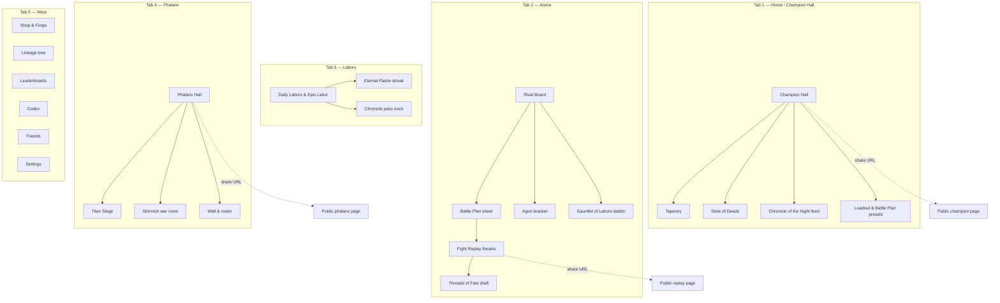
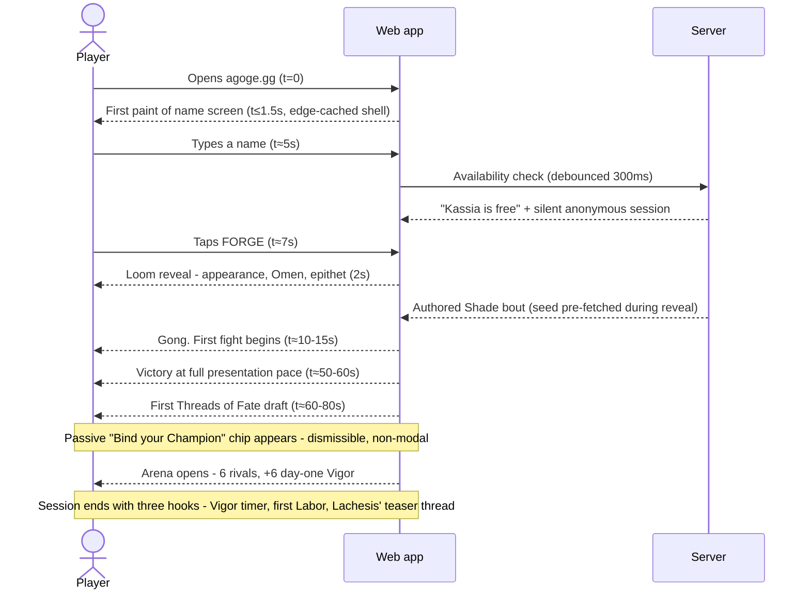
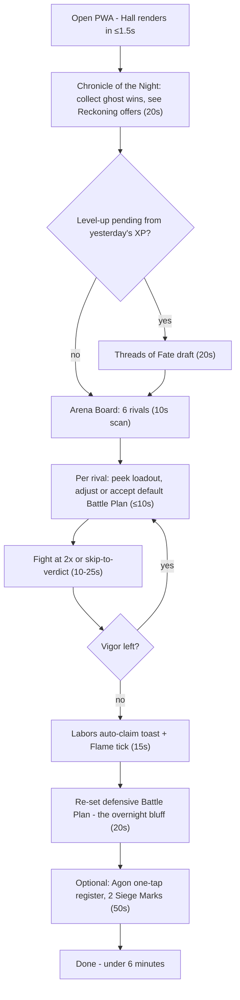
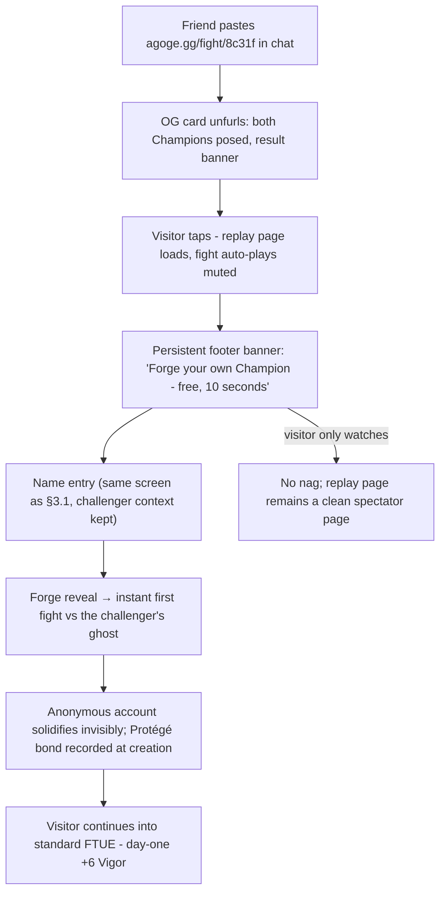
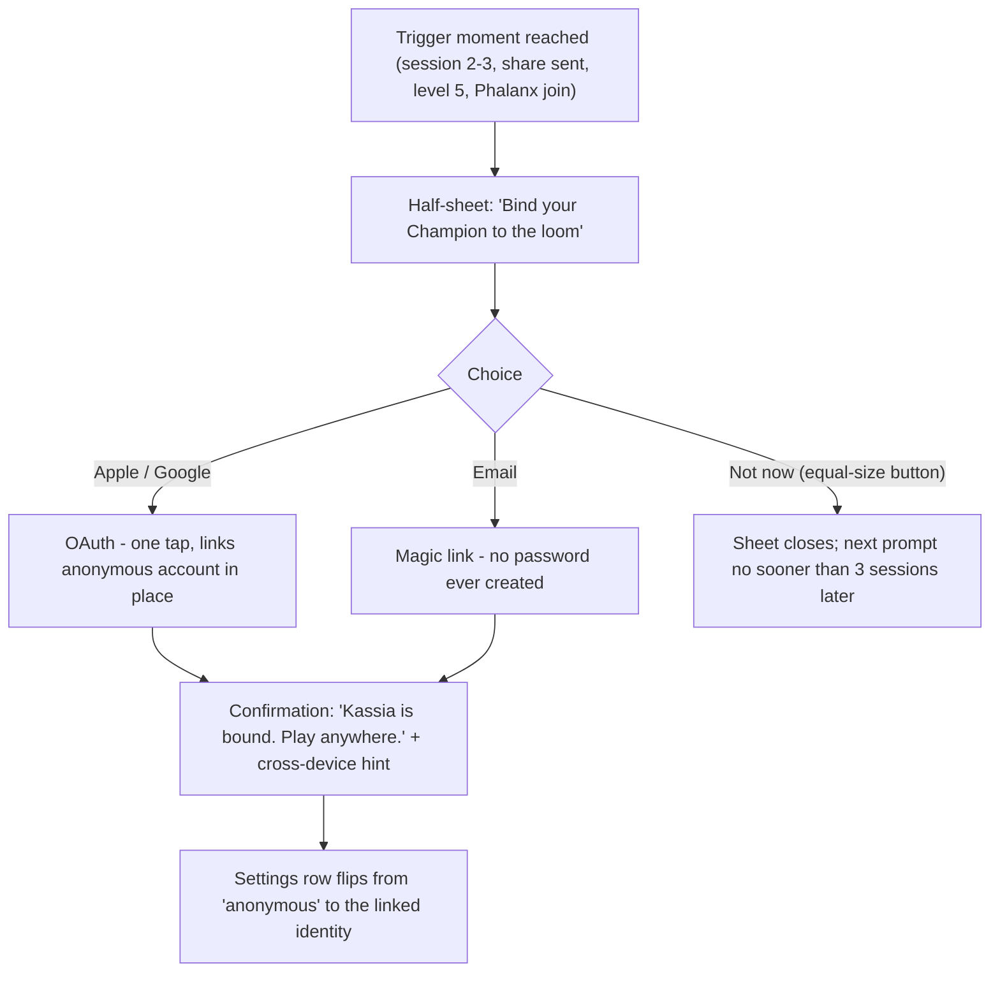

# AGOGE — UI/UX Specification & Wireframes

> **Scope.** This document owns interface design: UX principles, information architecture, wireframes, critical flows, the responsive system, accessibility, motion, and the component inventory. Game rules and numbers referenced here (Vigor, Threads of Fate, the Rival Board, Labors) are owned by `02-gdd-core.md` and `03-gdd-systems.md`; the rendering stack and payload constraints by `04-technical-architecture.md`; prices and pass structure by `07-monetisation-liveops.md`. Art direction is fixed by `00-vision.md` §4 — Greek-vase-painting-meets-modern-motion in a terracotta / bronze / lapis / ivory palette — and this spec applies it rather than reinventing it.

---

## 1. UX principles

Seven principles govern every screen. When two conflict, the lower number wins.

1. **The five-minute ritual is the organising constraint.** The daily loop (open → collect → six fights → re-set the bluff → out) must complete in under six minutes (`03-gdd-systems.md` §5.4). Every screen in the ritual path is therefore one tap from the next, and no ritual screen may ever grow a mandatory sub-step. Depth (Gauntlet tinkering, Forge sessions, spectating) lives *beside* the path, never on it.
2. **One thumb, portrait, mobile first.** Every ritual interaction sits in the bottom 60% of a portrait phone screen; primary actions are full-width bars anchored above the tab bar. Design at 360 px first; wider viewports receive more theatre, never more obligation.
3. **Desktop is an enhanced theatre, not a different game.** The desktop layout upgrades presentation — a larger fight stage, side-by-side scouting panes, persistent event log — but contains zero exclusive functions. Anything a mouse can do, a thumb can do.
4. **Zero mandatory reading.** The FTUE teaches by spectacle (the first fight *is* the tutorial); barks and labels carry tone; no tutorial screens, no modals of text. A player who reads nothing can reach level 5 without confusion.
5. **Progressive disclosure of depth.** Four visible stats on the surface; the full derived-stat machinery (initiative, interval, counter, block…) lives in the in-game **Codex**, one tap away from any stat chip via a long-press or "?" affordance. Transparency is a feature — depth is discoverable, never demanded.
6. **No dark patterns — audited, not aspirational.** Concretely: no fake notification badges (badges only ever report a true, claimable state); honest timers (a countdown always ends exactly when it says); real-currency prices always shown in the player's currency next to any Ichor price; no pre-ticked purchase options; decline buttons are the same size as accept buttons; account-upgrade and PWA prompts are deferred and dismissible forever. This list is a release checklist item, not prose.
7. **Every screen is a share object.** Profiles, replays, brackets and Phalanx halls are public URLs with server-rendered OG cards (`03-gdd-systems.md` §10.2). The logged-out view of any deep link is a designed landing page with a single **Forge your own** on-ramp — virality is an interface requirement.

---

## 2. Information architecture

### 2.1 Screen map



### 2.2 Navigation model

**Mobile (≤1023 px): a five-tab bottom bar**, always visible except inside the fight theatre (which goes full-bleed and restores the bar on exit).

| Tab | Label | Icon | Contents | Badge rules (true-state only) |
|---|---|---|---|---|
| 1 | **Home** | Champion bust | Champion Hall, Tapestry, Stele, overnight feed | Unclaimed feed items |
| 2 | **Arena** | Crossed doru | Rival Board (default), Agon, Gauntlet segments | Vigor remaining > 0 after reset |
| 3 | **Labors** | Torch | Daily/Epic Labors, Eternal Flame, Chronicle track | Completed-but-unclaimed Labors |
| 4 | **Phalanx** | Aspis shield | Hall, Titan Siege, Skirmish | Siege Marks unspent; war lineup due |
| 5 | **More** | Meander glyph | Shop, Forge, Lineage, Leaderboards, Codex, Friends, Settings | Never badged |

**Desktop (≥1024 px): a top navigation bar.** The same four primary destinations as text links (Home · Arena · Labors · Phalanx), with More expanded inline into Shop, Lineage, Codex; right-aligned: Obols/Ichor pills, Vigor pips, streak flame, avatar menu (Settings, Sign out). The bottom bar's true-state badge rules apply unchanged.

### 2.3 Deep-link scheme

All routes are public-shareable; unauthenticated visitors receive the public view plus a **Forge your own** banner. Server-rendered 1200×630 OG cards make every pasted link a poster (`03-gdd-systems.md` §10.2).

| Route | Resolves to | OG card |
|---|---|---|
| `agoge.gg/c/:name` | Champion public profile — the canonical challenge link | Champion poster, epithet, league badge |
| `agoge.gg/:name` | Vanity 301 → `/c/:name` (reserved-word list guards `arena`, `shop`, etc.) | — |
| `/c/:name/tapestry` | Full draft history | Tapestry ribbon strip |
| `/c/:name/stele` | Achievements & titles | Stele engraving card |
| `/fight/:id` | Deterministic replay theatre | Both Champions posed + result banner |
| `/phalanx/:tag` | Phalanx hall public view | Banner, sigil, Siege tier |
| `/agon/:date/:flight` | Tournament bracket | Bracket state card |
| `/gauntlet` | Current week's 12-rung ladder | Week's boss + modifier |
| `/chronicle` · `/shop` · `/codex/:entry` · `/settings` | App sections (auth-gated where personal) | Generic brand card |

---

## 3. Wireframes

Conventions: `[ ... ]` tappable, `( )`/`(*)` empty/filled pips, `~` the streak flame, frames are 360 px (mobile) and 1280 px content width (desktop). The six key screens get both form factors; the rest are mobile-only (desktop reflows them onto the 12-column grid per §5).

### 3.1 Onboarding — name entry → forge reveal → first fight

**Mobile.** One screen, three sequential states. No account, no email, no choice paralysis.

```
 STATE A - NAME              STATE B - FORGE            STATE C - FIRST FIGHT
+------------------------+  +------------------------+  +------------------------+
|      (golden dusk)     |  |                        |  | [=====HP  ] KASSIA     |
|      A  G  O  G  E     |  |    the loom weaves...  |  |                        |
|                        |  |      threads spiral    |  |    (theatre stage,     |
| "Speak a name, and the |  |     into a figure      |  |     full presentation  |
|  Fates will do the     |  |                        |  |     pace, no controls) |
|  rest."                |  |   KASSIA "the Poised"  |  |                        |
| +--------------------+ |  |    Omen of the Xiphos  |  | SHADE     [==HP      ] |
| | Name your Champion | |  |   Might+2 Grace+2 ...  |  |                        |
| +--------------------+ |  |                        |  | Herald: "A NATURAL!"   |
|  "Kassia" is free      |  |   (gong swells...)     |  |                        |
| [      FORGE  ]        |  |                        |  |      (no skip on the   |
|  Have a Champion?      |  |                        |  |       very first bout) |
|  Sign in               |  |                        |  |                        |
+------------------------+  +------------------------+  +------------------------+
```

**Desktop.** The same three states in a centred 480 px column over a full-bleed painterly backdrop; state C widens the stage to the full theatre (§5.3). No sidebar, no chrome — the landing page has exactly two interactive elements (name field, sign-in link) until the Champion exists.

Name-entry details: live uniqueness check debounced at 300 ms; profanity/moderation pipeline runs at submit (`03-gdd-systems.md` §10.4); on rejection the field shakes once (120 ms) and offers three seeded suggestions — never a dead end.

### 3.2 Home / Champion Hall — heir to MyBrute's cell

The Hall is the game's social object: your own view and the public `/c/:name` view are the same layout minus private controls.

**Mobile.**

```
+----------------------------------+
| AGOGE            (bell) (gear)   |
|                                  |
|      KASSIA "the Poised"         |
|      Silver League  · Lv 7       |
|   +--------------------------+   |
|   |   (champion portrait,    |   |
|   |    idle animation,       |   |
|   |    beasts at her feet)   |   |
|   +--------------------------+   |
| Might 12 | Grace 14 | HP 112     |
| Tempo  9 | Grit  8  | Kleos 1483 |
|                                  |
| Vigor (*)(*)(*)(*)( )( )   4/6   |
| ~ Flame 12 days   Embers x1      |
|                                  |
| CHRONICLE OF THE NIGHT           |
| > Your ghost held! +6 Kleos      |
|   [Watch]                        |
| > THERON felled your ghost       |
|   [Reckon - 41h left]            |
|                                  |
| TODAY'S LABORS             2/3   |
| [x] Win 2 Arena fights    40 Ob  |
| [ ] Win vs a Reach rival  60 Ob  |
| [x] Register for Agon     30 Ob  |
|                                  |
| [ Tapestry ] [ Stele ] [ Share ] |
| [        TO THE ARENA ->       ] |
+----------------------------------+
|Home |Arena |Labors |Phlnx | More |
+----------------------------------+
```

**Desktop.** Two columns on the 12-column grid: portrait and stats left (5 cols), feed + Labors + quick actions right (7 cols). The Tapestry's last three drafts render as a ribbon under the portrait — the Hall doubles as a build billboard for visitors.

```
+---------------------------------------------------------------------------+
| AGOGE   Home  Arena  Labors  Phalanx  Shop  Codex     [Ob 1,240][Vigor 4] |
|---------------------------------------------------------------------------|
|  KASSIA "the Poised"  Lv 7        |  CHRONICLE OF THE NIGHT               |
|  Silver League - Kleos 1,483      |  > Ghost held vs OKEANOS  +6  [Watch] |
|  +--------------------------+     |  > THERON felled your ghost [Reckon]  |
|  |  (portrait + beasts,     |     |---------------------------------------|
|  |   idle animation)        |     |  TODAY'S LABORS                  2/3  |
|  |                          |     |  [x] Win 2 Arena fights        40 Ob  |
|  +--------------------------+     |  [ ] Win vs a Reach rival      60 Ob  |
|  Might 12  Grace 14  Tempo 9      |  [x] Register for Agon         30 Ob  |
|  Grit 8    HP 112                 |  ~ Flame 12 days  Embers x1           |
|  Recent threads: [+3 Gr][Labrys]  |                                       |
|  [ Tapestry ] [ Stele ] [ Share ] |  [         TO THE ARENA ->          ] |
+---------------------------------------------------------------------------+
```

### 3.3 Arena Board — six rival cards

Rules and bands are owned by `03-gdd-systems.md` §1.1; the interface job is making six decisions legible in ten seconds each.

**Mobile.** A vertical stack grouped by band; each card is a **loadout peek** plus the rival's *last-known* Battle Plan — the bluffing surface.

```
+----------------------------------+
| ARENA        Kleos 1,483 Silver  |
| Board resets 09:12   [Reroll x1] |
|----------------------------------|
| BEATABLE                         |
| +------------------------------+ |
| | OKEANOS  Lv6      1,398 K    | |
| | Doru + Aspis  ·  Lykos x1    | |
| | Last plan: Guarded / Hold /  | |
| |   "When first bloodied..."   | |
| | [ Scout ]     [ FIGHT  -1 ]  | |
| +------------------------------+ |
| | PHOKAS ...                   | |
|----------------------------------|
| EVEN                             |
| | NIKOS ...    | THERON ...     |
|----------------------------------|
| REACH   (+1 XP for fighting up)  |
| | DEIMOS ...   | PYRRHA ...     |
|----------------------------------|
| Clean Sweep: 4/6 fought          |
| Agon: bracket resolving [View]   |
+----------------------------------+
|Home |ARENA |Labors |Phlnx | More |
+----------------------------------+
```

Fought rivals grey out with the result stamped on the card (laurel or dust). **Scout** opens the rival's public Hall in a sheet — scouting never leaves the Arena context.

**Desktop.** A 3×2 card grid (4 cols each); hovering a card expands the loadout peek into the full public loadout with Codex tooltips; the right rail (persistent, 3 cols) shows Agon status and Gauntlet progress so the whole day's fighting is one screen.

### 3.4 Battle Plan sheet — the 10-second decision

Opens as a bottom sheet (mobile) or right-side panel (desktop) over the Arena. Design goal: **a returning player commits in under 10 seconds**; defaults are the last plan used against this rival, so one tap ("Loose the Gong") is always a legal play.

**Mobile.**

```
+----------------------------------+
|  vs OKEANOS          [x close]   |
|  Their last-known plan:          |
|  Guarded / Hold Ground / hidden  |
|----------------------------------|
| STANCE                           |
| [Aggressive][Measured*][Guarded] |
|                                  |
| GAMBIT                           |
| (Hurl First)(Close the Gap*)     |
| (Hold Ground)(Feint)...          |
|                                  |
| TRUMP                            |
| "When first bloodied ->          |
|      Wrath of Herakles"    [v]   |
|----------------------------------|
| You vs them: won 2 of last 3     |
| [       LOOSE THE GONG   -1     ]|
+----------------------------------+
```

**Desktop.** The sheet docks beside the rival card; the three pickers render in one row; a small "plan memory" table lists your last three plans against this rival and the outcomes. Trump editing opens the condition-grammar builder (`02-gdd-core.md` §4.7.3) — a two-dropdown sentence, never a scripting UI.

### 3.5 Fight Replay — the theatre

**Mobile (portrait).** The stage letterboxes (§5.3); HUD lives in the letterbox bands so no pixel is dead.

```
+----------------------------------+
| < Back           agoge.gg/fight/ |
|                        8c31f     |
|+--------------------------------+|
|| KASSIA [========  ]            ||
||                                ||
||     (2:1 stage - vase-style    ||
||      figures, squash and       ||
||      stretch, bronze dust)     ||
||                                ||
||            [==   ] OKEANOS    ||
|+--------------------------------+|
| Herald: "A COUNTER! The crowd    |
| is on its feet!"                 |
| [ pause ] [ 2x ] [ skip>| ] 0:21 |
|----------------------------------|
|         (on verdict:)            |
|  VICTORY - KASSIA                |
|  +2 XP (+1 reach bonus)  +14 K   |
|  [ Share replay ] [ Next fight ] |
+----------------------------------+
```

**Desktop.** Stage centred at up to 1280×640; right rail shows the scrolling event log (the same deterministic log that powers narration, §6.3); below, the replay scrubber with event tick-marks (first blood, Trump activation, disarms). Patron's Oath theatre extras (slow-motion, frame-step, damage overlay — `07-monetisation-liveops.md`) mount into this rail without layout change.

Post-fight verdict rules: XP and Kleos deltas animate in once, numbers are tabular-lining, and **Share replay** is co-primary with **Next fight** — sharing is never buried.

### 3.6 Threads of Fate draft — the designed dopamine moment

**Mobile.**

```
+----------------------------------+
|        LEVEL 8 ATTAINED          |
|  Lachesis: "Three threads. Cut   |
|   the two you can live without." |
|                                  |
| +--------+ +--------+ +--------+ |
| |  +3    | | WEAPON | | SKILL  | |
| | GRACE  | | Labrys | | Keen   | |
| |        | |        | | Edge   | |
| +--------+ +--------+ +--------+ |
|                                  |
| > Labrys: slow, huge; Might-     |
|   scaled; -initiative. [Codex]   |
|                                  |
|  Favour x2    [ Reroll all  -1 ] |
|                                  |
| [         WEAVE IT IN          ] |
|  Milestone at Lv 10: a non-stat  |
|  thread is guaranteed            |
+----------------------------------+
```

Cards flip face-up in a staggered reveal (§7.2). Tapping a card focuses it and fills the detail strip; **Weave It In** is disabled until a card is focused — no accidental drafts. Reroll consumes one Favour and replaces all three cards with a fresh loom animation; the milestone footer frames the *next* guarantee, converting each draft into anticipation for the next. The chosen thread animates into the Tapestry ribbon on confirm.

**Desktop.** Cards render at full size side by side with their complete Codex entries beneath each — no focus step needed; keyboard 1/2/3 selects, Enter weaves, R rerolls (with confirm).

### 3.7 Compact wireframes (mobile-only)

**Tapestry** — the shareable build history (`02-gdd-core.md` §6.4):

```
+----------------------------------+
| TAPESTRY - KASSIA        [Share] |
| Lv2 [+3 Might]  Lv3 [Kopis]      |
| Lv4 [+2/+1 Gr/Te]                |
| Lv5 [* Keen Edge]   <- milestone |
| Lv6 [+3 Grace] (rerolled)        |
| Lv7 [Lykos]                      |
| filter: [Stats][Weapons][Skills] |
+----------------------------------+
```

**Gauntlet of Labors** — weekly 12-rung PvE ladder:

```
+----------------------------------+
| GAUNTLET - Week of the Boar      |
| Modifier: "Bronze Skin" (+armour)|
| 12 [locked]  11 [locked]         |
| 10 [locked]   9 [locked]         |
|  8 [ FIGHT ]  <- you are here    |
|  7 [x] 6 [x] 5 [x] ... 1 [x]     |
| Trophies this week: 60           |
| Resets in 3d 09:12               |
+----------------------------------+
```

**Phalanx Hall + Titan Siege:**

```
+----------------------------------+
| [banner] THE UNBROKEN  /phalanx/ |
|          UNBRKN   ·  24/30       |
| TITAN SIEGE - KRIOS  Tier II     |
| [===========------] 62%          |
| Your Siege Marks: (*)(*)  [Spend]|
| Skirmish: vs IRONWOVEN - day 2   |
|   lineup due 04:12  [War room]   |
| WALL                             |
| > Nikos: "Clean sweep, lads."    |
| [ Roster ] [ Wall ] [ Settings ] |
+----------------------------------+
```

**Agon bracket:**

```
+----------------------------------+
| DAILY AGON - Flight 14 (Silver)  |
| Round of 16 resolving 18:00      |
| KASSIA --+                       |
|          +-- winner --+          |
| DEMOS  --+            |          |
| PHILON --+            +-- ...    |
|          +-- PHILON --+          |
| ...                              |
| [ My path ] [ Watch round of 32 ]|
+----------------------------------+
```

**Chronicle pass track** (retroactive, never expires — `07-monetisation-liveops.md`):

```
+----------------------------------+
| CHRONICLE - Saga of Ares         |
| FREE   [12][13][14][15][16]...   |
| PREMIUM[12][13][14][15][16]...   |
|         ^ tier 14: Ember         |
| 2,140 / 2,400 to tier 15         |
| [ Unlock premium  $9.99 ]        |
| Past Chronicles [v] (buy any     |
|  time, progress at leisure)      |
+----------------------------------+
```

**Shop** (real prices always visible; no timers that lie, no bundles that hide maths):

```
+----------------------------------+
| BRONTE'S SHOP        [Ob][Ichor] |
| FEATURED (rotates weekly,        |
|  returns to catalogue after)     |
| [Skin: Marble-Wrought  800 Ic    |
|   = $8.00]                       |
| [Backdrop: Dusk Terrace 300 Ob]  |
| CATALOGUE: [Skins][VFX][Poses]   |
|   [Backdrops][Slots]             |
| Everything here is cosmetic.     |
| Power is never sold.             |
+----------------------------------+
```

**Stele / profile** (public `/c/:name/stele`):

```
+----------------------------------+
| STELE OF DEEDS - KASSIA          |
| Titles: [the Poised][Gilded]     |
| Laurels: 34 round-wins (wreath I)|
| Deeds: 41/120 engraved           |
| > Boar-Breaker  (Gauntlet 12)    |
| > Thrice-Woven  (3 Weaves)       |
| [ Set displayed title ]          |
+----------------------------------+
```

**Settings:**

```
+----------------------------------+
| SETTINGS                         |
| Account: anonymous  [ Bind now ] |
| Sound        [off*] [on]         |
| Reduced motion   [system*]       |
| Dyslexia numerals    [off]       |
| Colour-blind assist  [auto]      |
| Notifications: Reckoning [on]    |
|   Vigor full [on]  Agon [off]    |
| Install app          [ Add ]     |
| Privacy - replays [public*]      |
| Language / Sign out / Legal      |
+----------------------------------+
```

---

## 4. Critical flows

### 4.1 First-session FTUE — beat by beat

Target: **the first fight is under way within 15 seconds of first paint, and won within 60 seconds** — comfortably inside the "first fight within 60 seconds" budget even on throttled 3G. The beats are guaranteed by `02-gdd-core.md` §3.3; this is the interface timing contract.



| Beat | Budget | Cumulative |
|---|---|---|
| First paint (edge-cached shell, <3 MB total payload) | ≤1.5 s | 0:01.5 |
| Name typed + availability confirmed | ~5 s (user-paced) | 0:07 |
| Forge reveal (loom animation; fight seed pre-fetched behind it) | 2 s | 0:09 |
| Gong → first fight under way | ≤5 s worst-case network | 0:10–0:15 |
| First fight, full pace (no skip control on this one bout) | 35–45 s | ≤0:60 |
| First draft presented and woven | ~20 s | ~1:20 |

**Account upgrade cadence:** session 1 shows only the passive chip (a one-line dismissible banner after the first draft). The first *active* prompt — a half-sheet, still one-tap dismissible — appears at **session 2–3**, or earlier only if the player themselves initiates a share or Phalanx join (moments of felt investment, per `02-gdd-core.md` §3.4). Session 1 is never interrupted.

### 4.2 The daily ritual flow

The interface mirror of `03-gdd-systems.md` §5.4 — every arrow below is a single tap.



Interface guarantees that protect the budget: Labor claims are automatic with a toast (no claim-tapping chores); the Battle Plan sheet defaults to the last plan used; fights queue back-to-back with a single **Next fight** button; nothing in this loop ever shows an interstitial.

### 4.3 Challenge-link recipient flow

The Lineage growth engine (`03-gdd-systems.md` §10.1) from the visitor's side. The fight is the pitch; commitment comes after entertainment.



The `/c/:name` challenge link behaves identically but leads with a 15-second best-recent-replay taster instead of a specific fight. In both cases the **Forge your own** banner is the page's only conversion element — one CTA, never a wall.

### 4.4 Account upgrade flow



Rules: linking never migrates or resets anything — the anonymous Supabase session simply gains credentials (`04-technical-architecture.md`); declining is stateless and cost-free; the prompt is never shown during the ritual path, only at its natural ends (post-draft, post-share, post-join).

---

## 5. Responsive system

### 5.1 Breakpoints and grids

| Token | Min width | Columns | Gutter | Margin | Layout behaviour |
|---|---|---|---|---|---|
| `xs` | 360 px | 4 | 16 px | 16 px | Single column; bottom tab bar; sheets from bottom |
| `md` | 768 px | 8 | 20 px | 24 px | Two-pane where useful (Board + sheet side by side); tab bar remains |
| `lg` | 1024 px | 12 | 24 px | 32 px | Top nav replaces tab bar; persistent right rail on Arena/Replay |
| `xl` | 1440 px | 12 | 24 px | auto | Content max-width 1280 px, centred; extra width goes to theatre backdrop art |

Below 360 px (legacy devices) the layout does not reflow further; it scales type down one step and keeps all touch targets at full size.

### 5.2 Touch targets, safe areas, inputs

- **Touch targets ≥44×44 CSS px** with ≥8 px spacing (vision contract §6; comfortably exceeding WCAG 2.2's 24 px minimum, SC 2.5.8). The Vigor pips, stat chips and scrubber tick-marks are decorative-plus-label — their tap zones are full-row.
- **Safe-area insets:** the tab bar and all bottom-anchored primary buttons pad with `env(safe-area-inset-bottom)`; the theatre HUD respects top notches via `safe-area-inset-top`. Tested devices list lives with the release checklist.
- **Hover is never load-bearing.** Desktop hover previews (rival card expansion, Codex tooltips) all have tap/click and keyboard equivalents.

### 5.3 How the fight theatre letterboxes

The stage is a fixed **2:1 logical scene (2048×1024)** rendered by PixiJS (`04-technical-architecture.md`).

- **Portrait mobile:** the scene fits to viewport width (360 px → 180 px tall is too small, so the renderer crops to a 4:3 *camera* on the 2:1 scene, keeping both fighters framed via the sim's position data). The letterbox bands above and below are painted surfaces carrying the HUD — fighter names, HP bars, Herald bark line, controls — so letterboxing is composition, not waste.
- **Landscape / desktop:** full 2:1 scene, height-capped at 60 vh and 640 px, centred; side gutters receive painterly backdrop bleed (non-interactive) and, at `lg`+, the event-log rail.
- **Orientation change mid-fight** re-fits the camera without pausing the deterministic playback; the scrubber position is preserved.

### 5.4 PWA install prompts, done politely

- Capture `beforeinstallprompt` silently; **never** surface it on first visit or during the ritual path.
- Offer install via: (1) a quiet banner after the **second completed session**, (2) the Eternal Flame day-3 milestone toast ("Make the ritual one tap — add AGOGE to your home screen"), (3) a permanent Settings row.
- iOS (no install event): the same triggers open a two-step illustrated share-sheet instruction card.
- Dismissal is remembered for 30 days; two dismissals silence prompts permanently (Settings row remains). The Capacitor store builds (`04-technical-architecture.md`) suppress all install prompting.

---

## 6. Accessibility — WCAG 2.2 AA commitments

AGOGE targets **WCAG 2.2 AA** across web and PWA, verified per release by automated checks (axe-core in CI) plus a manual audit of the six key screens.

### 6.1 Colour tokens and contrast in the terracotta/bronze/lapis palette

The palette is warm and dark by default (the golden dusk). Contrast ratios below are computed with the WCAG relative-luminance formula and enforced by a token lint in CI — a token pair that regresses fails the build.

| Token | Hex | Used for | Against | Ratio | AA |
|---|---|---|---|---|---|
| `ink-900` | `#251A14` | Body text (light surfaces) | `ivory-100 #F6EFE2` | 14.9:1 | ✓ |
| `ivory-100` | `#F6EFE2` | Body text (dusk surfaces) | `dusk-900 #241813` | 15.1:1 | ✓ |
| `ivory-100` | `#F6EFE2` | Card text | `dusk-800 #32211A` | 13.4:1 | ✓ |
| `terracotta-600` | `#A8431F` | Primary buttons (ivory label) | `ivory-100` | 5.3:1 | ✓ |
| `lapis-600` | `#2C4F9E` | Secondary actions (ivory label) | `ivory-100` | 6.8:1 | ✓ |
| `lapis-300` | `#8FA8DE` | Links on dusk | `dusk-900` | 7.3:1 | ✓ |
| `bronze-400` | `#C99B5F` | Large numerals, ornament | `dusk-900` | 6.9:1 | ✓ |
| `gold-300` | `#FFD86B` | Kleos, laurels | `dusk-900` | 12.6:1 | ✓ |
| `laurel-700` | `#4A5A26` | Success fills (ivory label) | `ivory-100` | 6.6:1 | ✓ |
| `alarm-700` | `#8C2F2A` | Destructive fills (ivory label) | `ivory-100` | 7.2:1 | ✓ |

Rule: `terracotta-500 #C4552B` (the hero brand hue) is **decorative-only** — at 3.8:1 against ink it may never carry small text or sole meaning. Focus indicators are a 2 px `gold-300` ring with 2 px offset, satisfying SC 2.4.11 (focus not obscured) — sticky bars reserve scroll-margin so focused elements are never hidden beneath them.

### 6.2 Reduced motion

`prefers-reduced-motion` (or the Settings toggle) switches the game to a calm register:

- **Fights render as timeline cards**: the deterministic event log becomes a vertical list of illustrated cards (static poses, no animation) — "Round 3 — KASSIA counters, 14 damage" — ending in the verdict card. Same information, same pacing control (advance per tap or auto at reading speed), same share button.
- UI transitions collapse to ≤120 ms opacity fades; the loom reveal, laurel ceremonies and confetti become static compositions; parallax and idle animations stop.
- Nothing is lost: rewards, barks (as text) and the draft all function identically.

### 6.3 Screen-reader fight narration — the event log doubles as narration

Because combat is deterministic and server-simulated, **every fight already exists as an ordered event log** (`04-technical-architecture.md`). Each event type carries a localised narration template — the same strings that drive the Herald's barks and the reduced-motion timeline cards. For screen readers, the theatre exposes an `aria-live="polite"` region that speaks the log at playback pace ("Kassia hurls the akontion — 11 damage, armour pierced"), with the scrubber operable as a standard slider. One content pipeline serves animation, barks, timeline cards and narration — accessibility here is an *output mode of the sim*, not a parallel system, and it can never drift out of sync with what sighted players see.

All interactive components ship with names/roles/states per ARIA Authoring Practices; icons always pair with text or `aria-label`s; toasts use `role="status"`.

### 6.4 Colour-blind-safe encoding — never colour alone

| Meaning | Colour | Redundant channel |
|---|---|---|
| Leagues (Bronze→Olympian) | League hues | Distinct badge silhouettes: plain disc / single chevron / double chevron / column capital / laurel wreath — plus text label |
| Rival bands (Beatable/Even/Reach) | Green/neutral/red tint | Band section headers + up/down glyph on each card |
| Fate card categories | Category hues | Corner glyph per category (bar-chart / blade / spiral / paw) + label |
| Win/loss stamps | Laurel/dust tones | Laurel icon vs dust icon + word |
| HP bars | Green→red drain | Numeric HP always shown; bar hatches below 25% |

A "colour-blind assist" setting (auto-detects nothing; purely opt-in) thickens the redundant glyphs and switches the HP drain ramp to a blue–orange scale.

### 6.5 Keyboard navigation map (desktop)

| Key | Action |
|---|---|
| `1–4` | Switch primary nav (Home / Arena / Labors / Phalanx) |
| `Tab` / arrows | Move focus; arrow keys traverse rival cards and fate cards |
| `Enter` | Primary action of focused card (Fight / Weave / Claim) |
| `Space` | Play/pause replay |
| `F` | Toggle 2× speed · `K` skip to verdict |
| `←` `→` | Scrub replay by event tick |
| `S` | Share (replay, profile, Tapestry) |
| `Esc` | Close sheet / back |
| `?` | Shortcut overlay |

All functionality is operable without a pointer (SC 2.1.1); no keyboard traps; shortcuts are single keys with no timing requirements and remappable in Settings.

### 6.6 Dyslexia-friendly numerals

A Settings toggle swaps the display face's figures for a high-legibility numeral set (unambiguous 6/9, slashed 0, open 3/8, tabular-lining throughout — Atkinson Hyperlegible-class forms, subset to ~12 KB). Because AGOGE is a numbers game (stats, Kleos deltas, damage), numerals get their own accessibility lever independent of the body face; the toggle also increases numeric letter-spacing by 0.02 em. Body text remains the standard humanist sans at a 16 px minimum with 1.5 line-height and user zoom unblocked to 200% (SC 1.4.4).

---

## 7. Motion & game feel

### 7.1 Animation principles

| Pattern | Duration | Easing | Notes |
|---|---|---|---|
| Micro feedback (press, toggle, pip fill) | 100–120 ms | ease-out | Every tap acknowledges within one frame |
| Standard UI transitions (sheets, tabs, cards) | 150–250 ms | ease-out enter, ease-in exit | Never longer — snappy is the brand |
| Fight hits | 150–180 ms | custom squash-and-stretch | 12% deformation on impact; 60–90 ms hit-stop on crits and Trump activations |
| Verdict stamp | 300 ms | overshoot | One bounce, then still |
| Level-up draft reveal | ~1.6 s total | choreographed | The designed exception — see below |
| Laurel/promotion ceremonies | ≤2 s | choreographed | Always tap-to-skip |

The **Threads of Fate reveal is the game's engineered dopamine moment** and deliberately breaks the 250 ms rule: gong swell (200 ms) → loom threads spiral in (400 ms) → three cards weave face-down (300 ms) → staggered flips at 120 ms intervals with a per-category chime → settle (200 ms). It is tap-through-skippable from the first frame, and reduced-motion collapses it to a fade — but for everyone else this is the moment the day was for, and it earns its budget. Nothing else in the interface may exceed 300 ms without a skip affordance.

Fight feel inherits the art direction: thick-silhouette vase figures with exaggerated squash-and-stretch, bronze-dust defeat bursts, dazed birds — slapstick-heroic, never gore (`00-vision.md` §4).

### 7.2 Performance budget

| Budget | Target | Enforcement |
|---|---|---|
| Frame rate | 60 fps on mid-range Android (Moto G-class, 2022) during fights; 30 fps battery-saver mode auto-engages on `navigator.getBattery` low state | Perf test in CI device farm |
| Initial payload | **<3 MB** total (vision §6), allocation owned by `04-technical-architecture.md` §11.5: app shell JS 180 KB, PixiJS 110 KB, sim bundle 40 KB, CSS + subset fonts 90 KB, UI atlas 400 KB, champion base atlas + first backdrop 900 KB — ~1.7 MB, leaving headroom | Bundle-size gate in CI (fails above 2.5 MB) |
| Interaction latency | Input → visual acknowledgement ≤100 ms | Web-vitals INP monitoring (PostHog) |
| Renderer limits | Particle cap 200; `devicePixelRatio` capped at 2; texture memory ≤128 MB | Runtime clamps |

Audio, additional weapon/beast atlases, Saga backdrops and the admin-visible Codex art all lazy-load post-interactive and cache via the service worker.

### 7.3 Loading & skeleton strategy

- **Skeleton screens, never spinners**, for any wait >300 ms: rival cards, feed rows and shop tiles render as shimmering placeholders (1.2 s shimmer loop, reduced-motion: static).
- **Optimistic UI** for zero-risk actions (Labor auto-claims, emote sends, plan saves) with silent rollback on failure.
- **Pre-fetching along the ritual path:** while the forge loom plays, the first fight's seed is already fetched (§4.1); while a fight plays, the next rival's snapshot warms; replay pages pre-render their poster frame from the OG image so the page never opens blank.
- Hard failures (offline mid-ritual) degrade to a Herald-voiced offline card with cached Hall data — the PWA never shows a browser error page.

### 7.4 Sound design direction

- **Muted by default** — browser autoplay policy makes this mandatory, and we treat it as a feature: AGOGE is fully playable silent (commute-friendly). After the first gong moment, a small chip offers "Sound on?" once; the choice persists.
- With permission, sound is **punchy and sparse**: the gong (session start and fight start), material hit "thocks" differentiated by weapon discipline, a crowd swell on counters and Trumps, the draft chimes (one per card category — an ear-trainable vocabulary), and the Herald's bark stings. No background music loop at launch; the dusk ambience bed ships with the first Saga if testing shows it earns its bytes.
- Per-channel mutes in Settings (effects / Herald / ambience); Capacitor builds respect the OS silent switch.

---

## 8. Component inventory — the design-system build checklist

The frontend milestone (`08-roadmap.md`) builds this list bottom-up in Storybook before screen assembly; each component ships with keyboard, screen-reader and reduced-motion behaviour as acceptance criteria.

### 8.1 Primitives

| Component | Variants / notes |
|---|---|
| Button | Primary (terracotta), secondary (lapis), ghost, destructive; full-width bar variant; equal-size decline rule baked in |
| Currency pill | Obols, Ichor, Trophies; Ichor always renders adjacent real-price text where purchasable |
| Stat chip | Might/Grace/Tempo/Grit + derived; long-press/`?` opens Codex popover |
| Vigor pips | 0–12 with bank-cap divider; full-row tap target |
| Streak flame | Day count + Ember indicators; milestone glow states |
| League badge | 5 silhouettes + text (colour-blind-safe, §6.4) |
| Kleos delta | Signed, animated once, tabular numerals |
| Progress track | Linear (Chronicle tiers, XP) and radial (Siege) |
| Toast / status | `role="status"`; auto-claim confirmations |
| Sheet / modal | Bottom sheet (mobile), docked panel (desktop); focus-trapped |
| Tabs / segmented control | Nav segments; Stance picker reuses it |
| Tooltip / Codex popover | Tap-toggle on touch; hover+focus on desktop |
| Skeleton card | Shimmer loop; reduced-motion static |
| Empty state | Herald-voiced illustrations per context |
| Banner | Passive prompts (bind account, PWA install); dismiss-forever logic |

### 8.2 Game objects

| Component | Notes |
|---|---|
| Champion card | Portrait, epithet, level, league; sizes S (leaderboard row) / M (rival) / L (Hall) |
| Rival card | Champion card + loadout peek + last-known Battle Plan + Fight/Scout actions |
| Weapon tile | Discipline glyph, dial summary; Codex link |
| Skill tile | Boon/Technique/Trump family glyphs |
| Beast tile | Grit-tax badge, exclusivity indicators |
| Fate card | Category glyph + hue; face-down/reveal/focused/woven states |
| Loadout strip | Equipped weapons/skills/beasts; preset switcher (Patron extras slot here) |
| Trump condition builder | Two-dropdown sentence UI |
| Tapestry ribbon | Horizontal (Hall) and full vertical (Tapestry page) renderers |
| Lineage tree node | Lit/unlit torch states; milestone ornaments |

### 8.3 Scene & mode components

| Component | Notes |
|---|---|
| Theatre canvas wrapper | PixiJS mount, camera fit, letterbox HUD bands, orientation handling |
| Replay scrubber | Event tick-marks; slider semantics; keyboard scrub |
| Timeline card renderer | Reduced-motion fight output (§6.2) |
| Herald bark line | Text stream synced to event log; `aria-live` source |
| Verdict panel | Result, XP/Kleos deltas, Share + Next fight |
| Bracket view | Agon flights; collapses to "My path" on mobile |
| Gauntlet ladder | 12 rungs, modifier banner, lock states |
| Siege health bar | Tier segments, Phalanx damage attribution |
| War room lineup | 7-slot picker with deadline countdown |
| Leaderboard row | Friends-default scope; deep-links to profile/replay |
| Shop tile & price tag | Real-currency co-display; "cosmetic only" badge |
| Chronicle track | Dual-rail free/premium; retroactive Saga picker |
| OG share preview | In-app preview of the card a link will unfurl as |
| Onboarding loom | Name field, availability hint, forge reveal sequence |
| Settings row set | Toggle, select, and action rows incl. account-bind state |

Component count: ~40. Everything above composes the six key screens plus the compact set with no bespoke one-off UI, which is the definition of done for the design-system milestone.

---

*Cross-references: mechanics `02-gdd-core.md`, modes and economy `03-gdd-systems.md`, rendering and payload `04-technical-architecture.md`, prices and LiveOps `07-monetisation-liveops.md`, build order `08-roadmap.md`.*
