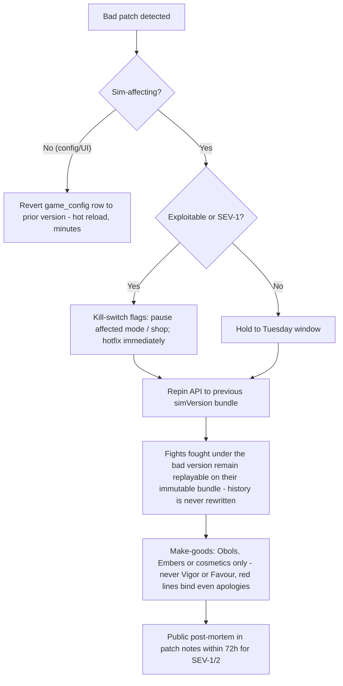

# AGOGE — Monetisation Strategy & LiveOps Plan

> **Scope.** This document owns all real-money pricing, the product catalogue, revenue modelling, the live calendar and live operations. In-game currency flows and Obol price anchors are owned by `03-gdd-systems.md` §8; the deterministic-replay and patch-safety machinery is owned by `04-technical-architecture.md` §3; shop and Chronicle UI surfaces by `06-ui-ux.md`; build phasing by `08-roadmap.md`. Everything here conforms to the vision contract (`00-vision.md` §5) — the catalogue is fixed: **Chronicle** ($9.99/Saga), **Patron's Oath** ($4.99/month), direct-purchase cosmetics, and Champion slots. Nothing else is for sale.

---

## 1. Philosophy & red lines

### 1.1 The trust thesis: longevity LTV beats extraction

AGOGE monetises a **relationship measured in years**, not a wallet measured in weeks. The evidence base (`docs/research/market.md`) is unambiguous:

- **Torn** — a text-based browser game with 2004 graphics — crossed **100,000 DAU in 2026**, funded for two decades by a $4.85/month supporter subscription and a $5 pack. Fairness compounds.
- **Melvor Idle** cleared an estimated **$6.7M on Steam alone** with buy-once pricing and an explicit "level playing field" philosophy; **Super Auto Pets** is the genre's cited fairness benchmark (89% positive, 35k+ reviews); **Backpack Battles** sold **640,000 copies in a month** on the strength of a *generous* demo.
- **The Bazaar** is the cautionary tale: in March 2025 it put ranked entry and hero expansions behind payment after years of cosmetic-first promises; the revolt forced a full reversal within a month, and the trust damage still shadowed its Steam launch.
- **MyBrute itself** declined partly because Muxxu-era monetisation (paid fights, paid slots) arrived alongside the *deletion of the free viral loop* (`docs/research/community.md` §4–5). Players never resented the payments as much as the broken compact.

Our thesis: with D30 ≥ 8% and a progression horizon of months-to-years (`00-vision.md` §5), a Mentor who trusts us is worth more across three Sagas than any Mentor squeezed in one. Every pricing decision below is tested against a single question: *would a ten-year player read this and feel respected?*

### 1.2 The never-list

These are absolute. Each carries the market scar that proves it.

| # | We will never sell… | Evidence |
|---|---|---|
| 1 | **Vigor, energy, or fight refills** — Vigor is 6/day, bank cap 12, identical for every account forever | Shakes & Fidget's 100-vs-300 energy split is the single most-cited reason it is "heavily Pay2Win"; MyBrute Lite's paid fight-cap removal aged badly |
| 2 | **XP, stats, gear, or any power** — equipment is horizontal by design | AFK Journey's gacha fatigue; every P2W complaint thread in the lineage |
| 3 | **Favour or rerolls** — Favour comes from play milestones only (`00-vision.md` §5) | Selling rerolls is selling draft outcomes — paid randomness by the back door |
| 4 | **Ranked entry or tournament access** — Arena, Agon and Grand Agon are free forever | The Bazaar charged ~$1/ranked run in March 2025; instant revolt, full reversal |
| 5 | **Loot boxes or any paid randomness** — every purchase shows exactly what it delivers | Belgium's outright ban (upheld 2025), the Netherlands' push for an EU-wide ban, and the pending EU Digital Fairness Act make this a legal as well as moral corridor |
| 6 | **Rewarded or interstitial ads** — no ad SDKs in the client; "watch an ad for Vigor" is energy-for-money by another name | The Eternaltwin community itself rejected watch-an-ad fight refills; our virality (replay URLs, Lineage) is the marketing budget |
| 7 | **Chronicle tier skips** — pass progress is play, and the pass never expires, so skips solve nothing | Retroactive passes (Halo Infinite, Deep Rock Galactic) removed the pressure skips exist to exploit |
| 8 | **Per-user price discrimination** — everyone in a region sees the same price on the same day | See §8.2: pricing is never an A/B arm |

Two corollaries: **Embers are never sold on their own** (`03-gdd-systems.md` §5 — they appear only on the Chronicle's *free* lane and at streak milestones), and **no Ichor→Obol exchange exists** (`03-gdd-systems.md` §8.1 — money can never vacuum up the soft-currency economy).

### 1.3 The Mentor's Charter — fairness as a public contract

Trust must be legible, not implied. At launch we publish the **Mentor's Charter** at `agoge.gg/charter`, linked from the footer of every shop and Chronicle surface (`06-ui-ux.md` already mandates "Everything here is cosmetic. Power is never sold." on the shop itself). The Charter is the never-list of §1.2 in seven short player-facing promises, plus:

- **Versioned like a changelog.** Any edit to the Charter is diffed publicly with rationale. The Bazaar taught the genre that a promise silently amended is a promise broken.
- **A named accountability ritual.** If we ever breach it — even by accident (a mispriced bundle, a flag experiment that touched the shop) — we say so in the patch notes, revert, and compensate (§8.4).
- **Quoted in onboarding.** The Herald delivers one line of it the first time a player opens Bronte's shop: *"Her wares are finery, little Mentor. Glory is not on the shelf."*

---

## 2. Product catalogue

### 2.1 Ichor: honest premium currency

Ichor exists so cosmetics can be priced in one unit across regions and platforms — not to obscure cost.

- **Flat rate, always: 100 Ichor = $1.00.** Packs at $4.99 / $9.99 / $19.99 / $49.99 deliver 500 / 1,000 / 2,000 / 5,000 Ichor. **No volume bonuses** — bonus tiers exist to make maths hard, and hard maths is a dark pattern.
- **Every catalogue price is a multiple of 50 Ichor**, and every pack maps to whole items, so wallets never hold engineered "orphan remainders" — a design regulators and players both flag as manipulative.
- The client always renders the real-currency equivalent beside any Ichor price (`06-ui-ux.md` §"No dark patterns", a release-checklist item).
- Ichor never expires; unspent Ichor is refundable via self-serve within 14 days (§8.5).
- Ichor sinks are exactly those in the vision contract: cosmetics, the Chronicle, Champion slots. Never power, rerolls, Vigor or entries.

### 2.2 The Chronicle — $9.99 per Saga, retroactive, never expires

The Chronicle is the hero product: the season pass as a **commemorative book of the Saga**, written in the Saga god's cosmetic line. Dual-track (free + premium), 60 tiers, purchasable at any time — including years later.

**Progression.** Play earns **Verses**; every **2,400 Verses** inscribes the next tier (matching the track UI in `06-ui-ux.md` §3.7). Verses come only from the existing daily/weekly ritual — the Chronicle adds zero new chores:

| Source | Verses | Ceiling |
|---|---|---|
| Each daily Labor (3/day) | 400 | 1,200/day |
| First Arena win of the day | 200 | 200/day |
| Any Arena fight (win or loss) | 100 | 600/day (Vigor-capped) |
| Agon registration | 100 | 100/day |
| Epic Labor (weekly) | 1,500 | 1,500/week |
| Gauntlet rung cleared | 100 | 1,200/week |
| Siege participation (≥4 Marks spent) | 600 | 600/week |

**Pacing maths.** A 5-minute ritual player (Labors + fights + first win) earns ~2,000 Verses/day and reaches **tier 50 by day 60** of a 63-day Saga. An engaged 15–20-minute player who also touches Agon, the Gauntlet and their Phalanx earns ~18,000/week and clears **tier 60 around day 56**. Tiers **1–50 carry the complete headline reward suite**; tiers **51–60 are Apocrypha tiers** — colour variants, an animated border, a capstone title-sigil — the completionist's lap of honour. So the ritual player is rewarded *fully* (vision pillar 3) and the engaged player still has a summit. Anyone who falls short simply finishes next Saga: the Chronicle never expires.

**Reward placement** (representative tiers; full track is `game_config` data):

| Tier | Free lane | Premium lane |
|---|---|---|
| 1 | 100 Obols | Saga weapon skin I |
| 5 | Saga emote | 150 Obols |
| 10 | 150 Obols | Saga victory pose |
| 14 | **Ember** | Profile border, stage 1 |
| 20 | Saga profile flair | Saga fight-VFX palette |
| 25 | 200 Obols | Saga weapon skin II |
| 29 | **Ember** | 250 Obols |
| 35 | Saga emote II | Saga companion skin |
| 40 | 250 Obols | Profile border, stage 2 |
| 44 | **Ember** | Saga arena backdrop |
| 50 | **Free capstone: the god's sigil** | **Full Saga Champion skin** |
| 51–60 | Apocrypha Obols (50/tier) | Apocrypha variants; tier-60 animated capstone border |

Lane totals: free lane ≈ 1,200 Obols + 3 Embers + 4 cosmetics; premium lane ≈ 2,000 Obols + the complete ~9-piece Saga cosmetic line (roughly 9,500 Obols of catalogue value for $9.99). Premium Obols are deliberately modest — about a third of one engaged month's earnings (`03-gdd-systems.md` §8.1) — so the pass never becomes a soft-currency pump.

**Placement rules (enforced, not aspirational):**

- **No Favour in either lane.** The vision is explicit that Favour comes from play milestones only, and `02-gdd-core.md` §6.3 enumerates its faucets exhaustively. Even a free-lane placement would read as "pass-gated rerolls" and invite pressure to expand it; the answer is zero, forever.
- **Embers appear only in the free lane** (tiers 14/29/44). A premium-lane Ember is streak insurance for money — a corollary breach (§1.2). Ember tiers are claimed manually and wait indefinitely, so the hold-cap of 2 (`03-gdd-systems.md` §5) never wastes one.
- **No Vigor, XP, Kleos, Trophies or tier skips anywhere in the track.**

**Retroactive mechanics (the Deep Rock Galactic model, improved):**

1. Every past Chronicle is purchasable forever at the same $9.99 (1,000 Ichor) — never repriced, never "vaulted".
2. Any account — paying or not — may set any Chronicle as its **active** track; all Verses flow to the active track at identical rates. (Halo Infinite's caveat, where only premium owners can progress old passes, is exactly the asterisk we remove.)
3. Buying premium retroactively converts already-inscribed tiers instantly: clear tier 40 free, pay later, receive all 40 premium rewards on the spot.
4. Chronicles contain cosmetics and Obols only, so a two-year-old pass can never inject off-meta power.

### 2.3 Patron's Oath — $4.99/month, comfort and gratitude

The Oath is Torn's supporter model ($4.85/month, two decades of goodwill) tuned for AGOGE: **QoL only**, direct subscription via Stripe (it is deliberately *not* an Ichor sink — subscriptions through consumable currency are how billing gets murky).

| Benefit | Detail |
|---|---|
| **Loadout & Battle Plan presets** | 5 saved presets per Champion (base: 2, per `02-gdd-core.md` §7.1) — comfort for theorycrafters, zero in-fight advantage |
| **Full Tapestry analytics** | Draft-history breakdowns, win-rate by Stance/Gambit matchup, Trump trigger statistics — computed **only from information already public** (an attacker still sees only last-known Battle Plans; the Oath never pierces the bluffing metagame, `00-vision.md` §5) |
| **Replay theatre** | Slow-motion, frame-step, damage-log overlay, cinematic camera in the replay rail (`03-gdd-systems.md` §10.2; `06-ui-ux.md` §Fight). Spectating itself is always free |
| **Extended archive** | Lifetime searchable fight history and replay bookmarks/playlists (base UI: last 50 fights; the server keeps everything regardless) |
| **Tapestry export** | CSV/JSON export of your own Champion data |
| **Profile flair** | Animated patron laurel border + Oath sigil, shown on profile and Phalanx roster |
| **Monthly cosmetic gift** | One Oath-exclusive piece per month; each piece enters the Forge archive as craftable two Sagas later — patrons buy *earliness*, not perpetual exclusivity |
| **Priority support** | Front of the ticket queue (§8.5) |

Cancel anytime, keep everything ever granted; pausing (Stripe) preserves the gift streak for up to two months.

**Why no Vigor — the question every player asks.** Extra fights for subscribers is the most requested "obvious" perk and the fastest way to die. Vigor parity is the load-bearing wall of ladder credibility: the moment payers fight 9 times to a free player's 6, every leaderboard position carries an asterisk (Shakes & Fidget's 3× energy split is the canonical scar; MyBrute's Muxxu era tried paid fights and shrank). Vigor is identical for all players, forever — the first line of the Mentor's Charter.

### 2.4 Bronte's shop — cosmetics, direct purchase only

Seven categories, each priced in Obols (anchors owned by `03-gdd-systems.md` §8.1) and/or Ichor at a ≈5:1 Obol:Ichor value ratio for the major categories; the two small impulse rows (emotes, profile flair) are deliberately cheaper in Obols (≈2.5–3:1) so the earned path is most generous where it is felt most often:

| Category | Obols | Ichor (= real price) |
|---|---|---|
| Emotes & Herald's Phrases skins | 300 | 100 ($1.00) |
| Profile flair (borders, sigil frames) | 500 | 200 ($2.00) |
| Victory poses | 800 | 150 ($1.50) |
| Fight-VFX palettes | 1,200 | 250 ($2.50) |
| Weapon skins | 1,500 | 300 ($3.00) |
| Companion skins | 2,000 | 400 ($4.00) |
| Arena backdrops | 2,500 | 500 ($5.00) |
| Full Champion (armour) skins | 3,000–4,000 | 600–800 ($6–8) |

**Rarity without loot boxes.** Rarity describes *craft and acquisition path*, never drop odds — nothing in AGOGE is randomly acquired:

- **Wrought** — everyday pieces; most are Obol-purchasable, favouring players who play.
- **Burnished** — premium line; Obols or Ichor, dual-priced per the table.
- **Mythic** — animated showpieces (living-flame VFX, fully animated skins), 1,000–1,200 Ichor ($10–12, the hard ceiling for any single item) **and always earnable** via a Forge master recipe (Trophies + Obols + a deed requirement, `03-gdd-systems.md` §9). Every Mythic has both a price tag and a pilgrimage.

**Rotation cadence & the FOMO-lite policy.**

- The **permanent catalogue** holds every non-Saga cosmetic ever released. Nothing is silently deleted (mirroring the Forge's Codex listing of retired recipes).
- **Bronte's Featured** rotates 6 items weekly (Thursdays) for visibility, not scarcity: every featured item returns to the catalogue afterwards and *the tile says so* (`06-ui-ux.md` mock: "rotates weekly, returns to catalogue after").
- **Saga lines** retire at rollover — that is their commemorative point — but return honestly: through the Chronicle's retroactive purchase, the Forge archive (one community-voted master recipe per Saga, `03-gdd-systems.md` §9), and unchanged-price anniversary re-runs.
- **Prices are honest:** an item's price never rises after listing; no fake discounts; sales exist only at fixed calendar moments (launch anniversary), announced in advance. Countdowns always end exactly when they say (`06-ui-ux.md` dark-pattern checklist).
- One transparent bundle exists per Saga — the **Saga Patron Bundle, $19.99** = Chronicle ($9.99) + 1,000 Ichor ($10.00) + a supporter sigil (not sold separately, PoE-style recognition). The maths is printed on the tile; nothing is hidden.

### 2.5 Champion slots

Two slots free; expansion to the cap of 6 via either currency (`00-vision.md` §5):

| Slot | Obols | Ichor (= real price) |
|---|---|---|
| 3rd | 8,000 | 300 ($3.00) |
| 4th | 15,000 | 450 ($4.50) |
| 5th | 25,000 | 600 ($6.00) |
| 6th | 40,000 | 800 ($8.00) |

Pure convenience: slots parallelise collection-building, never power (each Champion still earns its own Vigor-capped fights and its own ladder position). The Obol path is genuinely reachable (~6 engaged weeks for slot 3, `03-gdd-systems.md` §8.1) so slots read as earnable, with Ichor as the shortcut for the impatient collector.

### 2.6 Xenia gifting

Gifting mechanics are owned by `03-gdd-systems.md` §8.3: one gift per week to a mutual friend of ≥7 days' standing — in practice Phalanx-mates, whose rosters are where those bonds form — bought at full catalogue price, cosmetic only, soul-bound (never resellable, never Forge-convertible), recipients capped at 3/week. From the monetisation side, Xenia is a warmth feature that happens to be revenue-positive: "I saw this pose and thought of your Champion" is the healthiest purchase motivation in the catalogue, and the soul-bound, full-price, low-cap design presents zero RMT surface.

---

## 3. Pricing & regional strategy

### 3.1 Price points vs benchmarks

| Product | AGOGE | Benchmark rationale |
|---|---|---|
| Chronicle | $9.99/Saga | The ~$10/season anchor (Halo Infinite's 1,000-credit pass); a Saga is 9 weeks, so it amortises to ~$4.50/month — cheaper than a monthly pass cadence, honest for a 2-session/day game |
| Patron's Oath | $4.99/month | Torn's proven $4.85 supporter tier; under the $5 psychological line for a "tip jar with benefits" |
| Cosmetics | $1–$12 | Super Auto Pets' $5–10 pack territory; the $12 Mythic ceiling keeps us structurally whale-free — depth of spend is capped by design, breadth of payers is the model |
| Slots | $3–$8 | Priced below annoyance: a convenience should never cost more than the Chronicle |
| Ichor | 100 = $1 flat | No bonus tiers; the anti-obfuscation stance is itself marketing |

### 3.2 Regional pricing

Web distribution frees us from store price-tier grids, but purchasing-power parity still decides whether a Brazilian or Filipino Mentor can ever pay us. Posture:

- **Four bands** via Stripe per-region Prices: Band A (US/EU/UK/JP/AU…, list price), Band B (~0.55×: Brazil, Mexico, Turkey, Poland…), Band C (~0.35×: India, Indonesia, Philippines, Vietnam…), Band D (~0.25×, floor $1.99 Chronicle). Backpack Battles' launch month (48% China, 11% Japan) shows how global this genre's demand is.
- Banded prices apply to Chronicle, Oath and Ichor packs identically; Ichor *amounts* per item are global, so there is no cross-region catalogue arithmetic.
- Region is fixed by payment-method country (standard VPN-arbitrage control); gifts are priced at the sender's band, and since gifts are soul-bound there is no resale arbitrage.
- We never region-lock content, only prices. Same game, same ladder, everywhere.

### 3.3 Payments stack

- **Now (web/PWA):** **Stripe** Checkout + Billing (Oath subscriptions, pause/cancel self-serve) + Stripe Tax for VAT/GST. All-in cost of payment ≈ 5–7% — the margin advantage that funds regional generosity. Purchases land in the `purchases` ledger (`05-database-schema.md`) via webhook; entitlements are server-authoritative like everything else.
- **Capacitor stage (iOS/Android):** store IAP adapters ship with the wrapper (`00-vision.md` §6). Margin implication: 30% (or 15% under small-business programmes while revenue < $1M) against web's ~6%. Policy: store builds sell the same catalogue at the same consumer price — we absorb the margin, players never see a platform surcharge — while the web shop remains the canonical store and US anti-steering rulings/EU DMA let us link out where lawful.
- **Discord Activities:** Embedded App SDK IAP (one-time + subscription SKUs, US/UK/EU) means the Chronicle and Ichor are purchasable inside an Activity; Discord's platform share applies, so treat Activities as an *acquisition and play* surface first and a storefront second. The Lineage challenge-link maps one-to-one onto Discord servers.
- **Telegram Mini Apps:** digital goods must flow through Telegram Stars with its own revenue split; same posture — distribution channel, near-zero CAC, storefront secondary. Both channels always deep-link back to the web account (anonymous-first auth makes the account portable by construction, `04-technical-architecture.md`).

---

## 4. Revenue model

### 4.1 Scenarios

Definitions: **monthly payers** = unique accounts with ≥1 purchase in the calendar month; ARPPU = gross revenue ÷ monthly payers; DAU/MAU assumed 22% (habit-loop games run 20–25%). Industry median payer conversion for casual F2P is 1–2%; the vision targets **≥3% by M6**, justified by trust positioning plus frictionless web checkout.

| Scenario | Payer % of MAU | Blended monthly ARPPU | 10k MAU | 50k MAU | 200k MAU |
|---|---|---|---|---|---|
| Conservative | 2.0% | $6.50 | $1,300/mo · $15.6k/yr | $6,500/mo · $78k/yr | $26,000/mo · $312k/yr |
| **Base** | **3.0%** | **$8.50** | **$2,550/mo · $30.6k/yr** | **$12,750/mo · $153k/yr** | **$51,000/mo · $612k/yr** |
| Optimistic | 4.5% | $11.00 | $4,950/mo · $59.4k/yr | $24,750/mo · $297k/yr | $99,000/mo · $1.19M/yr |

Figures are gross; net web revenue ≈ 93% after payments/tax ops/refunds, mobile-attributed share ≈ 70–85% at the Capacitor stage. Base-case ARPDAU at 50k MAU ≈ **$0.039** — deliberately modest (`00-vision.md` §5: "ARPDAU target modest, LTV via longevity"). Optimistic ARPPU stays low by gacha standards because our spend ceiling is structural: there is simply nothing expensive to buy, and that is the brand.

### 4.2 Product mix (base case)

| Product | Share of gross | Sanity check at 50k MAU |
|---|---|---|
| Chronicle | 40% | ≈ $10,700/Saga ≈ 1,070 buyers/Saga ≈ 71% of monthly payers — the hero product |
| Patron's Oath | 30% | ≈ 766 active subs ≈ 1.5% of MAU — Torn-style supporter share |
| Cosmetics & Ichor | 25% | ≈ $3,200/mo ≈ 800 items/mo across 50k MAU — light, broad |
| Slots, bundles, Xenia | 5% | one-off convenience purchases |

### 4.3 Sensitivity

- **Payer conversion is the dominant lever:** +0.5 pt at 50k MAU ≈ +$2,100/month at base ARPPU. Everything in §8 (KPI programme) exists to move this ethically — via trust and desire, not pressure.
- **Chronicle attach** swings ±10 pts per Saga ≈ ±$1,500/Saga at 50k; attach follows cosmetic-line desirability, which is why the Saga art line is the single biggest content investment (§6).
- **Oath churn:** at 6%/month steady-state, subs stabilise near the §4.2 figure; 12% halves it. The monthly gift + Forge-archive promise is the churn defence.
- **Regional mix:** a Band-C-heavy audience trims blended ARPPU ~15% — accepted deliberately; those players power the ladder, the Lineage tree and the Phalanxes that paying players stay for.
- **Store fees:** every 10 pts of revenue migrating to store IAP costs ~2.4 pts of net margin; the web-canonical stance in §3.3 is worth real money.
- **Cost floor:** infrastructure is ~$30–60/month pre-traction (`00-vision.md` §6) and a Saga costs ~$22–27k to produce (§6.2) — at 50k MAU base, a Saga roughly pays for itself; above it, LiveOps is profitable.

---

## 5. The LiveOps calendar

### 5.1 The 9-week Saga beat chart

The player-facing rhythm is canon in `03-gdd-systems.md` §6.1 (community goal week 4, classic-boss vote week 5, Twisted Weekend week 6, Omens weeks 7–8, Grand Agon final weekend). This chart adds the operational lanes we run against it:

| Week | Game beat (per `03`) | Commerce | Comms & community | Ops |
|---|---|---|---|---|
| 1 | **New god's rites**: modifier live, soft reset, placement rush | Chronicle on sale; Saga shop line opens; Saga Patron Bundle | Launch patch notes (full numeric diffs); god-reveal trailer replay cards | Sim-affecting Saga patch shipped Tuesday before launch; war-room staffing 48h |
| 2–3 | Settling meta; first themed Gauntlet cast | Featured rotation resumes | "From the Loom" dev note: early meta read, win-rate transparency | First balance touch-up window (wk 3 Tue) if any outlier >8 pts |
| 4 | **Community goal** — arena-wide counter, e.g. *Chains of Krios*: cumulative Titan damage arena-wide; success = free cosmetic for every account + lore vignette | Nothing new — the week belongs to the free event | Progress-bar embeds for Discord; milestone Herald posts | Goal telemetry dashboard live |
| 5 | Classic Gauntlet boss **vote** (opens Monday, 72h) | Mid-Saga cosmetic drop teased | Vote candidates presented with their history | Vote winner staged in `game_config` |
| 6 | Voted boss returns; **Twisted Weekend** (72h stacked modifier, Kleos at 50% weight) | **Mid-Saga cosmetic drop** (Burnished line + 1 Mythic) | Twisted Weekend highlight-reel sharing push | Twist config is data-only, no simVersion bump needed if reusing tested modifiers |
| 7–8 | Grand Agon qualification push; **Omens** of the next god | Last featured rotations of the line | Omens = full patch-notes preview of next modifier — theorycraft window | Next Saga's sim bundle built, golden-mastered, staged (`04` §3.4) |
| 9 | **Hearth Week** (downtime ritual): no drops, no patches; Grand Agon final weekend; rewards, rollover, soft reset | Shop line retires to archive (gently noted: Chronicles never expire) | "The Saga in Numbers" retrospective; Grand Agon bracket spectacle, hourly reveals; community-goal epilogue vignette | **Deploy freeze all week**; team rest; rollover automation Sunday |

The Hearth Week ritual is deliberate: a quiet week each Saga protects the team from live-service burnout, gives players a guilt-free breather (anti-FOMO in calendar form), and makes the next god's arrival feel like weather.

### 5.2 Weekly ops cadence

| Day | In-game | Operations |
|---|---|---|
| Monday | Weekly reset: Gauntlet, Siege chests, Epic Labor | KPI review (§8.1); incident retro if any |
| **Tuesday** | — | **Sole sim-affecting patch window**, 10:00 UTC: simVersion bump + golden-master corpus pass mandatory before activation (`04-technical-architecture.md` §3.4); old fights replay forever on their immutable versioned bundles, so balance patches never corrupt history |
| Wednesday | — | "From the Loom" dev note (fortnightly); experiment reviews |
| Thursday | Bronte's Featured rotation | Cosmetic/config drops (data-only, hot-reloaded via `game_config`, no deploy) |
| Friday | — | Deploy freeze from 16:00 UTC; weekend on-call rota |
| Daily | Vigor reset; 3 Labors; hourly Agon rounds | Automated anomaly alerts (economy, win-rates, payment failures) |

One patch day per week is a player promise as much as an engineering discipline: the meta changes on Tuesdays, full stop, and every change ships with complete numeric diffs (transparency is a feature — the same philosophy as the in-game Codex). The window is a reserved slot, not an obligation: per `04-technical-architecture.md` §3.4, outcome-affecting simVersion bumps still prefer Saga rollover, and the weekly window exists for SEV-2 outliers that cannot wait.

### 5.3 Monthly content drop rhythm

Sim-affecting content (weapons, skills, beasts) lands **only at Saga boundaries** — one big meta moment per Saga, previewed by Omens. Between boundaries, the monthly drop is meta-neutral:

- **Saga start:** +2 weapons, +3 skills across the three families, occasionally +1 Beast of Legend; the arena modifier; 9 themed Gauntlet boss casts.
- **Mid-Saga (weeks 4–6):** community goal, classic-boss return, mid-Saga cosmetic drop, 6 new Labor templates rotated into the daily pool.
- **Continuous:** weekly Gauntlet modifier remixes and featured rotations — all pure `game_config` data.

### 5.4 First-year plan, Saga by Saga

Gods and modifiers for Sagas 1–4 are canon (`03-gdd-systems.md` §6.2); headline LiveOps features below are this document's plan, with engineering phasing owned by `08-roadmap.md`.

| Saga | God & modifier | Headline feature (LiveOps) | New sim content | Signature beats |
|---|---|---|---|---|
| 0 (2 wks) | **Prologue: The Unlit Arena** — no modifier | Soft launch; Mentor's Charter published; Lineage links live | Launch arsenal (24 weapons, ~30 skills, 4 beasts) | First Agon; charter press beat |
| 1 | **Ares** — *Blood Price*: all damage +15% | First Chronicle; Titan Siege opens | +2 weapons, +3 skills | Week-4 *Chains of Krios* Titan goal; first Grand Agon |
| 2 | **Athena** — *The Aegis*: first crit negated | Phalanx Skirmish wars; Xenia gifting | +2 weapons, +3 skills | First classic-boss vote; first anniversary-free period |
| 3 | **Hermes** — *Winged Sandals*: higher Tempo acts first, +10% evasion | Discord Activity beta (play + IAP) | +2 weapons, +3 skills | Lineage push: replay OG-cards v2; community-goal = global Protégé count |
| 4 | **Hephaistos** — *Unbreakable Grip*: no disarms | Forge archive + first master-recipe vote; Capacitor store builds | +2 weapons, +3 skills, +1 beast | Twisted Weekend doubles as forge-festival |
| 5 | **Artemis** — *The Wild Hunt*: Beasts of Legend deal +20% damage | Companion-skin line; spectator polish (Gauntlet first-clear feed) | +2 weapons, +3 skills, **Keryneian Hind** (−3 Grit, evasive harrier) | Year-one anniversary re-runs at unchanged prices |

Five Sagas plus the Prologue fill ~49 weeks. Every Saga follows the §5.1 chart; nothing in the plan depends on features not already specified in `02`/`03`.

---

## 6. Content pipeline & cost

### 6.1 Content-as-data keeps cadence cheap

Weapons, skills, beasts, Labor templates, Gauntlet casts, Saga definitions, the Chronicle track, shop rotations and event counters are all **versioned `game_config` rows**, edited and previewed in `apps/admin` and hot-reloaded by the API without deploys (`04-technical-architecture.md` §6). The admin tool knows which keys are sim-affecting and physically cannot activate those without a simVersion bump plus a passing golden-master run. Consequence: a Saga is overwhelmingly an **art and design** exercise; engineering shows up only for the sim-content slice and the occasional new event mechanic.

### 6.2 What one Saga costs

| Workstream | Contents | Person-days |
|---|---|---|
| Art | ~20-piece cosmetic line (1 Champion skin, 2–3 weapon skins, VFX palette, backdrop, companion skin, poses/emotes/flair), Chronicle key art, god motif | 30 |
| Design | Modifier design + balance pass, 9 Gauntlet casts, 6 Labor templates, Chronicle track config, Twisted Weekend twist, playtest | 18 |
| Engineering | Sim-content implementation (+2 weapons, +3 skills), simVersion bump, golden-master corpus, event glue | 7 |
| QA / LiveOps | Config review, staged rollout, Omens/notes production | 5 |
| **Total** | | **~60 person-days ≈ $22–27k** at a blended indie day-rate of $375–450 |

Annual content bill (Prologue + 5 Sagas + anniversary): **~$115–140k** — covered at the 50k-MAU base case (§4.1), and structurally impossible to bloat because a Saga's scope is fixed by the beat chart, not by ambition. This is the direct answer to MyBrute's fatal "release, update a bit, drop" pattern (`docs/research/community.md` §5): cadence survives because cadence is cheap.

### 6.3 Community-sourced flavour

Free content with built-in marketing, always cosmetic/flavour, never balance:

- **Boss-naming contests:** each Saga, one new Gauntlet boss is named by community vote from moderated submissions; the winner is credited on a public **Chorus** page and receives that Saga's Mythic.
- **Herald's Phrases submissions:** quarterly intake into the curated preset-phrase pool (`03-gdd-systems.md` §10.4 keeps it preset-only, so moderation is one-time).
- **Classic-boss and master-recipe votes:** already canon (`03` §6.3, §9) — nostalgia as a renewable resource.
- **Lore vignettes:** community-goal epilogues invite fan translation/reading threads; contest terms grant us licence on submissions (standard, stated plainly).

---

## 7. LiveOps operations

### 7.1 KPI dashboard

One PostHog dashboard, reviewed every Monday; Stripe and Postgres feed the commercial rows. Targets are the vision's, with funnel detail:

| Metric | Definition | Target | Source |
|---|---|---|---|
| D1 / D7 / D30 | Classic cohort retention | ≥35% / ≥15% / ≥8% (top-decile vs GameAnalytics medians 27/8/<3) | PostHog |
| First-fight rate | Visitors reaching fight #1 | ≥70% (the 10-second pillar) | PostHog |
| Account-link rate | Anonymous → linked by D7 | ≥40% | Supabase Auth |
| Sessions & length | Median | 1.5–2.5/day · 3–6 min | PostHog |
| Ritual completion | 3 Labors done / DAU | ≥55% | Postgres |
| Lineage K-factor | D7-activated Protégés per sharing Mentor | ≥0.25 | Postgres |
| Payer conversion | Monthly payers / MAU | ≥3% by M6 | Stripe |
| Monetisation funnel | Shop visit → item view → checkout → paid | Watch drop-offs; no step optimised by pressure | PostHog + Stripe |
| Chronicle attach / completion | Buyers per Saga; % of buyers reaching tier 50 | attach per §4.2; completion ≥60% (a low completion rate = regret = we mis-designed) | Postgres |
| Oath churn | Monthly cancel rate | ≤6% | Stripe |
| Refund rate | Refunds / purchases | <1% | Stripe |
| Economy health | Median engaged-wallet growth | ≤10%/month (`03` §8.2) | Postgres |

### 7.2 Experimentation programme

A/B testing runs through PostHog flags (`04-technical-architecture.md`) under hard ethical guardrails:

- **Never price discrimination.** No user ever sees a different price than their region's list price; price changes are global, announced, and never an experiment arm.
- **Never sim-affecting.** Fight outcomes are deterministic and identical for all (flags cannot touch `packages/core`); fairness and replay integrity forbid gameplay experiments by construction.
- **Never pressure mechanics.** No testing of scarcity framing, countdown prominence, purchase-prompt timing after losses, or anything on the `06-ui-ux.md` dark-pattern checklist.
- **Allowed:** onboarding copy and flow order, tutorial pacing, notification wording (opt-in only), layout and discoverability, Codex presentation.
- Every experiment has a written hypothesis, a minimum detectable effect, and an ethics sign-off from the design lead; concluded experiments are summarised in the fortnightly dev note — public science, in the same spirit as public stat formulas.

### 7.3 Community management

- **Discord-first.** The genre's living audience is on Discord (Eternaltwin sustains ~14,000 members for a preservation project). Channels: announcements, patch notes, saga-theorycraft, phalanx-recruitment, replay-sharing (OG-cards unfurl natively), support, and a moderated suggestions board. The Activities beta (Saga 3) makes the server a *venue*, not just a lobby.
- **Patch-note voice:** the Herald opens in character (two lines, affectionate bombast), then plain-English designer notes, then complete numeric diffs. Never patronising, never vague — "Doru counter window 0.8s → 0.6s" is respect.
- **Public roadmap:** a Now / Next / Later board, updated at each Saga rollover; Omens already make our near-term patches public a week early, so the roadmap simply extends the same honesty horizon.
- **Rituals:** fortnightly "From the Loom" dev notes; "The Saga in Numbers" retrospective each Hearth Week; monthly Herald's Mailbag answering the suggestions board.

### 7.4 Incident & rollback playbook

Severities: **SEV-1** (economy/payment exploit, sim divergence, data exposure — respond within 1h, any day), **SEV-2** (balance outlier: any option >8 pts win-rate swing or >55% pick presence — fix next Tuesday window), **SEV-3** (cosmetic/UI — normal backlog).

Key doctrines: **fights are canon** — we never delete or re-resolve fight history (every fight replays forever on the rules it was fought under, `04-technical-architecture.md` §3.4); Kleos consequences of a SEV-1 bug are handled by league-boundary leniency at Saga end, not by rewriting results; and compensation respects the never-list, because a red line that bends during an apology was never a line.

### 7.5 Player-support loop

1. **Self-serve first:** in-game Codex + FAQ; Stripe self-serve for Oath management and 14-day unspent-Ichor refunds (exceeding EU withdrawal norms rather than lawyering them).
2. **Discord support channel** staffed by moderators with an escalation path; **email/ticket** SLA 48h (Oath: 24h).
3. **Voice of the Mentor:** support tags are aggregated weekly into the Monday ops review; recurring themes enter the design backlog with a public "heard, planned/declined because…" note in the Mailbag. Support is a sensor, not a cost centre — the loop from ticket → patch note is the trust thesis (§1.1) made operational.
