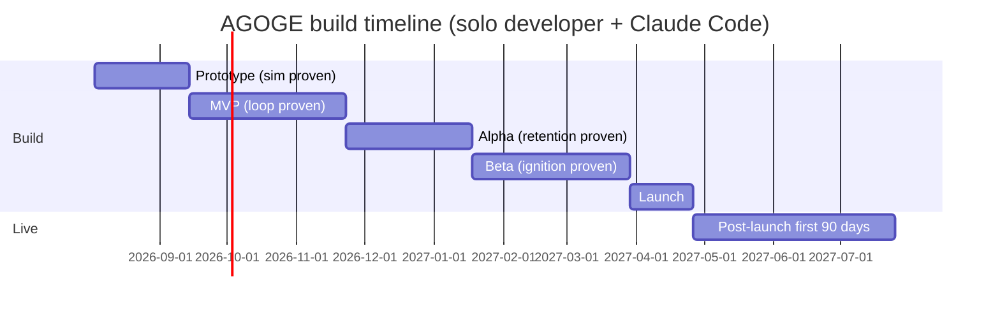

# AGOGE — Roadmap, Risks & Phased Implementation Plan

> **Scope of this document.** Sequencing, prioritisation, the risk register, team/budget reality, go/no-go gates, and — the centrepiece — a phased, PR-sized implementation plan executable with Claude Code. Feature definitions live in `02-gdd-core.md` and `03-gdd-systems.md`; stack and infrastructure in `04-technical-architecture.md`; schema in `05-database-schema.md`; screens in `06-ui-ux.md`; monetisation and the LiveOps calendar in `07-monetisation-liveops.md`. This document decides *when*, not *what*.

**Planning assumption, stated once and used throughout:** one experienced full-stack developer, effectively full-time (~25 focused build hours per week), with Claude Code driving implementation. Every increment in §4 is sized to a single working session (half a day to one day, including tests and review). A 20% schedule contingency is applied at the end, not hidden inside each milestone.

---

## 1. Milestone roadmap

### 1.1 Overview

Eight milestones, two already complete, each with a measurable exit gate. The through-line: **prove the sim, then the loop, then retention, then ignition — then spend.**

| # | Milestone | Duration | Calendar (target) | Exit gate (summary) |
|---|---|---|---|---|
| 0 | Research | done | — | Four research reports in `docs/research/` |
| 1 | GDD | done | — | This nine-document set, internally consistent |
| 2 | Prototype | 6 weeks | Aug–mid Sep 2026 | Golden-master suite green; ≥1,000 fights/s on one core; balance matrix within bands |
| 3 | MVP | 10 weeks | mid Sep–Nov 2026 | Full loop playable by 50 friendlies; name→first fight <10 s; crash-free ≥99.5% |
| 4 | Alpha | 8 weeks | Dec 2026–mid Jan 2027 | 150-player closed cohort; D1 ≥25%; zero sim exploits; Stripe test-mode purchase works end-to-end |
| 5 | Beta | 10 weeks | mid Jan–Mar 2027 | D1 ≥30% on a 500-player cohort; D7 ≥12%; share-rate ≥8% of fights; real-money purchases live |
| 6 | Launch | 4 weeks | Apr 2027 | Launch-week checklist complete; go gates green (§6.2) |
| 7 | Post-launch | ongoing | May 2027 → | First-90-days plan per `07-monetisation-liveops.md` |

With the 20% contingency applied across the whole line, public launch lands **May–June 2027**. The Alpha window absorbs the December holidays; its 8 weeks assume ~6 productive ones.

### 1.2 Milestone 2 — Prototype

**Goal:** prove the deterministic sim is correct, fast, balanced, and fun to read — before any backend or UI exists. The sim is the irreplaceable asset; everything else is replaceable plumbing.

- **IN:** monorepo scaffold with CI; `packages/core` complete (PRNG discipline, integer maths, derived stats, tick loop, 24 weapons, 30 skills, 4 Beasts of Legend, Battle Plan resolution); CLI fight harness; balance sim runner; golden-master corpus; versioned sim bundle build.
- **OUT (explicitly):** any server, any database, any React, any art, any auth. A throwaway text renderer only.
- **Exit criteria (all measurable):**
  1. Golden-master suite green: 250-fight frozen corpus re-simulates byte-for-byte in CI (`04-technical-architecture.md` §2.4).
  2. **≥1,000 simulated fights/second on one desktop core** (consistent with the 1–3 ms/fight budget on a slower Fly shared vCPU).
  3. Property tests pass: termination within the 3,000-tick cap, HP never negative, replay identity, mirrored-fight symmetry.
  4. Balance matrix: across the 12 archetype fixtures at levels 5/15/30, no archetype outside a 42–58% win band; no single weapon discipline above 58% pick-adjusted win rate over 10,000 fights.
  5. **Fun check:** five outside readers read ten text replays each; at least four can correctly name the winner's turning point. If narration is illegible, the fight theatre will be too.

**Duration: 6 weeks** (increments P1–P11, §4.2).

### 1.3 Milestone 3 — MVP

**Goal:** the complete daily loop — forge a Champion, plan, fight, draft, share — live at a URL, playable end-to-end by strangers on their phones.

- **IN:** Supabase + Fly.io + Cloudflare Pages deployment; anonymous-first auth with lossless upgrade; Champion creation with name-seeded kit; Vigor and daily reset; six-rival Arena board; Battle Plan sheet; PixiJS fight theatre (placeholder art); Threads of Fate drafts with Favour rerolls; Tapestry; **replay share URLs with OG cards**; 3 daily Labors + Eternal Flame; Kleos ratings + a single leaderboard; PWA shell under the 3 MB budget; Sentry/PostHog/pino wiring; seed script (200 bot Champions).
- **OUT:** leagues, Agon, Gauntlet, Phalanx, Aristeia, Chronicle, shop, Forge, Stele, Lineage rewards, admin panel, any payment, any sockets. Placeholder art throughout — contracted art lands in Alpha/Beta.
- **Exit criteria:**
  1. **Full loop playable by 50 friendlies** for 14 consecutive days without a data-loss or progression-blocking bug.
  2. Playwright golden path green nightly: fresh browser → named Champion → first fight verdict in **<10 seconds** on throttled fast-3G.
  3. Crash-free sessions ≥99.5% (Sentry) over the friendlies' second week.
  4. A shared fight URL unfurls with an OG card in Discord/WhatsApp/X and plays the replay with no login.
  5. Initial payload ≤2.5 MB (CI-enforced; contract is <3 MB).

**Duration: 10 weeks** (M1–M20, §4.3).

### 1.4 Milestone 4 — Alpha

**Goal:** the retention lattice — competition, guild, prestige, ritual — plus the commercial skeleton in test mode, run against a closed Discord-recruited cohort.

- **IN:** Leagues and Saga scaffolding; daily Agon with SSE bracket reveals; Gauntlet of Labors; Phalanx creation + Titan Siege; Aristeia; Chronicle free track (premium flagged); Obols cosmetics shop + Forge v1; **Stripe test mode** (Ichor, Chronicle, Patron's Oath); Stele of Deeds; challenge links with Protégé attribution (rewards flagged off); admin panel (lookup, audited grants, anomaly queue); anti-abuse hardening; PostHog retention dashboards; first contracted art integrated.
- **OUT:** real money; full Lineage rewards; Grand Agon; Skirmish; spectating; Rival of the Week; localisation.
- **Exit criteria:**
  1. 150-player closed cohort (Discord-recruited) through **two full weekly cycles** (Gauntlet reset, Siege reset, Agon daily).
  2. **D1 ≥25%, D7 ≥10%** on the cohort (below final targets — art and Lineage aren't in yet; this gate detects structural failure, not polish).
  3. A Stripe test-mode purchase grants an entitlement, survives webhook retry, and is refundable from the admin panel.
  4. Zero successful sim/economy exploits: replay spot-audit finds no mismatched outcomes; economy-audit job reports zero invariant violations for 14 days.
  5. One balance patch shipped as `simVersion 2` with old replays still binary-identical under `v1`.

**Duration: 8 weeks** (A1–A18, §4.4).

### 1.5 Milestone 5 — Beta (soft launch)

**Goal:** open the doors quietly and prove organic ignition — the loop, the share objects, and money, on real strangers.

- **IN:** full Lineage (challenge links → Protégé D7-gated, capped, non-power rewards); real-money Stripe live mode; Grand Agon + first full Saga rollover; Rival of the Week; Echo Duels; final art/audio integration; itch.io release then a CrazyGames cohort; performance and onboarding-funnel optimisation via PostHog A/Bs.
- **OUT:** everything on the not-before-launch list (§2.4).
- **Exit criteria:**
  1. **D1 ≥30% on a ≥500-player organic cohort** (not friendlies, not Discord regulars); D7 ≥12%. (Launch targets are D1 ≥35 / D7 ≥15 per `00-vision.md`; Beta gates sit one notch below with a visible path up.)
  2. **Share-rate ≥8%** of fights generate a share-URL visit; **K-factor ≥0.15** measured through challenge-link attribution.
  3. Payer conversion ≥1.5% among players past day 3 (vision target: ≥3% by M6 post-launch).
  4. One complete Saga rollover executed by jobs alone — no manual intervention.
  5. Infrastructure ≤$150/month at the Beta population (cost table: `04-technical-architecture.md` §11.3).

**Duration: 10 weeks.**

### 1.6 Milestone 6 — Launch

**Goal:** the loud version of what Beta proved: first patronised Saga live, portal placements, press/creator outreach, Product Hunt/HN day. **IN:** launch checklist (§6.3), capacity rehearsal at 10× Beta peak, support/moderation playbooks. **OUT:** new features — launch is an operations milestone. **Exit:** checklist complete, gates green (§6.2). **Duration: 4 weeks.**

### 1.7 Milestone 7 — Post-launch

The first 90 days follow the LiveOps calendar in `07-monetisation-liveops.md`. Feature work resumes from the not-before-launch queue (§2.4) strictly behind the retention data. Full plan pointer: §6.4.

---

## 2. Prioritisation

### 2.1 Method

Every major feature scored on **Impact** (1–5: contribution to retention, virality or revenue, weighted by the research evidence) and **Effort** (1–5: 1 ≈ 1–2 sessions, 3 ≈ a week, 5 ≈ several weeks). The rule that falls out: **high-impact/low-effort ships earliest; high-effort anything waits until a gate proves it is needed.**

### 2.2 Impact-vs-effort matrix

The table below is the single prioritisation source of truth; milestone columns match §1. Where a feature has a test-mode and a live phase (payments), both are shown.

| Feature | Impact | Effort | Milestone | Rationale in one line |
|---|---|---|---|---|
| Deterministic sim core | 5 | 3 | Prototype | Everything depends on it; irreplaceable asset |
| Battle Plan (sim + UI) | 5 | 2 | Prototype/MVP | The agency fix for MyBrute's core failure |
| Anonymous-first auth | 5 | 1 | MVP | Pillar 1; Supabase gives it nearly free |
| Arena board + Vigor ration | 5 | 2 | MVP | The daily appointment is the product |
| Threads of Fate drafts | 5 | 2 | MVP | The dopamine moment, now with agency |
| **Replay share URLs + OG cards** | 5 | 1 | MVP | The atomic viral object; trivially cheap |
| PixiJS fight theatre | 4 | 3 | MVP | The spectacle; placeholder art acceptable |
| Labors + Eternal Flame | 4 | 2 | MVP | Streak psychology doubles daily retention |
| Kleos + leaderboard | 4 | 2 | MVP | Fights need stakes from day one |
| PWA shell (<3 MB) | 4 | 1 | MVP | Instant-load is a competitive weapon |
| Leagues + Saga reset | 4 | 2 | Alpha | Ladder legibility for the mid-field |
| Daily Agon | 4 | 3 | Alpha | Second daily appointment, spectator loop |
| Gauntlet of Labors | 3 | 2 | Alpha | PvE variety + Trophy faucet |
| Phalanx + Titan Siege | 4 | 4 | Alpha | Strongest D30 driver; biggest Alpha item |
| Aristeia | 4 | 2 | Alpha | The no-ruined-Champions promise made real |
| Chronicle (free track → paid) | 4 | 2 | Alpha→Beta | Ritual monetisation spine |
| Shop + Stripe (test → live) | 4 | 2 | Alpha→Beta | Money must be tested long before trusted |
| Patron's Oath | 3 | 1 | Alpha→Beta | Torn-proven supporter tier, tiny build |
| Forge (cosmetic crafting) | 3 | 2 | Alpha | Gives Trophies meaning |
| Stele of Deeds | 3 | 1 | Alpha | Cheap completionism surface |
| Admin panel | 4 | 2 | Alpha | Non-negotiable before strangers arrive |
| **Lineage (full rewards)** | 5 | 3 | Beta | The growth engine; needs anti-abuse + population |
| Grand Agon | 3 | 2 | Beta | Saga finale; needs a full Saga to exist |
| Rival of the Week | 4 | 1 | Beta | Best retention-per-hour of the §11.2 additions |
| Echo Duels | 3 | 1 | Beta | Unique share object, near-zero cost |
| Skirmish (Phalanx wars) | 3 | 3 | Post-launch | Needs many healthy Phalanxes to matter |
| Hall of Legends | 3 | 1 | Post-launch | Needs history worth exhibiting |
| Sparring Grounds | 2 | 2 | Post-launch | Community tooling; community must exist first |
| Live spectating (sockets) | 2 | 3 | Post-launch | SSE reveals cover 90% of the value |
| Phalanx chat (Socket.IO) | 2 | 2 | Post-launch | Discord fills this gap for free at first |
| Capacitor wrap + IAP | 3 | 4 | Post-launch | PWA covers mobile until traction proves stores |
| Discord Activity build | 3 | 3 | Post-launch | Promising channel; after web loop is proven |

### 2.3 Cut lines

- **Prototype cut:** if it isn't executable by the CLI harness, it doesn't exist yet.
- **MVP cut:** ship the *loop*, not the *lattice*. Anything a day-1 player doesn't touch in their first week is out.
- **Alpha cut:** ship every retention system whose absence would invalidate the cohort test — and nothing whose absence wouldn't. (Example: Aristeia is in because level-30 players appear within the cohort window at the tuned XP pace; Grand Agon is out because no Saga completes within it.)
- **Beta cut:** ship everything a launch player will meet in their first 60 days. If a Beta player can't hit it in 60 days, launch players can't either — defer it.

### 2.4 The not-before-launch list

Each entry has a reason and a re-entry trigger; this is a queue, not a graveyard.

| Deferred feature | Why deferred | Re-entry trigger |
|---|---|---|
| **Skirmish** (opt-in Phalanx war) | Needs a critical mass of active 30-member Phalanxes; launching wars into a sparse guild landscape shows empty lobbies — worse than absence | ≥40 Phalanxes with ≥15 weekly-active members |
| **Live spectating** | Requires the Socket.IO layer; SSE bracket reveals already deliver the "appointment TV" feel at hourly cadence | Grand Agon concurrent viewership >500 via SSE |
| **Capacitor wrap + store IAP** | Two store review pipelines, IAP adapter duplication, 15–30% fee — all before the web loop is proven; the PWA *is* the mobile product at launch (`04-technical-architecture.md` §12) | D30 ≥8% sustained + measurable install-prompt demand |
| **Discord Activity / Telegram surface** | Real channels (200M+/950M MAU) but each is an integration tax and a layout re-test; the web build must stabilise first | Post-launch, as the first new-surface bet |
| **Phalanx chat** | Our official Discord covers social gravity at zero build cost; in-game chat adds moderation duty (see safety defaults, `03-gdd-systems.md` §10.4) | Phalanx D30 cohort data shows off-Discord majority |
| **Sparring Grounds, Hall of Legends** | Community tooling and a museum need a community and a history | First community tournament observed / first Grand Agon champion crowned |
| **Player markets/trading** | Permanently rejected — economy integrity (`03-gdd-systems.md` §8.3) | Never |

### 2.5 Minimum viable virality — the argument

Virality ships in two deliberate stages, and the split is load-bearing:

**Replay share URLs ship in MVP** because the share object is the cheapest, most proven asset we own. The research is unambiguous: MyBrute's growth engine was a URL that *was* a playable dare, and every fight page with an OG card is exactly that. Technically it is nearly free — fights are already immutable records, so `GET /f/:fightId` plus a rendered card is one increment (M14). It carries **zero abuse surface** (no rewards attached, nothing to farm), and it starts compounding immediately: every MVP friendly becomes a broadcaster, and share-rate telemetry accrues months before Beta needs it.

**Full Lineage waits for Beta** for three reasons. First, **abuse-resistance needs infrastructure MVP doesn't have**: D7-activity gates need the `lineage-gates` job, reward caps need the ledger, and farm detection needs A17's multi-account scoring — MyBrute's proxy-scripted pupil farms are the documented death of naive referral rewards. Second, **rewards without population are noise**: a Protégé system can't demonstrate its loop among 50 friendlies; at Beta's 500+ organic players it can be measured (K-factor gate, §1.5). Third, **sequencing protects the brand**: if Lineage rewards ever need clawing back, better in a closed Beta than in launch week. The bridge is A15: challenge links and Protégé *attribution* ship in Alpha with rewards flagged off, so Beta flips a flag on a system with weeks of attribution data behind it.

---

## 3. Risk register

Fifteen risks, scored likelihood × impact on 1–5 scales (scores ≥12 in bold). "Retired by" names the milestone whose exit gate proves the risk handled; residual risks stay on the live register reviewed each Saga.

| Id | Risk | L | I | Score | Early-warning signal | Mitigation | Retired by |
|---|---|---|---|---|---|---|---|
| D1 | **Threads of Fate drafts don't feel agentic** — 1-of-3 reads as slot machine with extra steps | 3 | 5 | **15** | Prototype fun-check readers can't articulate a build plan; MVP draft-screen dwell <3 s | Milestone guarantees + visible Tapestry make intent legible; A/B draft presentation in MVP; escalate to draft-preview ("next 3 levels' categories") if Alpha D7 interviews confirm | Alpha |
| D2 | **Battle Plan too thin** — one dominant stance/gambit combo solves the metagame | 3 | 4 | **12** | Balance runner shows any plan combo >55% usage or win rate at P8; Alpha plan-distribution telemetry | Counter-triangle tuning in Prototype; last-known-plan bluffing widens the space; add Gambits (content, not code) at Saga boundaries | Beta |
| D3 | 6-Vigor ration feels stingy to 2026 players used to endless sessions | 2 | 4 | 8 | Friendlies burn Vigor in <4 min then churn same-day; "give me more fights" is top feedback theme | Agon + Gauntlet + Labors give non-Vigor session content from Alpha; unranked Sparring is the release valve if data demands it — never sold Vigor (red line) | Beta |
| D4 | Balance collapse — a dominant build invalidates drafting | 3 | 4 | **12** | Any archetype >58% in the P8 matrix; Alpha ladder shows top-100 build homogeneity >40% | 10k-fight balance runner in CI on every content change; Saga-boundary patch cadence with simVersion discipline | ongoing (tooling by Prototype) |
| T1 | **Sim determinism drift across patches** breaks replays/audits | 3 | 5 | **15** | Golden-master diff fails; replay spot-audit mismatch in Alpha | Three-layer enforcement (types, lint, golden masters per `04` §3); versioned immutable sim bundles; event log stored as belt-and-braces | Prototype (tooling), audited forever |
| T2 | Supabase lock-in / pricing shift | 2 | 3 | 6 | Pricing announcement; auth latency degradation | Data is standard Postgres (exportable); game logic lives in our Node service, not Edge Functions; Better Auth named as auth exit (research `tech.md` §5); annual exit-cost review | residual |
| T3 | Replay/fight storage growth outruns budget | 3 | 2 | 6 | `fights` table >50 GB before 10k DAU; Supabase disk alerts | 35-day event-log pruning + the deferred partition-and-R2-archive plan in `05-database-schema.md` §5.1; OG cards CDN-cached, generated once | MVP (job ships A-phase) |
| T4 | Glicko-2 matchmaking degenerates at small population (same six rivals daily) | 4 | 3 | **12** | Rival-board repeat rate >50% week-over-week in friendlies cohort | 200 seeded bot Champions with authored builds pad the board honestly at MVP; widen rating bands at low population; bots retire per league as humans fill in | Beta |
| T5 | Single-region single-stack outage during a ranked window | 2 | 3 | 6 | Fly/Supabase status incidents; SSE reconnect spikes | Multi-instance api from day one; jobs idempotent and resumable (`04` §7.3); Agon rounds delay gracefully (resolve late, never wrong); status page from Alpha | residual |
| M1 | **No organic loop ignition** — share URLs get clicks, no conversions | 3 | 5 | **15** | Beta share-rate <8% or click→Champion conversion <15%; K <0.1 | The share page *is* an onboarding funnel (fight plays, then "forge your own" — no login wall); A/B the recipient flow (`06-ui-ux.md` §4.3); Lineage rewards tune the incentive; if K stays <0.1, launch spend is halted by gate §6.2 | Beta |
| M2 | Portal dependency — CrazyGames/Poki rev-share and iframe constraints shape the product | 3 | 3 | 9 | Portal cohort >60% of new players by late Beta | Portals are *cohort sources*, not the platform: own domain + PWA is canonical; Discord community and Lineage links build owned acquisition in parallel | residual |
| L1 | **Too close to MyBrute IP** — Motion Twin licensed Eternaltwin as non-commercial; a commercial near-clone invites action and community backlash | 2 | 5 | 10 | Community threads calling AGOGE a clone; any contact from Motion Twin | Differentiation is a *duty*: original name/world/cast/art (Greek-vase direction), original mechanics (Battle Plans, drafts, Aristeia), zero asset or name reuse; document the delta (this doc set is evidence); solicitor review of the finished art/lore pass before Beta | Beta |
| L2 | EU loot-box/consumer regulation touches monetisation | 1 | 4 | 4 | Regulatory news; store policy changes | Designed out from the start: no loot boxes, no paid randomness, real-currency price display, retroactive non-expiring Chronicle (`00-vision.md` §5); pre-Beta compliance checklist incl. withdrawal rights, VAT via Stripe Tax | Beta |
| L3 | COPPA/age posture — cartoon fighting attracts under-13s | 2 | 4 | 8 | Support mail from parents; school-network traffic patterns | Public posture 13+ (terms + neutral age gate at account upgrade); no chat at launch (safety default); no behavioural ads; COPPA-clean analytics config (no ad-ID) | Beta |
| L4 | GDPR obligations (EU players from day one) | 3 | 3 | 9 | DSAR arrives unhandled; consent audit fails | Erasure path designed in `05-database-schema.md` §5.2 (anonymise, keep fights); data-processing register + privacy policy at MVP-friendlies stage; EU-hosted Supabase region; PostHog EU cloud | MVP |
| O1 | **Solo-dev bus factor** — one person is design, code, ops and support | 5 | 3 | **15** | Any fortnight with zero commits; support backlog >72 h | Everything-as-code (infra, runbooks, this doc set); Claude Code sessions are re-runnable against documented increments; automated jobs need no daily hands; recovery runbook tested in Alpha; ops budget for a contractor on-call at launch | residual — mitigated, never retired |
| O2 | LiveOps burnout — Saga cadence becomes a treadmill | 4 | 4 | **16** | Saga content shipped late twice consecutively; developer working weekends to hold cadence | Sagas are config + content, not code (`03-gdd-systems.md` §6.4); 8–10-week Saga length chosen for solo sustainability; two Sagas banked before launch; automation-first LiveOps per `07-monetisation-liveops.md`; the calendar has planned quiet weeks | residual — watched every Saga |

The register's shape tells the strategy: the highest-scored risks (draft feel, determinism, ignition, bus factor/burnout) are exactly what the Prototype, MVP and Beta gates are built to test earliest and cheapest.

---

## 4. Phased implementation plan for Claude Code

### 4.1 Ground rules

- **One increment = one session = one PR.** Each has an id, dependencies, scope, key paths, and acceptance criteria a session can verify itself (tests pass, endpoint returns X, screen renders Y) before opening the PR.
- **Main is always deployable.** Every increment lands green; features that would break the app mid-build ship behind a flag. From M1 onward, merge-to-main deploys to staging automatically.
- **Order respects dependencies but stays re-plannable.** Depends-on lists the hard edges; anything not listed can be reordered.
- **Definition of done everywhere:** lint + typecheck + tests green in CI; new behaviour has tests; `pnpm turbo run build` succeeds; no new dependency without a line of justification in the PR.

### 4.2 Prototype increments (P1–P11)

| Id | Title | Depends on | Scope & key paths | Acceptance criteria |
|---|---|---|---|---|
| P1 | Monorepo scaffold | — | pnpm workspaces + Turborepo; ESLint/Prettier/Vitest; `tsconfig.base.json` (strict, `noUncheckedIndexedAccess`); dependency-cruiser boundary rules; GitHub Actions (lint→typecheck→test). Paths: repo root, `.github/workflows/ci.yml` | `pnpm turbo run lint typecheck test` green locally and in CI on a stub package; a contrived `core → pg` import fails CI |
| P2 | PRNG + stat model | P1 | mulberry32 + splitmix32 streams; integer helpers (`mulBp` floor rounding); Champion snapshot type; HP + all derived-stat formulas from `02-gdd-core.md` §4.4; core-only lint config (bans `Math.random`, `Date`, float maths). Paths: `packages/core/src/{rng,stats}` | Derived-stat table tests match `02` §4.4 exactly; HP(Grit 10, lvl 1) = 112; same seed → identical 10k draws twice; lint catches a planted `Math.random` |
| P3 | Fight tick loop | P2 | Abstract integer-tick loop (`02` §4.1); initiative, interval race, attack resolution pipeline (dodge/block/counter/combo/disarm per `02` §4.5); event-log emitter; termination guard. Paths: `packages/core/src/sim` | Property tests: terminates ≤3,000 ticks; HP ≥0; re-run identity; mirrored-fight symmetry. First fixture fight snapshot committed |
| P4 | CLI fight harness | P3 | `tools/fight-cli`: `pnpm fight --seed 42 --a spearman --b brawler` prints log + verdict; `--json` mode; 12 archetype fixture Champions. Paths: `tools/fight-cli`, `packages/core/fixtures` | Two identical invocations byte-identical; `--json` validates against the log schema; all 12 fixtures load |
| P5 | Weapons (24) | P4 | Six disciplines as dial bundles per `02` §5.2: Doru reach/counter, Xiphos, Cestus combo, Labrys, Akontia armour-piercing thrown, Aspis disarmable shield; in-fight draw logic. Paths: `packages/core/src/content/weapons.ts` | Per-discipline behaviour tests (e.g. Akontia damage scales with Grace and ignores armour); corpus grows to 50 fixture fights, green |
| P6 | Skills (30) | P5 | Boons (passives), Techniques (auto-triggers), Trump conditions per `02` §5.3; trigger engine with deterministic ordering. Paths: `packages/core/src/content/skills.ts` | Every skill has ≥1 test proving its trigger and magnitude; corpus at 100 fights, green |
| P7 | Beasts + Battle Plan | P6 | Four Beasts with Grit tax and exclusivity (`02` §5.4); Stance/Gambit/Trump resolution incl. stance derived-stat shifts (`02` §4.7). Paths: `packages/core/src/{content/beasts,plan}` | Stance shift tests match formula table; Lykos ×3 legal, Boar+Cub illegal; Trump fires on its condition in a scripted fixture; corpus at 150 |
| P8 | Balance sim runner | P7 | `tools/balance`: archetype × level matrix, 10k fights per cell, win-rate/duration/first-blood stats, markdown report; CI smoke mode (1k/cell). Paths: `tools/balance` | 100k fights complete <2 min on dev core; report flags any cell outside 42–58%; baseline report committed |
| P9 | Golden-master freeze + perf gate | P8 | Freeze the 250-fight simVersion-1 corpus; CI benchmark job. Paths: `packages/core/golden/v1/`, CI workflow | Corpus re-simulates byte-for-byte in CI; benchmark records **≥1,000 fights/s on one core**; both are required CI checks |
| P10 | Narration layer | P9 | Event log → Herald commentary strings (also the future screen-reader narration, `06-ui-ux.md` §6.3); CLI `--narrate`. Paths: `packages/core/src/narration` | Every event type has a line; narration snapshot tests green; the §1.2 fun-check pack (10 readable replays) generated |
| P11 | Versioned sim bundle | P9 | Build pipeline emitting immutable `sim/v1.mjs` (~40 KB target) per `04` §3.4; Node smoke-loader. Paths: `tools/build-sim` | `pnpm build:sim` emits bundle ≤60 KB; dynamic `import()` of the bundle replays a corpus fight identically to source |

### 4.3 MVP increments (M1–M20)

| Id | Title | Depends on | Scope & key paths | Acceptance criteria |
|---|---|---|---|---|
| M1 | Infra bootstrap | P1 | Supabase project (EU region) + migration tooling (CLI, drift check); Fly.io app skeleton with `/healthz`; Cloudflare Pages placeholder; deploy-on-merge CI. Paths: `apps/api`, `supabase/migrations`, workflows | Merge to main → staging deploys; `GET /healthz` returns 200 in staging; a trivial migration applies via CI only |
| M2 | Protocol package | P11 | zod schemas: fight record, snapshots, Battle Plan, error codes, analytics event enum v1 (`04` §9.3). Paths: `packages/protocol` | Round-trip tests for every schema; `core` snapshot type and protocol schema proven structurally identical by a compile-time test |
| M3 | API skeleton | M1, M2 | Fastify + tRPC; JWKS-local JWT verify → `ctx.userId`; `idempotency_keys` table + middleware; per-user/IP rate-limit plugin. Paths: `apps/api/src/{server,auth,idempotency}` | Integration (docker Postgres+Redis): no JWT → 401; replayed `requestId` returns the stored response without re-executing |
| M4 | Core schema migrations | M3 | Identity, champions, progression, fights, ledger tables per `05-database-schema.md` §3.1–3.4 (MVP subset). Paths: `supabase/migrations` | Migrations apply on a fresh database; generated TypeScript types compile; seed of one Champion round-trips |
| M5 | Anonymous auth + Champion creation | M4 | `signInAnonymously()` flow; `champion.create` with name-seeded flavour + starting kit (`02` §3.2); 2 free slots. Paths: `apps/api/src/routers/champion`, `apps/web/src/auth` | Integration: anon JWT creates a Champion; fixed test name yields the fixed fixture kit; third Champion rejected with the canonical error code |
| M6 | fight.challenge | M5 | Transactional Vigor spend → server seed → `core` simulate → persist record + ledger + XP (2/1, +1 upset). Paths: `apps/api/src/routers/fight`, service layer | Two concurrent challenges each spend exactly 1 Vigor (race test); stored fight re-simulates to an identical log; Vigor 0 → canonical error |
| M7 | Daily reset + rival board | M6 | BullMQ on Upstash; 00:00 UTC job: Vigor grant (6, cap 12), six-rival board near Kleos, Labor rotation stub; deterministic job ids. Paths: `apps/workers` | Job run against seeded db grants correctly and is idempotent on re-run; board holds 6 rivals within the rating band; day-one bonus (+6) granted once |
| M8 | Web shell (PWA) | M2 | React 19 + Vite; routes per `06-ui-ux.md` §2.1; design tokens; TanStack Query + tRPC client; manifest + service worker; CI payload budget. Paths: `apps/web` | Installable PWA (Lighthouse); payload report <2.5 MB fails CI if exceeded; Home renders live api data locally |
| M9 | FTUE flow | M5, M8 | Name entry → forge reveal → first fight vs authored bot, per `06` §4.1; anonymous sign-in invisible. Paths: `apps/web/src/routes/onboarding` | Playwright on preview deploy: fresh context → verdict **<10 s** on throttled fast-3G; refresh mid-flow loses nothing |
| M10 | PixiJS fight theatre | M8, P11 | Canvas replay of the event log: placeholder rigs, HP bars, 2×, skip, reduced-motion per `06` §3.5/§6.2; lazy-loads the fight's simVersion bundle. Paths: `apps/web/src/theatre` | Rendered final HP equals log final HP exactly; 2× and skip reach the same end state; screenshot test stable |
| M11 | Threads of Fate | M6 | Draft generation (1-of-3, ≥1 stat offer, milestone guarantees per `02` §6.3); Favour rerolls; draft UI per `06` §3.6. Paths: `apps/api/src/routers/fate`, `apps/web/src/routes/draft` | Property test over 10k drafts: guarantees never violated; reroll spends exactly 1 Favour (idempotent); e2e: pick persists and re-renders |
| M12 | Battle Plan surface | M6, M8 | `setBattlePlan`; attacker sees rival's *last-known* plan (`02` §4.8); Battle Plan sheet per `06` §3.4. Paths: `apps/api`, `apps/web/src/routes/plan` | Integration: rival's current plan never leaks — response equals last *fought* plan; e2e: set plan → fight → replay reflects it |
| M13 | Champion Hall + Tapestry | M11 | Hall per `06` §3.2; Tapestry timeline; loadout editing. Paths: `apps/web/src/routes/{hall,tapestry}` | e2e: a draft pick appears in the Tapestry; loadout swap changes the next fight's stored snapshot; deep link `/c/:name` renders |
| M14 | Share pages + OG cards | M10 | `GET /f/:fightId` minimal HTML + OG meta, edge-cached; `GET /og/:fightId.png` via satori + resvg, generated once. Paths: `apps/api/src/rest/share` | curl shows correct OG tags; PNG <100 KB and CDN-cache-hit on second request; page hydrates the replay with no login; unfurl verified in Discord |
| M15 | Labors + Eternal Flame | M7 | 3 daily Labors from the template pool (`03-gdd-systems.md` §5.1); claims; streak + Ember freezes. Paths: `apps/api/src/routers/labors` | Claim idempotent; reset job advances streak; a missed day consumes exactly one Ember when banked, else resets; e2e claim flow |
| M16 | Progression completeness | M11 | XP curve 1–50 (`02` §6.2), soft cap, Obols faucets/sinks (MVP subset of `03` §8.1), ledger on every delta. Paths: `apps/api/src/services/progression` | Curve test matches the table exactly; every currency movement has a ledger row (invariant test); level 50 stops XP without error |
| M17 | Account upgrade | M9 | `linkIdentity()` OAuth (Google/Apple/Discord) + email OTP; upgrade prompts at emotional peaks; purchases-require-link flag. Paths: `apps/web/src/auth` | e2e: anon plays → links email → signs in from a second context → same Champion, same `user_id`; upgrade prompt fires at level 10, never at first launch |
| M18 | Kleos + leaderboard | M7 | Glicko-2 batch update in the reset job; Redis sorted-set board; `leaderboard.get`. Paths: `apps/workers`, `apps/api/src/routers/leaderboard` | Rating maths golden tests (fixed fixtures → fixed ratings); board reflects reset-job output; pagination cursor stable under insertion |
| M19 | Observability + seed bots | M1 | Sentry (client+server, sourcemaps); pino + OTel; PostHog with taxonomy v1; seed script forging 200 authored bot Champions. Paths: `apps/*/src/telemetry`, `tools/seed` | A thrown test error appears in Sentry with readable stack; an e2e run emits the expected event sequence in PostHog test project; seeded arena board is full on first boot |
| M20 | MVP hardening + friendlies gate | M9–M19 | Staging soak; nightly Playwright golden paths; invite flag; feedback link; GDPR basics (privacy policy, erasure runbook per `05` §5.2). Paths: e2e suite, runbooks | Nightly suite green 3 consecutive nights; 50 friendlies onboarded; **MVP exit criteria (§1.3) all measured and recorded** |

### 4.4 Alpha increments (A1–A18)

| Id | Title | Depends on | Scope & key paths | Acceptance criteria |
|---|---|---|---|---|
| A1 | Saga + league scaffolding | M18 | Saga config tables, league tiers Bronze→Olympian, placement + promotion logic in the reset job, Kleos soft-reset formula. Paths: `supabase/migrations`, `apps/workers` | Promotion tests across fixture ladders; soft reset yields `1500 + 0.4 × (Kleos − 1500)` exactly; league badge renders on Hall |
| A2 | Agon backend | A1 | Registration window (00:00–18:00 UTC), bracket seeding job, hourly round jobs 19:00–00:00, laurels; no XP. Paths: `apps/workers/src/agon` | A seeded 64-entrant bracket resolves over 6 simulated hours in test; byes handled; laurels persisted; re-run of any round job is a no-op |
| A3 | Agon UI + SSE | A2 | Bracket screen; `GET /sse/agon/:id` reveals via Redis pub/sub. Paths: `apps/api/src/sse`, `apps/web/src/routes/agon` | e2e: entering, then receiving a round reveal over SSE without refresh; reconnect resumes cleanly; poll fallback works with SSE disabled |
| A4 | Gauntlet backend | M16 | Weekly 12-rung ladder, authored bosses + modifiers (`03` §3), Trophy payouts, Monday reset. Paths: `apps/api/src/routers/gauntlet` | Rung progression rules enforced (no skips); Trophies land in ledger; weekly reset job re-arms the ladder idempotently |
| A5 | Gauntlet UI | A4 | Ladder screen, modifier display, first-clear board. Paths: `apps/web/src/routes/gauntlet` | e2e: attempt → win → next rung unlocks; modifier text matches config; first-clear board paginates |
| A6 | Phalanx core | M17 | Create/join/leave, roles, 30-cap, banner basics (`03` §4.1). Paths: `apps/api/src/routers/phalanx` | Cap enforced at 30 (race test); role permission matrix tested; e2e create-and-join across two accounts |
| A7 | Titan Siege backend | A6 | Krios damage pools, `siege.attack` (Siege-Mark-priced, never Vigor, per `03` §4.2), 15-min `siege-tick` aggregation, tier crossings, Monday reset. Paths: `apps/workers/src/siege` | Damage accumulates across members (integration); tier crossing fires exactly once; tick job idempotent |
| A8 | Siege UI + SSE | A7 | Siege screen with damage bars, `GET /sse/siege/:phalanxId`. Paths: `apps/web/src/routes/siege` | e2e: attack updates the bar via SSE; tier-up moment renders; weekly reset reflected next visit |
| A9 | Aristeia | M16 | Rebirth at 30+: reset to level 1, keep name + sigils, account-wide perk (+1 Favour/Saga), full re-draft (`02` §6.5). Paths: `apps/api/src/routers/aristeia` | Rebirth transaction test: level 1, kit reset, sigil granted, perk recorded account-wide; Tapestry shows the prior cycle read-only; irreversible without the canonical confirm token |
| A10 | Chronicle (free track) | A1 | ~60-tier dual-track structure; free track live, premium flagged off; tier progress sources; retroactive-forever data model per `07-monetisation-liveops.md`. Paths: `apps/api/src/routers/season` | Tier progress accrues from fixture actions; `claimTier` idempotent; premium tiers visible but locked behind the flag; a past Chronicle remains claimable in test |
| A11 | Obols shop + Forge v1 | M16 | Cosmetics catalogue, `purchaseWithObols`, equip/loadout of skins; Forge: Trophies + duplicates → cosmetic crafting (`03` §9). Paths: `apps/api/src/routers/shop`, `apps/web/src/routes/{shop,forge}` | Purchase debits ledger and grants entitlement exactly once; equipped skin appears in the next fight's replay; Forge recipe consumes inputs atomically |
| A12 | Stripe test mode | A10, A11 | Checkout sessions, signature-verified webhook → entitlements, Ichor grants, refund path, Stripe Tax config. Paths: `apps/api/src/rest/webhooks` | Test-mode purchase grants Ichor/Chronicle premium; webhook replay is idempotent; admin-triggered refund revokes cleanly; anonymous (unlinked) purchase blocked |
| A13 | Patron's Oath (test) | A12 | $4.99/mo subscription in test mode; QoL entitlement flags (extra presets, Tapestry analytics, replay theatre, flair). Paths: `apps/api/src/services/entitlements` | Subscription lifecycle (create/renew/cancel) drives entitlement flags correctly in test clock; no gameplay-affecting flag exists (assert against an allow-list) |
| A14 | Stele of Deeds | M16 | Achievement engine (event-driven), titles, Stele screen (`03` §7.1). Paths: `apps/api/src/services/stele` | Fixture event streams award the expected deeds exactly once; title equips and renders on the public profile |
| A15 | Challenge links + Protégé attribution | M14 | `lineage.link` mints challenge URLs; recipient flow per `06` §4.3; Protégé attribution + D7 gate job; **rewards flagged off**. Paths: `apps/api/src/routers/lineage`, `apps/workers/src/lineage-gates` | Recipient creates a Champion through the link and fights the sender's ghost; attribution recorded once per account; gate job marks D7 activity correctly on fixtures; no reward is claimable while flagged |
| A16 | Admin panel | M20 | `apps/admin`: player lookup, fight audit (re-simulate & diff), audited grants, anomaly review queue, refund trigger (`04` §10). Paths: `apps/admin` | Smoke e2e: login, lookup, one audited grant (with reason recorded); fight audit shows byte-identical re-sim for a healthy fight and flags a tampered fixture |
| A17 | Anti-abuse hardening | A15, A16 | Per-IP anon signup limits; multi-account scoring (IP/device/velocity + feeder graphs); `economy-audit` nightly job; replay spot-audit sampling. Paths: `apps/api/src/security`, `apps/workers/src/audit` | Scripted farm fixture (20 accounts, one beneficiary) scores above review threshold and appears in the admin queue; audit job passes 14 consecutive nights on staging; planted ledger violation is caught |
| A18 | Closed-alpha cohort | A1–A17 | Discord server live; invite waves; PostHog D1/D7 funnels + dashboards; `simVersion 2` balance patch rehearsal. Paths: dashboards, runbooks | 150 players through two weekly cycles; **Alpha exit criteria (§1.4) measured and recorded**; v1 replays verified unchanged after the v2 ship |

### 4.5 Beta epics (B1–B8)

Beta shifts from PR-sized increments to week-scale epics — by then the codebase, test harness and deploy pipeline make Claude Code sessions self-directing within an epic. B1: Lineage rewards live (flip A15's flag; capped, non-power rewards; K-factor instrumentation). B2: Stripe live mode + commerce compliance pass (VAT, receipts, withdrawal rights). B3: Grand Agon + first full Saga rollover. B4: Rival of the Week; B5: Echo Duels (both per `03` §11.2). B6: final art/audio integration (contracted assets, §5). B7: itch.io release, then the CrazyGames cohort with portal-iframe adjustments. B8: onboarding-funnel A/Bs and performance polish against the Beta gates.

---

## 5. Team & budget reality

### 5.1 What stays solo-with-Claude

Everything in §4: all engineering (sim, api, web, workers, admin), game design and balance (the runner makes tuning a data exercise), copywriting, analytics, LiveOps configuration, community management at Alpha/Beta scale, and any marketing asset that is a screenshot or replay of the game itself. This is the honest majority of the project — the design deliberately avoids what a solo developer cannot ship: no 3D, no real-time netcode, no voice acting, no open-world content treadmill.

### 5.2 What needs contracting

| Item | When | Cost band (USD) | Notes |
|---|---|---|---|
| Art style bible (palette, shape language, 3 exemplar pieces) | early Alpha | $3,000–6,000 | The Greek-vase-meets-modern-motion direction (`00-vision.md` §4) needs one strong illustrator to define, not a team |
| Champion base rigs + core animation set (idle/attack/hit/KO/victory ×2 body types) | Alpha→Beta | $8,000–15,000 | Spine or equivalent; the single largest cheque; everything else reuses these rigs |
| Weapon/beast sprites + VFX palettes (24 weapons, 4 beasts, hit sparks) | Beta | $4,000–8,000 | Batched commissions against the style bible |
| Arena backdrops (3 at launch) | Beta | $1,500–3,000 | Painterly stills; parallax layers optional |
| Audio pack (SFX set + 4 music loops) | Beta | $2,000–4,000 | Library-licensed music acceptable at launch; bespoke later |
| Marketing/capsule art (OG default card, portal thumbnails, store capsules) | Launch | $800–1,500 | Portals convert on thumbnails; do not economise here |
| Legal (IP-differentiation review, ToS/privacy, commerce check) | pre-Beta | $2,000–4,000 | Retires risks L1–L4 with professional eyes |
| **Total contracted, through launch** | | **$21,000–41,500** | Phased so the biggest cheques follow the Alpha retention gate |

### 5.3 Running costs

Infrastructure starts at **≈$40–55/month** and holds through Beta (the vision's $30–60 anchor) — full three-stage table in `04-technical-architecture.md` §11.3. The steps up are demand-driven and gated: ~$380–420/month at 10k DAU and ~$2,400/month at 100k DAU, at which point infrastructure is a low-single-digit percentage of even modest revenue. Non-infra recurring: Claude Code subscription, one Stripe account (per-transaction fees only), Discord (free), domain + email (~$5/month). **Rule: no cost step-up before the gate that justifies it is green (§6.2)** — the largest pre-revenue monthly burn is therefore under $150 total.

---

## 6. Go/no-go gates & launch plan

### 6.1 Soft-launch strategy

1. **Discord from Alpha (Dec 2026).** Opens with the closed cohort — recruitment pool, feedback channel, and seed of the Phalanx ecosystem. Target: 300 members by Beta, 1,000 by launch.
2. **itch.io first (early Beta).** Small, forgiving, feedback-rich audience; zero platform coupling; validates the PWA on wild devices before portal iframe constraints apply.
3. **CrazyGames cohort second (mid Beta).** The measured acquisition test: CrazyGames leads portals on IAP support and supplies the ≥500-player organic cohort the Beta gate requires. Poki and a Discord Activity build stay post-launch (§2.4).
4. **Own domain always canonical.** Portals are cohort taps; identity, accounts and payments live on our PWA, and every share URL points home.

### 6.2 The gates that greenlight spend

Money and effort escalate only through green gates; a red gate stops the next cheque, not the game.

| Gate | Metric threshold | What it unlocks |
|---|---|---|
| Prototype exit | Sim gates §1.2 all green | Backend/infra build (MVP) |
| MVP exit | Loop gates §1.3 all green | Alpha build + art style bible cheque |
| Alpha exit | D1 ≥25%, D7 ≥10%, zero exploits | Animation-set cheque + Beta build + legal review |
| Beta exit | **D1 ≥30% / D7 ≥12% on 500+ organic; share-rate ≥8%; K ≥0.15; conversion ≥1.5%** | Launch spend: marketing art, portal pushes, creator outreach |
| Post-launch M3 | D30 ≥8%, conversion trending to 3%, LiveOps cadence held for 2 Sagas | Capacitor/store investment; not-before-launch queue reopens |

If Beta misses its gate: **do not launch louder — diagnose quieter.** PostHog funnels localise the failure (onboarding, day-3 cliff, or share loop), one more 6-week Beta iteration runs, and only then is a pivot-or-persevere decision taken. Launch marketing against a leaking funnel is the classic browser-game death.

### 6.3 Launch-week checklist

- [ ] Capacity rehearsal: synthetic load at 10× Beta peak (fight, reset and Agon paths); Postgres pooler and rate limits verified under it.
- [ ] Two Sagas fully banked (content + config); Saga 1 patron announced.
- [ ] Golden-master, Playwright and economy-audit suites green on the release candidate; rollback rehearsed (`fly releases revert` + Pages rollback).
- [ ] Status page public; support inbox + moderation playbook live; admin on-call runbook tested by a cold read.
- [ ] Store/commerce: Stripe live keys, tax registrations, receipts, refund path re-verified with a real card.
- [ ] Legal surfaces linked: ToS, privacy, imprint; age posture live at account upgrade.
- [ ] Marketing assets staged: trailer cut from replays, press kit, portal thumbnails, Product Hunt/HN posts drafted; creator keys sent 1 week prior.
- [ ] Analytics guardrails: launch dashboard (D1 funnel, crash-free, share-rate, infra saturation) on one screen; PostHog event budget alarm armed.
- [ ] Community: launch-day Discord event scheduled; first Rival-of-the-Week pairing seeded.
- [ ] Kill-switches confirmed: feature flags for Lineage rewards, shop, and signup throttle, each tested in staging.

### 6.4 First 90 days

Owned by `07-monetisation-liveops.md`: the Saga-cadence calendar, mid-Saga event beats, Chronicle and shop rotation, and the weekly community ritual. This document contributes only the constraint already encoded above: post-launch feature work draws from the §2.4 queue strictly in the order the retention data argues for, and the O2 burnout mitigations — banked content, config-driven events, planned quiet weeks — are gate conditions for every Saga, not aspirations.

---

*Sequencing and risks end here. The systems this plan builds are specified in `02-gdd-core.md` and `03-gdd-systems.md`; the machines it runs on in `04-technical-architecture.md`; the money it must earn, ethically, in `07-monetisation-liveops.md`.*
